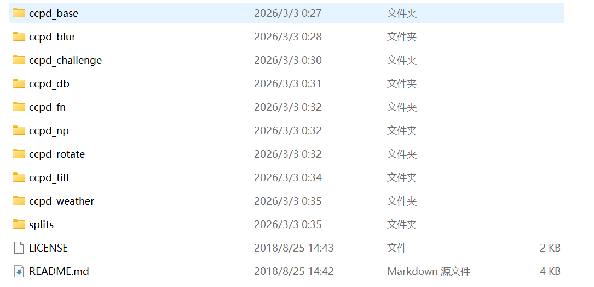
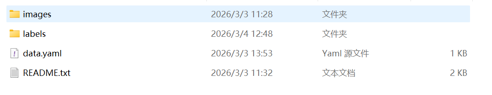
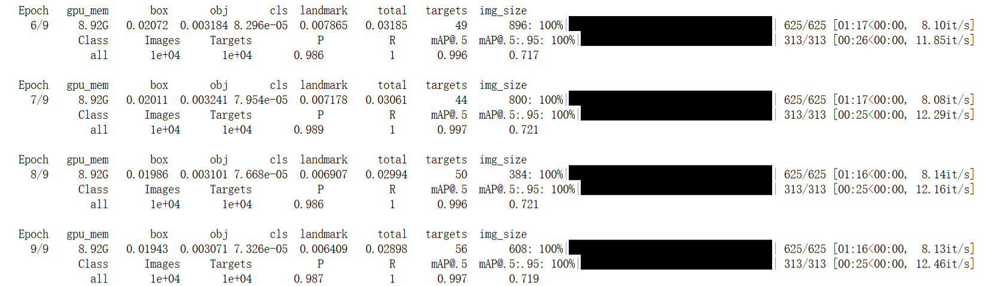
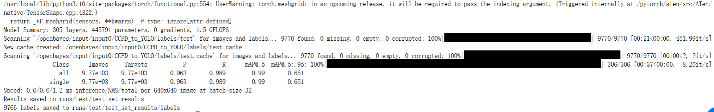

# 1. 数据集

首先数据集的选用我选择的是CCPD2019 (Chinese City Parking Dataset），数据来源：kaggle。
#### （1）训练\Val\Test分段

拆分文件在“split/”文件夹下。
CCPD-Base中的图像被拆分为train/val集合。CCPD中的子数据集（CCPD-DB、CCPD-Blur、CCPD-FN、CCPD-Rotate、CCPD-Tilt、CCPD-Challenge）被用于测试。

#### （2）数据集注释

注释嵌入在文件名中。
示例图片名称为“025-95_113-154&383_386&473-386&473_177&454_154&383_363&402-0_0_22_27_27_33_16-37-15.jpg”。每个名字可以被拆分为七个字段。这些场的解释如下。

- **面积**：车牌面积与整个画面区域的面积比值。
- **倾斜度**：水平倾斜度和垂直倾斜度。
- **边界框坐标**：左上顶点和右下顶点的坐标。
- **四个顶点位置**：整个图像中LP四个顶点的精确（x， y）坐标。这些坐标从右下顶点开始。
- **车牌号**：CCPD中的每张图片只有一张LP。每个LP编号由一个汉字、一个字母和五个字母或数字组成。有效的中国车牌由七个字符组成：省（1个字符）、字母（1个字符）、字母+数字（5个字符）。“0_0_22_27_27_33_16” 是每个字符的索引。这三个数组的定义如下。每个数组的最后一个字符是字母O，而不是数字0。我们用O表示“无字符”，因为中文车牌字符中没有O。
```python
provinces = ["皖", "沪", "津", "渝", "冀", "晋", "蒙", "辽", "吉", "黑", "苏", "浙", "京", "闽", "赣", "鲁", "豫", "鄂", "湘", "粤", "桂", "琼", "川", "贵", "云", "藏", "陕", "甘", "青", "宁", "新", "警", "学", "O"]
alphabets = ['A', 'B', 'C', 'D', 'E', 'F', 'G', 'H', 'J', 'K', 'L', 'M', 'N', 'P', 'Q', 'R', 'S', 'T', 'U', 'V', 'W',
             'X', 'Y', 'Z', 'O']
ads = ['A', 'B', 'C', 'D', 'E', 'F', 'G', 'H', 'J', 'K', 'L', 'M', 'N', 'P', 'Q', 'R', 'S', 'T', 'U', 'V', 'W', 'X',
       'Y', 'Z', '0', '1', '2', '3', '4', '5', '6', '7', '8', '9', 'O']
```
- **亮度**：车牌区域的亮度。
- **模糊度**：车牌区域的模糊度。

#### （3）数据集处理

该数据集并不适配我代码使用的yolov5检测模型的配置，所以要对数据集加以处理，来适配yolo格式，这里采用一个python脚本进行格式转换。
yolo格式：label x y w h  pt1x pt1y pt2x pt2y pt3x pt3y pt4x pt4y
- **ccpd2019数据集：**

原来数据集有train：100000张（来自ccpd-base）；val：99996张（来自ccpd-base）；
test：141982张（来自各个子集）。
- **ccpd-to-yolo**：
将数据集转化成yolo格式，并在原来基础上进行随机抽样，选取2万张作为train，1万张作为val，1万张作为test。

- **lable格式如下：**


---

# 2. 环境配置

#### （1）本地部署

代码来自于github开源项目：(https://github.com/we0091234/Chinese_license_plate_detection_recognition)，下载后conda创建一个新的环境，使用:
```bash
pip install -r requirement.txt
```
快速配置环境即可，注意选择以下版本，不然会有冲突：
- Python >= 3.6
- numpy 1.26.4
- torch 2.1.0 
- torchvision 0.16.0 （requirements里未提及，需要额外pip一下）

#### （2）云端算力部署

平台：OpenBayes，显卡：NVIDIA GeForce RTX 5090，上传数据集，配置环境。

---

# 3. 训练
#### （1）命令

```bash
python train.py --data data/widerface.yaml --cfg models/yolov5n-0.5.yaml --weights weights/plate_detect.pt --epoch 10
```

#### （2）模型

采用**yolov5n-0.5**，车牌目标较小，在监控画面中车牌通常只占图像的1%-5%，车牌具有标准的宽高比，纹理特征明显，字符与背景对比度高，yolov5n-0.5 足够捕捉这些特征，无需大模型。

| 对比模型        | 参数量     | 计算量(GFLOPs) | 模型大小   |
| ----------- | ------- | ----------- | ------ |
| YOLOv5n-0.5 | ~0.45M~ | ~0.57G      | ~1.8MB |
| YOLOv5n     | ~1.73M  | ~2.1G       | ~7MB   |
| YOLOv5s     | ~7.2M   | ~16.5G      | ~28MB  |
| YOLOv5m     | ~21.2M  | ~49.0G      | ~82MB  |
| YOLOv5l     | ~46.5M  | ~109.1G     | ~178MB |
 
##### 模型配置
```python
# parameters  
nc: 1  # number of classes  
depth_multiple: 1.0  # model depth multiple  
width_multiple: 0.5  # layer channel multiple  
  
# anchors  
anchors:  
  - [4,5,  8,10,  13,16]  # P3/8  
  - [23,29,  43,55,  73,105]  # P4/16  
  - [146,217,  231,300,  335,433]  # P5/32  
  
# YOLOv5 backbone  
backbone:  
  # [from, number, module, args]  
  [[-1, 1, StemBlock, [32, 3, 2]],    # 0-P2/4  
   [-1, 1, ShuffleV2Block, [128, 2]], # 1-P3/8  
   [-1, 3, ShuffleV2Block, [128, 1]], # 2  
   [-1, 1, ShuffleV2Block, [256, 2]], # 3-P4/16  
   [-1, 7, ShuffleV2Block, [256, 1]], # 4  
   [-1, 1, ShuffleV2Block, [512, 2]], # 5-P5/32  
   [-1, 3, ShuffleV2Block, [512, 1]], # 6  
  ]  
  
# YOLOv5 head  
head:  
  [[-1, 1, Conv, [128, 1, 1]],  
   [-1, 1, nn.Upsample, [None, 2, 'nearest']],  
   [[-1, 4], 1, Concat, [1]],  # cat backbone P4  
   [-1, 1, C3, [128, False]],  # 10  
  
   [-1, 1, Conv, [128, 1, 1]],  
   [-1, 1, nn.Upsample, [None, 2, 'nearest']],  
   [[-1, 2], 1, Concat, [1]],  # cat backbone P3  
   [-1, 1, C3, [128, False]],  # 14 (P3/8-small)  
  
   [-1, 1, Conv, [128, 3, 2]],  
   [[-1, 11], 1, Concat, [1]],  # cat head P4  
   [-1, 1, C3, [128, False]],  # 17 (P4/16-medium)  
  
   [-1, 1, Conv, [128, 3, 2]],  
   [[-1, 7], 1, Concat, [1]],  # cat head P5  
   [-1, 1, C3, [128, False]],  # 20 (P5/32-large)  
  
   [[14, 17, 20], 1, Detect, [nc, anchors]],  # Detect(P3, P4, P5)  
  ]
```
- **width_multiple: 0.5** 
正是这个模型叫 `yolov5n-0.5` 的原因，它将标准模型的通道数缩减为一半，实现极致轻量化。

##### Anchors
Anchors（锚框）是**预定义的初始边界框**，可以理解为"**先验框**"。在目标检测中，模型不是在原始图像上直接预测目标位置，而是在这些预定义的锚框基础上进行微调。
```yaml
anchors:
  # 第1组：小尺度anchors (在P3/8层使用，负责小目标)
  - [4,5,    # 极小车牌（远距离）
     8,10,   # 小车牌
     13,16]  # 中小车牌
  
  # 第2组：中尺度anchors (在P4/16层使用，负责中等目标)
  - [23,29,   # 中等偏小车牌
     43,55,   # 中等车牌
     73,105]  # 中等偏大车牌
  
  # 第3组：大尺度anchors (在P5/32层使用，负责大目标)
  - [146,217,   # 大车牌
     231,300,   # 更大车牌
     335,433]   # 最大车牌（近距离）
```
- **Anchors与特征图的对应关系**
```text
输入图像 (640x640)
    │
    ├── 下采样8倍 → P3特征图 (80x80) → 第1组anchors [4,5, 8,10, 13,16]
    │                   每个格子有3个anchor → 80×80×3 = 19200个候选框
    │
    ├── 下采样16倍 → P4特征图 (40x40) → 第2组anchors [23,29, 43,55, 73,105]
    │                   每个格子有3个anchor → 40×40×3 = 4800个候选框
    │
    └── 下采样32倍 → P5特征图 (20x20) → 第3组anchors [146,217, 231,300, 335,433]
                        每个格子有3个anchor → 20×20×3 = 1200个候选框

总计候选框：19200 + 4800 + 1200 = 25200个初始锚框
```

##### Backbone
```text
层0: StemBlock(32,3,2)     # 输入3通道→32通道，步长2，下采样到320x320
层1: ShuffleV2Block(128,2)  # 32→128通道，步长2，下采样到160x160 (P3/8)
层2: ShuffleV2Block(128,1) ×3 # 128通道，步长1，保持尺寸
层3: ShuffleV2Block(256,2)  # 128→256通道，步长2，下采样到80x80 (P4/16)
层4: ShuffleV2Block(256,1) ×7 # 256通道，步长1，保持尺寸
层5: ShuffleV2Block(512,2)  # 256→512通道，步长2，下采样到40x40 (P5/32)
层6: ShuffleV2Block(512,1) ×3 # 512通道，步长1，保持尺寸
```
- **StemBlock**
```python
class StemBlock:
    """
    输入: 3×640×640 (RGB图像)
    输出: 32×320×320 (特征图)
    
    结构:
    - Conv(3, 16, 3, 2)  # 3→16通道，步长2，下采样
    - Conv(16, 32, 1, 1) # 16→32通道，1x1卷积调整维度
    - Shuffle操作         # 通道混洗增强特征融合
    
    作用: 快速下采样并初步提取特征
    """
```
-  **ShuffleV2Block的配置**
```yaml
# 层1: [-1, 1, ShuffleV2Block, [128, 2]]
解释:
- from: -1        # 输入来自上一层
- number: 1       # 1个这样的模块
- module: ShuffleV2Block
- args: [128, 2]  # 输出128通道，步长2（下采样）

# 层2: [-1, 3, ShuffleV2Block, [128, 1]]
解释:
- number: 3       # 连续3个ShuffleV2Block
- args: [128, 1]  # 输出128通道，步长1（保持尺寸）
```

##### Neck
```
head:
  # 上采样路径（自顶向下，传递语义信息）
  [[-1, 1, Conv, [128, 1, 1]],                    # 1x1卷积降维
   [-1, 1, nn.Upsample, [None, 2, 'nearest']],    # 2倍上采样
   [[-1, 4], 1, Concat, [1]],                      # 与Backbone的P4融合
   [-1, 1, C3, [128, False]],                      # C3模块融合特征  # 10
   
   [-1, 1, Conv, [128, 1, 1]],
   [-1, 1, nn.Upsample, [None, 2, 'nearest']],
   [[-1, 2], 1, Concat, [1]],                      # 与Backbone的P3融合
   [-1, 1, C3, [128, False]],                      # 14 (P3/8-small)
   
   # 下采样路径（自底向上，传递细节信息）
   [-1, 1, Conv, [128, 3, 2]],                     # 3x3卷积步长2下采样
   [[-1, 11], 1, Concat, [1]],                     # 与上采样路径的P4融合
   [-1, 1, C3, [128, False]],                      # 17 (P4/16-medium)
   
   [-1, 1, Conv, [128, 3, 2]],
   [[-1, 7], 1, Concat, [1]],                      # 与Backbone的P5融合
   [-1, 1, C3, [128, False]],                      # 20 (P5/32-large)
```


#### (3) 训练结果




测试：
