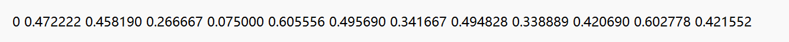
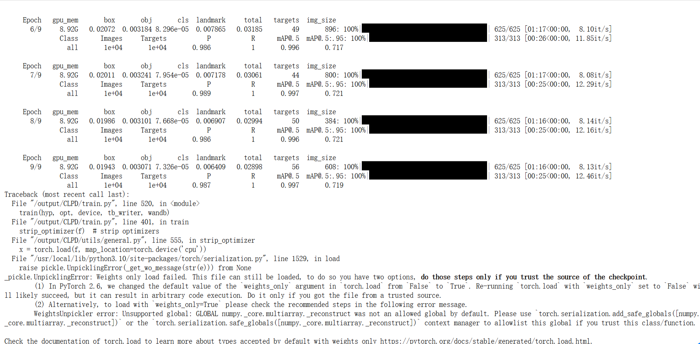

# 1. 数据集

首先数据集的选用我选择的是CCPD2019 (Chinese City Parking Dataset），数据来源：kaggle。
#### （1）训练\Val\Test分段

拆分文件在“split/”文件夹下。
CCPD-Base中的图像被拆分为train/val集合。CCPD中的子数据集（CCPD-DB、CCPD-Blur、CCPD-FN、CCPD-Rotate、CCPD-Tilt、CCPD-Challenge）被用于测试。

#### （2）数据集注释

注释嵌入在文件名中。
示例图片名称为“025-95_113-154&383_386&473-386&473_177&454_154&383_363&402-0_0_22_27_27_33_16-37-15.jpg”。每个名字可以被拆分为七个字段。这些场的解释如下。

- **面积**：车牌面积与整个画面区域的面积比值。
- **倾斜度**：水平倾斜度和垂直倾斜度。
- **边界框坐标**：左上顶点和右下顶点的坐标。
- **四个顶点位置**：整个图像中LP四个顶点的精确（x， y）坐标。这些坐标从右下顶点开始。
- **车牌号**：CCPD中的每张图片只有一张LP。每个LP编号由一个汉字、一个字母和五个字母或数字组成。有效的中国车牌由七个字符组成：省（1个字符）、字母（1个字符）、字母+数字（5个字符）。“0_0_22_27_27_33_16” 是每个字符的索引。这三个数组的定义如下。每个数组的最后一个字符是字母O，而不是数字0。我们用O表示“无字符”，因为中文车牌字符中没有O。
```python
provinces = ["皖", "沪", "津", "渝", "冀", "晋", "蒙", "辽", "吉", "黑", "苏", "浙", "京", "闽", "赣", "鲁", "豫", "鄂", "湘", "粤", "桂", "琼", "川", "贵", "云", "藏", "陕", "甘", "青", "宁", "新", "警", "学", "O"]
alphabets = ['A', 'B', 'C', 'D', 'E', 'F', 'G', 'H', 'J', 'K', 'L', 'M', 'N', 'P', 'Q', 'R', 'S', 'T', 'U', 'V', 'W',
             'X', 'Y', 'Z', 'O']
ads = ['A', 'B', 'C', 'D', 'E', 'F', 'G', 'H', 'J', 'K', 'L', 'M', 'N', 'P', 'Q', 'R', 'S', 'T', 'U', 'V', 'W', 'X',
       'Y', 'Z', '0', '1', '2', '3', '4', '5', '6', '7', '8', '9', 'O']
```
- **亮度**：车牌区域的亮度。
- **模糊度**：车牌区域的模糊度。

#### （3）数据集处理

该数据集并不适配我代码使用的yolov5检测模型的配置，所以要对数据集加以处理，来适配yolo格式，这里采用一个python脚本进行格式转换。
yolo格式：label x y w h  pt1x pt1y pt2x pt2y pt3x pt3y pt4x pt4y
**ccpd2019数据集：**

原来数据集有train：100000张（来自ccpd-base）；val：99996张（来自ccpd-base）；
test：141982张（来自各个子集）。
**ccpd-to-yolo**：将数据集转化成yolo格式，并在原来基础上进行随机抽样，选取2万张作为train，1万张作为val，1万张作为test。

**lable格式如下：**


---

# 2. 环境配置

代码来自于github开源项目：(https://github.com/we0091234/Chinese_license_plate_detection_recognition)，下载后conda创建一个新的环境，使用:
```bash
pip install -r requirement.txt
```
快速配置环境即可，注意选择以下版本，不然会有冲突：
- Python >= 3.6
- numpy 1.26.4
- torch 2.1.0 
- torchvision 0.16.0 （requirements里未提及，需要额外pip一下）

---

# 3. 训练
**命令：**
```bash
python train.py --data data/widerface.yaml --cfg models/yolov5n-0.5.yaml --weights weights/plate_detect.pt --epoch 10
```
车牌检测：



测试：
