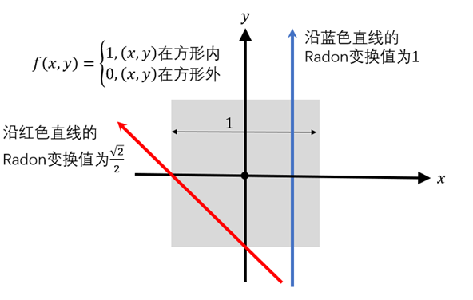
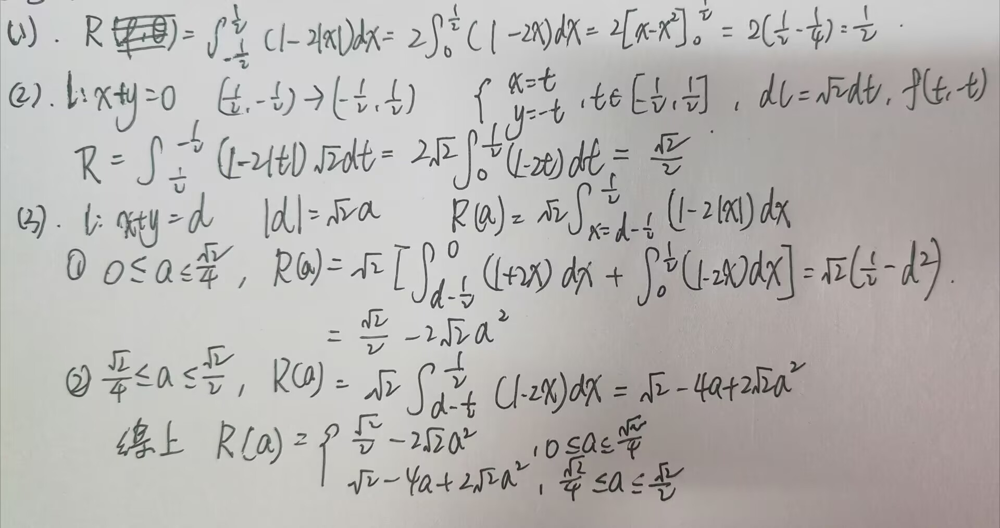
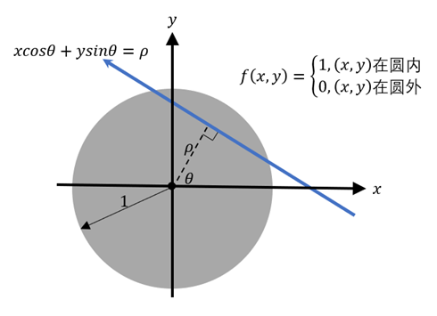
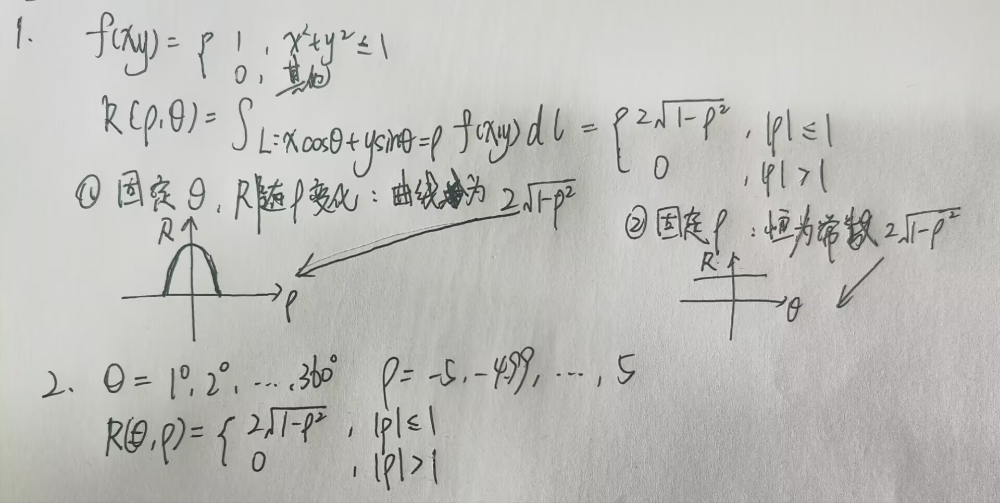
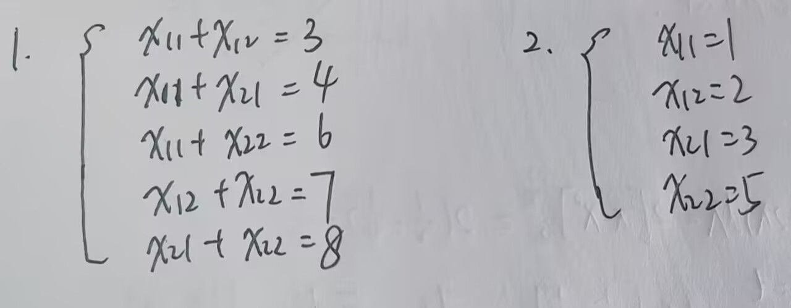

这个试题将帮你入门断层成像（Computed Tomography，简称CT）图像重建算法的原理。

# 1. Radon transform （拉东变换）

CT原始数据可近似为“拉东（Radon）变换”。拉东变换是一个积分变换，它将定义在二维平面上的一个函数f(x,y)沿着平面上的任意一条直线做线积分，相当于对函数f(x,y)做 CT扫描。对于直线$$xcosθ+ysinθ=ρ$$沿着这一条直线的拉东变换定义如下$$R(ρ,θ)=∫_{l∶ xcosθ+ysinθ=ρ}f(x,y)  dl$$或$$R(ρ,θ)=∬_{R^2}dx dy f(x,y)δ(xcosθ+ysinθ-ρ)$$上述两个定义是等价的。
- 例子：
对于一个边长为1的方形（内部值为1），如下图所示，沿着平行于边且与方形相交的直线的Radon变换值为1，沿着如图所示的斜着的方向变换值为√2/2.

 
### 习题1：

假设图像f(x,y)的定义发生改变，内部不在是均匀的，具体如下图。求解下述问题
 
1. 沿着图中蓝色实线的拉东变换值是多少？
2. 沿着方形斜对角线的红色实线（直线$\frac{\sqrt{2}}{2}$x+$\frac{\sqrt{2}}{2}$y=0）拉东变换值是多少？
3. （此题较难）沿着图中距离原点距离为a且平行于方形斜对角线的红色虚线，其拉东变换值是？请分为a∈\[$\frac{\sqrt{2}}{4},\frac{\sqrt{2}}{2}$]与a∈\[0,$\frac{\sqrt{2}}{4}$]两种情况进行讨论。


### 习题2：
 
1. 计算上图所示的f(x,y)【一个半径为1的圆，中心位于原点，圆内值为1】的拉东变换，即对于任意ρ和θ，计算$R(ρ,θ)=∫_{l∶ xcosθ+ysinθ=ρ}f(x,y)  dl$。做出给定角度θ，R(ρ,θ)随着ρ变化的曲线；以及给定ρ，R(ρ,θ)随着θ变化的曲线。提示：结合f(x,y)中心对称特性思考该问题。
2. 现实中我们只能在有限的数据点测量f(x,y)的拉东变换，按照下列标准对R(ρ,θ)进行采样：θ的取值范围是1到360度，以1度为间隔；ρ取值范围是\[-5,5]，以0.01为间隔。以ρ方向为列方向，θ为行方向，画出以此采样后所构成的R(ρ,θ)二维图像。

```python
# 第二问采用python进行绘图
import numpy as np
import matplotlib.pyplot as plt  

# 参数  
theta_deg = np.arange(1, 361)          # 1° 到 360°rho = np.arange(-5, 5.01, 0.01)        # -5 到 5，步长 0.01  
# 计算 R(ρ,θ) 矩阵  
R = np.zeros((len(theta_deg), len(rho)))  
for i, r in enumerate(rho):  
    if abs(r) <= 1:  
        R[:, i] = 2 * np.sqrt(1 - r**2)   # 所有角度行相同  
  
# 绘图  
plt.figure(figsize=(12, 5))  
plt.imshow(R, aspect='auto', origin='lower',  
           extent=[rho[0], rho[-1], theta_deg[0], theta_deg[-1]],  
           cmap='gray')  
plt.colorbar(label='R(ρ,θ)')  
plt.xlabel('ρ')  
plt.ylabel('θ (degrees)')  
plt.title('Radon Transform of a Unit Disk (Sampled)')  
plt.show()
```


# 2. 图像重建的解析算法

在实际应用中，R(ρ,θ)是测量获得的图像，而f(x,y)是未知的，我们需要通过算法从R(ρ,θ)反推f(x,y)，这是一个很有意思的逆问题求解过程。对于图像像素较少的情形，我们可以通过解析方法进行图像重建。

### 习题3：

假设我们待重建的图像维度为2x2，共包含4个像素。该图像沿着如下图中4条直线的拉东变换值为已知量（已在图中标明），我们希望通过拉东变换的值求解图中的像素值（$x_{11},x_{12},x_{21},x_{22}$）。
1. 将拉东变换中的线积分近似为沿着直线路径像素值的求和，写出$x_{11},x_{12},x_{21},x_{22}$满足的线性方程组（共五个方程）。
2. 利用这五个方程，求解$x_{11},x_{12},x_{21},x_{22}$的值。
 


# 3. Fourier Slice Theorem （傅里叶中心切片定理）

在实际场景中，我们需要重建的图像通常包含超过几十万个像素，意味着需要求解一个几十万元一次方程，这个计算的开销是非常大的。一种更为高效的算法称为滤波反投影算法，其中傅里叶中心切片定理是这个算法的核心：对R(ρ,θ)沿着 ρ方向做傅里叶变换
$$R^̃ (k,θ)=∫dρ R(ρ,θ) e^{-i2πρk}$$
$$=∫dρ ∬_{R^2}dx dy f(x,y)δ(xcosθ+ysinθ-ρ) e^{-i2πρk}$$
$$=∬_{R^2}dx dy f(x,y)∫dρ δ(xcosθ+ysinθ-ρ)e^{-i2πρk}$$
$$=∬_{R^2}dx dy f(x,y)e^{-i2πk(xcosθ+ysinθ)}$$
$$=f^̃ (k cosθ,k sinθ)$$
其中$f^̃  (k_x,k_y )=∬_{R^2}dx dy f(x,y) e^{-i2π(xk_x+yk_y ) }$是f(x,y)的傅里叶变换。上述推导为傅里叶中心切片定理：对R(ρ,θ)沿着 ρ方向做傅里叶变换，即是原图f(x,y)的傅里叶变换f ̃(k_x,k_y ) 过原点沿着θ方向的切片，如下图所示：
 
因此通过计算各个角度的$R^̃ (k,θ)$，我们可以得到$f^̃ (k_x,k_y )$，进而通过二维傅里叶逆变换还原原始图像。

### 习题4（此题较难）：

利用这个定理从你计算所得的R(ρ,θ)中复原f(x,y)。
1. 计算R(ρ,θ)对于给定θ的沿着ρ的傅里叶变换$R^̃ (k,θ)$。此变换较难计算解析解，可使用问题2.2中的采样结果进行离散傅里叶变换。对于给定θ，做出$R^̃ (k,θ)$随着k变化的曲线（包括实部和虚部）。
2. 对于给定($k_x,k_y$)，结合傅里叶中心切片定理以及$R^̃ (k,θ)$的值，获得此点对应的$f^̃ (k_x,k_y)$值。此步骤涉及插值。画出$f^̃ (k_x,k_y)$对应的图像。
3. 对$f^̃ (k_x,k_y )$做二维傅里叶反变换获得f(x,y)，画出f(x,y)的图像，观察图像的形状和值，是否复原了原图。
- 提示：
1. 结合f(x,y)中心对称特性可大幅度简化计算。
2. 离散傅里叶变换注意计算变换后数据点对应的频率值。
3. ($k_x,k_y$)的取样需要取均匀的数据点，建议取值范围是-50到50（Nyquist频率），间隔为0.1。
