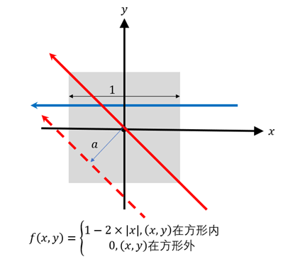
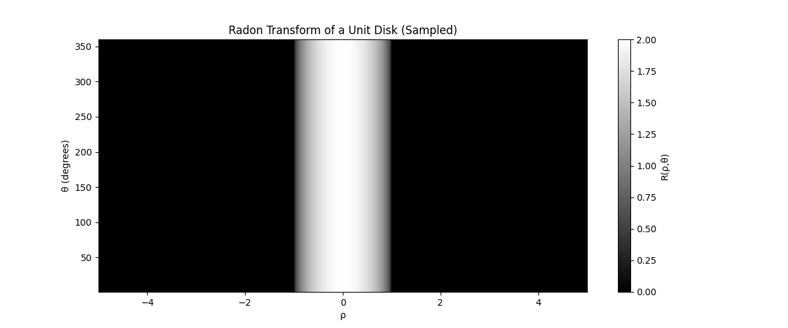
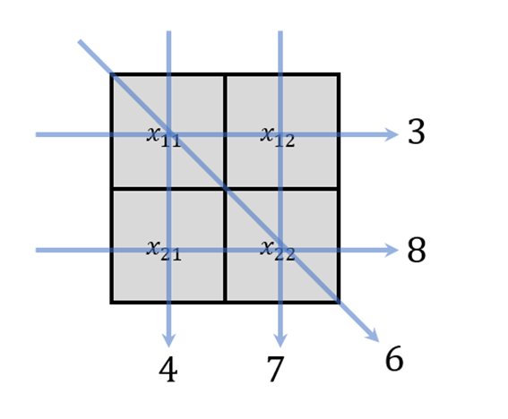
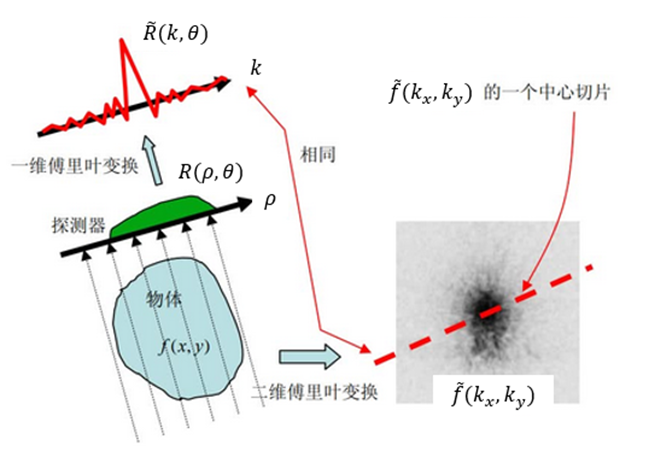
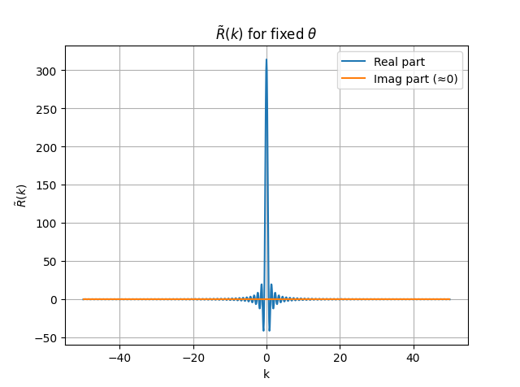
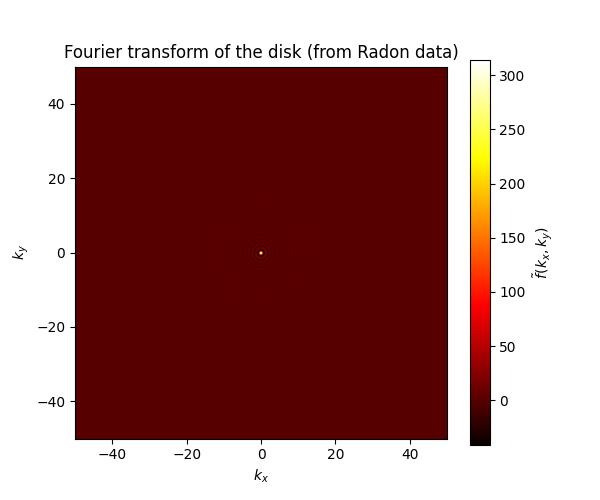
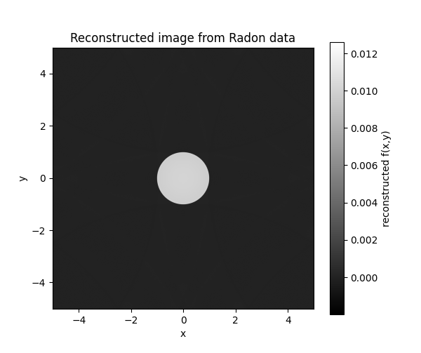

# CT图像重建算法入门

## 任务1学习汇报

汇报人：XXX
日期：2026年4月13日

---

# 一、Radon变换（拉东变换）

## 定义
- CT原始数据可近似为**拉东变换**
- 将二维函数 $f(x,y)$ 沿任意直线做线积分

$$R(\rho,\theta)=\int_{l:\ x\cos\theta+y\sin\theta=\rho}f(x,y)\,dl$$

## 参数含义
- $\rho$：直线到原点的距离
- $\theta$：直线的角度

---

# 习题1：方形图像的拉东变换

## 结果
1. **蓝色实线**（平行于边）：拉东变换值 = **1**
2. **红色实线**（斜对角线）：拉东变换值 = **$\frac{3\sqrt{2}}{4}$**

---

# 习题2：圆形图像的拉东变换

## 计算结果
对于半径为1的圆（圆心在原点，圆内值为1）：

$$R(\rho,\theta)=2\sqrt{1-\rho^2}, \quad |\rho|\leq1$$

## 特性
- 由于中心对称性，$R(\rho,\theta)$ 与 $\theta$ 无关
- 只与 $\rho$（直线到圆心距离）有关

---

# 习题2：采样结果

θ: 1°-360°（间隔1°），ρ: [-5,5]（间隔0.01）

---

# 二、图像重建的解析算法

## 问题设置（习题3）
- 待重建图像：2×2 维度，共4个像素
- 已知：5条直线的拉东变换值

## 求解方法
1. 线积分近似为像素值求和
2. 建立5个线性方程
3. 求解 $x_{11}, x_{12}, x_{21}, x_{22}$

---

# 习题3：图示

---

# 三、傅里叶中心切片定理

## 定理内容
对 $R(\rho,\theta)$ 沿 $\rho$ 方向做傅里叶变换：

$$\tilde{R}(k,\theta)=\tilde{f}(k\cos\theta, k\sin\theta)$$

**意义**：$\tilde{R}(k,\theta)$ 是原图傅里叶变换过原点沿 $\theta$ 方向的切片

---

# 习题4：图像重建步骤

## 步骤
1. 计算 $R(\rho,\theta)$ 沿 $\rho$ 的傅里叶变换 $\tilde{R}(k,\theta)$
2. 通过插值获得 $\tilde{f}(k_x,k_y)$
3. 二维傅里叶逆变换重建 $f(x,y)$

---

# 习题4：重建结果

|           $\tilde{R}(k,\theta)$            |            $\tilde{f}(k_x,k_y)$            |
| :----------------------------------------: | :----------------------------------------: |
|  |  |

**重建图像**：

---

# 总结

1. **Radon变换**是CT成像的数学基础
2. 小规模图像可用**解析方法**重建
3. 大规模图像需使用**滤波反投影算法**
4. **傅里叶中心切片定理**是高效重建的核心

---

# 谢谢！