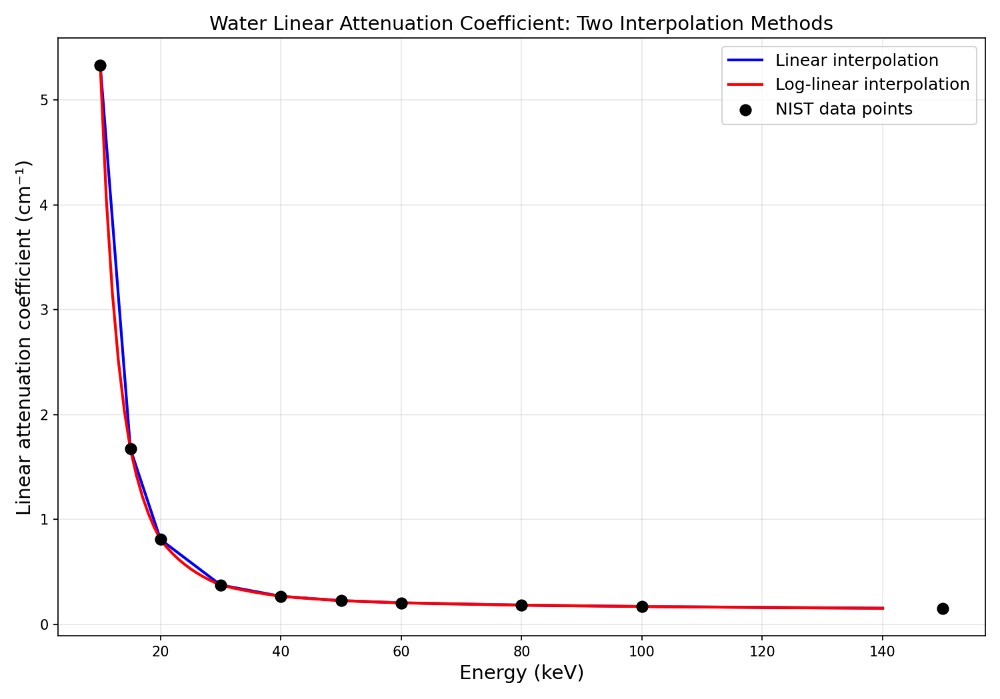
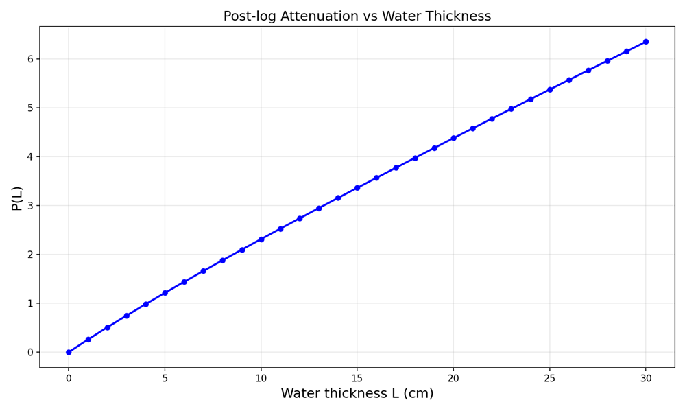
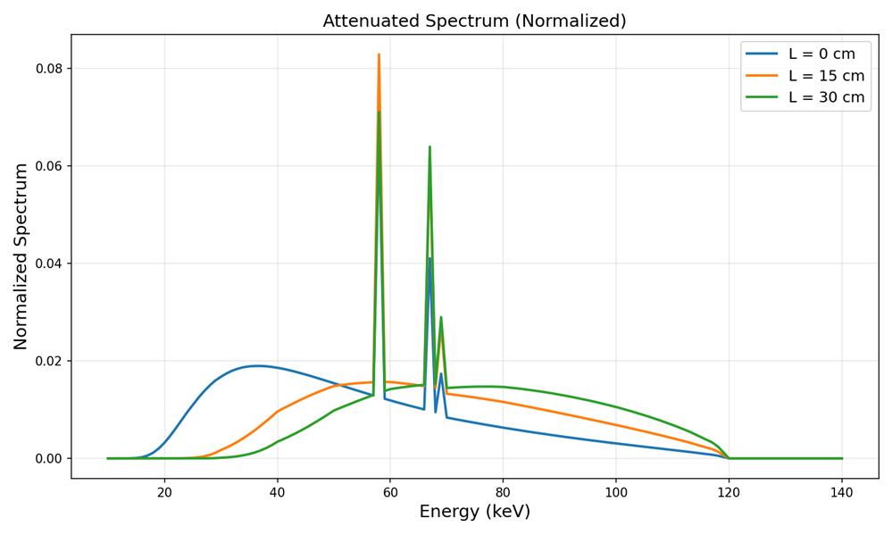

# step1

进入 https://physics.nist.gov/PhysRefData/XrayMassCoef/ComTab/water.html 页面获得水的随能量变化的质量衰减系数（μ/ρ）. 乘以水的密度，得到水的线性衰减系数（注意单位）。
 
利用网页中的数据，进行插值获取10 keV – 140 keV内每隔1 keV的水的线性衰减系数（即 10, 11, 12, …,139, 140 keV 的线性衰减系数）。有两种插值方式: 
a. 直接做线性插值（例如使用matlab函数interp1）
b. 对数据先取对数（即求算lnμ，和ln(E)），再做线性插值，之后通过指数运算($e^{lnμ}$)将数据复原。
画出两种插值方法下线性衰减系数随能量变化的曲线（在线性坐标下画图，不要在对数坐标下画图）。判断哪一种插值方法曲线更加平滑。将更加平滑方法得到的衰减系数值用于后续计算。

```text
在10-140 keV范围内，对数空间插值后指数还原比直接线性插值更平滑，符合衰减系数随能量变化的物理规律（近似指数关系）。
```

# step2

spectrum.txt文件里是一个120 kVp的能谱的信息Ω(E)。利用插值所得的水线性衰减系数的数据和能谱信息，计算不同水的厚度下post-log的衰减值，具体公式推导如下：
假设水的厚度为L。根据beer lambert定律，在单一能量E下的衰减服从$$e^{-μ(E)L}$$对于多能谱，经过衰减后的能谱为$$Ω(E)  e^{-μ(E)L}$$假设探测器为一个理想的光子计数探测器，则探测到的读数为能谱对整个能量的积分$$∫dE Ω(E)  e^{-μ(E)L}$$post-log计算如下$$P(L)= -ln⁡\frac{∫dE Ω(E) e^{-μ(E)L}}{∫dE Ω(E)}$$计算水厚度为0,1,2,…, 30 cm 时P(L)的值，画出P(L)随L变化的曲线。

计算水的厚度为0 cm，15 cm，30 cm时经过衰减后的能谱$Ω(E)  e^{-μ(E)L}$。在同一幅图里画出这三个能谱。为方便观察，可将能谱先归一化再作图。能谱归一化公式为$$Ω_{normalized}=\frac{Ω(E) e^{-μ(E)L}}{∫dE Ω(E) e^{-μ(E)L}}$$观察以上曲线，说说你的观察和想法。
注：以上公式均为解析公式，具体计算需将其离散化，例如
$$∫dE Ω(E)  e^{-μ(E)L}→∑ΔE Ω(E_i )  e^{-μ(E_i )L} $$


# step 3

Cupping artifacts模拟。对于一个给定直径为16 cm的“水盘”，模拟该物体在120 kVp多能谱下的正弦图（sinogram），具体模拟细节如下：正投影为平行束，模拟360个投影角，投影角间隔1度，每个投影角模拟400个平行束，相邻平行束间距为0.05厘米。对于每一束x射线，计算其穿过水盘的厚度L，并根据公式P(L)= -ln⁡〖(∫dE Ω(E) e^(-μ(E)L))/(∫dE Ω(E) )〗, 计算该束x射线对应的正弦图的值。
得到正弦图后，利用FBP算法经行重建，重建的图像的像素值即为多能谱下的衰减系数μ（单位为距离的倒数）。重建过程中注意Ramp核中应包含探测器像素大小的倒数，Ramp核的单位是距离平方的倒数。如果重建正确，得到的图像的值大约为0.2 cm-1. 
将重建的图转化为HU值，具体计算如下
HU=(μ-μ_(water,ref))/μ_(water,ref) ×1000
μ_(water,ref)为水的线性衰减系数的参考值，可通过以下计算获得
μ_(water,ref)=(∫dE Ω(E) μ_water (E))/(∫dE Ω(E) )  
提示：如果你的计算正确，μ_(water,ref)的值应为0.265 cm-1 . 得到的重建图像大致如下图所示(窗宽200HU左右)：
 
针对你重建出的图像，测量如上图虚线标注的两个位置（水盘中心和边缘各一个）平均的HU值。计算HU值之差。
	物理硬化伪影矫正。模拟一个厚度为2mm的x射线滤波片，在数值模拟上的操作如下：
Ω_filtered (E)=Ω(E)  e^(-μ_cu (E) L_cu )
其中Ω(E)为原始120kVp能谱，μ_cu (E)为铜的线性衰减系数，L_cu为铜片厚度（即2mm）。铜的线性衰减系数通过此链接获得 
https://physics.nist.gov/PhysRefData/XrayMassCoef/ElemTab/z29.html. 

将Ω_filtered (E)当做入射光谱（即用Ω_filtered (E)取代Ω(E)）,重复任务3. 
	硬化伪影的软件矫正。首先证明第2问中，P(L)-L曲线，在L=0附近的切线斜率为(∫dE Ω(E) μ_water (E))/(∫dE Ω(E) )，即第2问中的μ_(water,ref)。数学形式为：证明
lim┬(L→0)⁡〖P(L)/L〗=   lim┬(L→0)⁡〖-ln⁡〖(∫dE Ω(E) e^(-μ(E)L))/(L∫dE Ω(E) )=(∫dE Ω(E)μ(E))/(∫dE Ω(E) )〗 〗=μ_(water,ref)
提示：可用洛必达法则证明
由于实际探测器测得的测量值即为P(L)，软件硬化伪影矫正的原理是将多能谱下测得的P(L)折算为服从线性Radon变换的值，具体操作如下：对于120 kVp不带铜滤光片的能谱，计算水厚度为L=0,1,2,…, 30 cm 时P(L)的值，以及μ_(water,ref)×L。以P(L)为x轴，μ_(water,ref)×L为y轴，做出μ_(water,ref)×L 关于 P(L) 变化的曲线。用二次多项式拟合改曲线，即
μ_(water,ref)×L≈a_1 P(L)+a_2 P^2 (L)
拟合曲线获得系数a_1，a_2的值。
对于第3问中获得的正弦图（正弦图每一点的值为P(L)），利用系数a_1，a_2对正弦图进行矫正。利用FBP算法重建校正后的正弦图。将重建图像的值转化为HU值（方法同第三问），测量第3问中虚线标注的两个位置（水盘中心和边缘各一个）平均的HU值。计算HU值之差。
	对第4问中经过铜片滤波的Ω_filtered (E)重复第5问中的软件硬化伪影的操作，重点比较此光谱下的矫正系数a_1,a_2和第5问中是否相同，回答问题：对于某一光谱的硬化伪影矫正系数能直接用于另一光谱吗？
