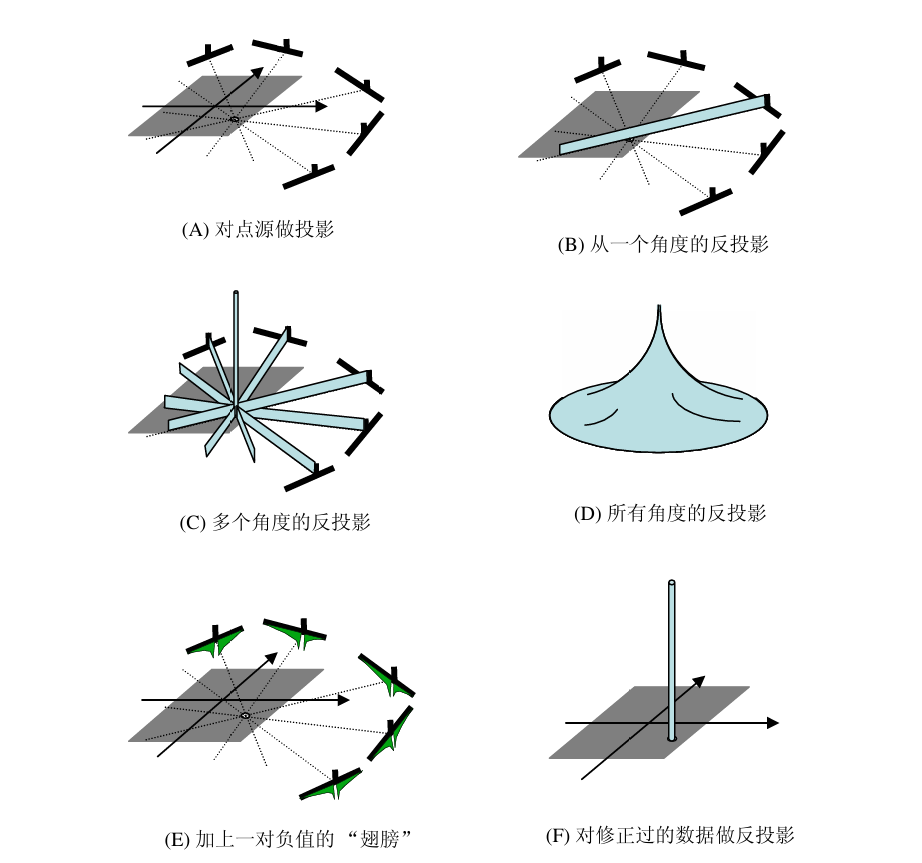
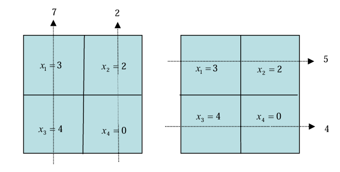
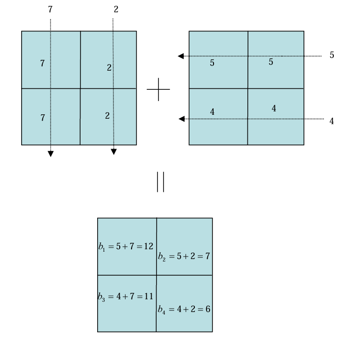
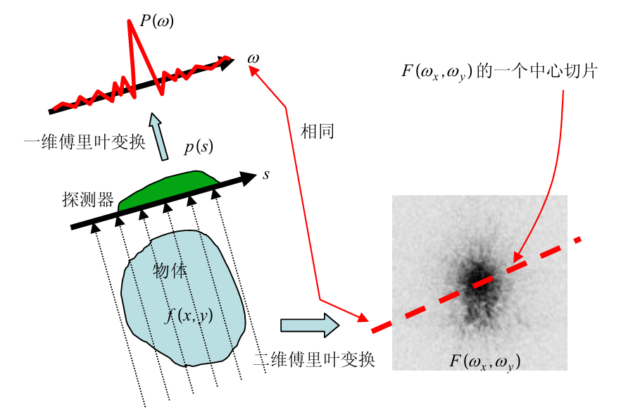
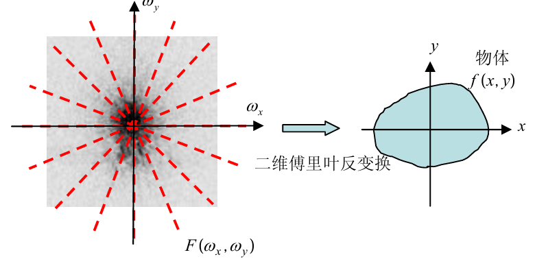

# 第一章 断层成像的基本原理

### 1.1 断层成像

断层成像：得到一个物体的内部的截面图像。
图像重建：从物体的投影数据来得到物体的内部断层成像的过程。

### 1.2 投影

所谓正弦图就是把投影数据显示在s-$\theta$平面上。

### 1.3 图像重建

点源图像重建的**任务**包含两个方面： 一是找出点源的位置，二是找出它的数值。

- 投影：点源在每个角度 p(s,θ)p(s,θ) 上形成一个高度为1的脉冲。
- 反投影（“撒种子”）：将脉冲数值沿投影路径**均匀分布**，多个角度叠加后在点源位置形成高峰。
- 问题：360°反投影得到的图像（图D）**边缘模糊**。
- 改进（滤波反投影）：先在投影脉冲两侧加上**负值“翅膀”**（图E），再反投影，即可得到**清晰图像**（图F）。

本质：先滤波（加负翼），再反投影 → 消除模糊。
投影：把图像“压缩”（线积分）  
反投影：把数据“摊回去”（但会模糊）  
滤波：修正数据，让重建变清晰，添了两个负值“翅膀”的运作叫做滤波。
FBP 算法：先滤波再做反投影的图像重建算法叫。

### 1.4 反投影

反投影 ≠ 投影的逆运算，仅靠反投影无法重建图像。

**2×2 矩阵示例**：
- 原图像 → 计算投影数据（如 p(1,0°)=7,p(2,0°)=2p(1,0°)=7,p(2,0°)=2 等）
- 各角度分别做反投影 → 求和得到最终反投影图像
- 结果：反投影图像 ≠ 原图像，但二者有密切关系。
- 核心：反投影本身不能复原图像，需进一步处理。

# 第二章 平行光束图像重建

### 2.1 傅里叶变换

- 核心思想：函数 p(s) 可表示为不同频率 $\omega$ 的正弦/余弦函数的加权和，权函数为 P($\omega$)（类似白光分解为彩色光谱）。
- 定义：P($\omega$) 是 p(s) 的傅里叶变换；反过来，p(s) 是 P($\omega$) 的反傅里叶变换。两者一一对应，记法：小写 p(s) ↔ 大写 P($\omega$) 。
- 示例：三角形函数的傅里叶变换主峰高（低频丰富），旁瓣随频率升高衰减，并有零值谷点（对应频率在函数中缺失）。
- 推广到二元： f(x,y) 的傅里叶变换为 F($\omega_x$, $\omega_y$)，其中 ($\omega_x$, $\omega_y$) 为方向频率。
- 傅里叶变换能揭示隐藏的数学关系，是后续断层重建（如中心切片定理）的基础。

### 2.2 中心切片定理

- 核心内容：二维函数 f(x,y) 的投影 p(s) 的傅里叶变换 P(ω)，等于 f(x,y) 的二维傅里叶变换 F($ω_x$,$ω_y$) 过原点且平行于探测器的中心切片（下图）。

- 数据采集：探测器绕物体旋转至少 180°，各个方向对应的中心切片就能覆盖整个傅里叶空间。得到完整的 F($ω_x$,$ω_y$)后，通过二维傅里叶反变换即可重建 f(x,y)。

**为什么直接反投影会模糊？**
- 反投影等价于在傅里叶空间中逐角度添加中心切片。
- 中心切片在原点（低频区）密度高，远离原点（高频区）密度低 → 低频分量被过度加权 → 图像边缘模糊。

**两种矫正方案（使傅里叶空间密度均匀）**

| 方案           | 操作                                                                       | 备注               |
| ------------ | ------------------------------------------------------------------------ | ---------------- |
| **方案一（频率域）** | 在 ($ω_x$,$ω_y$) 空间将所得结果乘以 $ω_x^2$+ $ω_y^2$→ 得到 F($ω_x$,$ω_y$) → 二维傅里叶反变换 | 理论清晰，但实际计算量大     |
| **方案二（投影域）** | 将投影数据的一维傅里叶变换 P(ω,θ) 乘以 ω（斜坡滤波器）→ 一维反变换 → 再反投影                           | **FBP 算法**，实际更常用 |
- 第一章的“负值翅膀”：正是斜坡滤波器 ∣ω∣ 在投影域的效果。