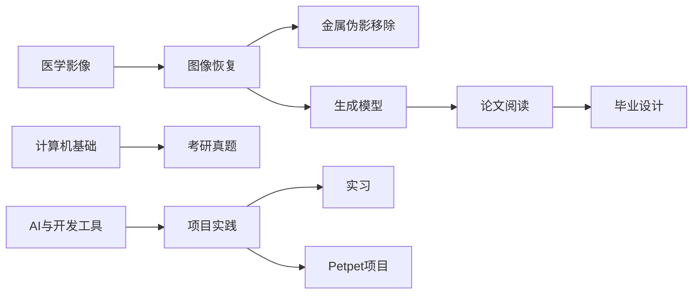

# 知识库总览

> [!summary] Summary
> 从主题、学习路径和项目关系三个入口浏览整个 Obsidian 仓库。

## 快速入口

- [[笔记/知识库/知识库索引]]：按目录列出全部笔记和标签。
- [[笔记/我的Markdown笔记规范与模板]]：新建和整理笔记时使用的结构规范。
- [[笔记/MOC/MOC-医学影像与CT]]：医学影像、CT 重建、伪影校正和 AI 恢复。
- [[笔记/MOC/MOC-生成模型]]：扩散模型、Score-SDE、Flow Matching 和漂移模型。
- [[笔记/MOC/MOC-计算机与考研]]：计算机基础、课程笔记、复习策略和历年真题。
- [[笔记/MOC/MOC-项目与实践]]：项目档案、实习记录和毕业设计。

## 知识域

| 知识域 | 核心问题 | 入口 |
| --- | --- | --- |
| 医学影像 | 如何从投影数据重建 CT，并校正伪影、恢复图像 | [[笔记/MOC/MOC-医学影像与CT]] |
| 生成模型 | 如何从扩散、SDE、流匹配和漂移角度理解生成建模 | [[笔记/MOC/MOC-生成模型]] |
| 计算机与考研 | 如何整理 C++ 基础、题型和复习路径 | [[笔记/MOC/MOC-计算机与考研]] |
| 项目与实践 | 如何把研究、实习和工程项目沉淀为可复用经验 | [[笔记/MOC/MOC-项目与实践]] |
| AI 工具 | 如何使用 Codex、OpenBayes 和 LaTeX 提高工作效率 | [[笔记/Codex介绍]] |

## 推荐学习路径

### CT 与图像恢复

```text
医学图像重建入门
  -> 任务1：Radon 变换与解析重建
  -> 任务2：正投影与反投影程序
  -> 任务3-7：硬化、截断和多能谱伪影
  -> FBPConvNet / RED-CNN / WGAN-GP
  -> CT 金属伪影移除论文
```

### 生成模型

```text
生成模型详解
  -> DDPM：离散扩散
  -> Score-SDE：连续时间与反向 SDE
  -> Flow Matching：向量场与条件路径
  -> 漂移模型：一步式生成
```

### 计算机考研

```text
课程笔记 / 笔试知识整理
  -> 复习策略
  -> 2010-2019 真题
  -> 2023-2024 真题
  -> 按题型回填错题与薄弱知识点
```

## 项目关系



## 维护节奏

- 新笔记先放入最接近的目录，再补充 `summary`、`tags` 和一个上级 MOC 双链。
- 完成一项实验后，把关键参数、结果、问题和下一步写回原笔记，不只保存截图。
- 论文笔记优先补充原文链接、核心贡献、局限和可复现实验。
- 每次新增主题时同步更新 [[笔记/知识库/知识库索引]] 和对应 MOC。
