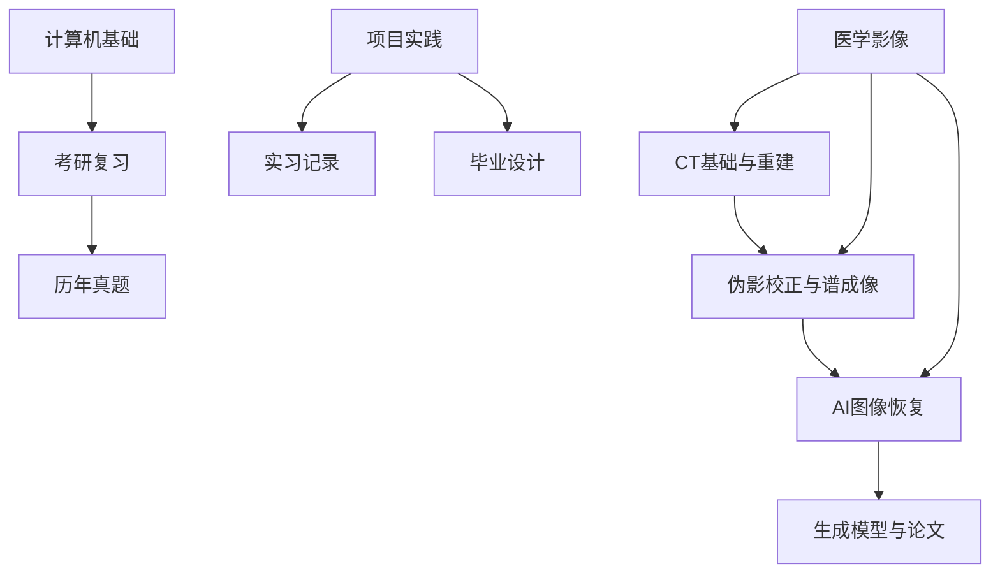

# 知识库索引

这是仓库 Markdown 笔记的入口页。条目使用 Obsidian 双链，标签用于快速筛选主题。

## 知识库导航

- [[笔记/知识库/知识库总览]]：总览、学习路径和知识域关系。
- [[笔记/MOC/MOC-医学影像与CT]]：医学影像与 CT 专题地图。
- [[笔记/MOC/MOC-生成模型]]：生成模型论文专题地图。
- [[笔记/MOC/MOC-计算机与考研]]：计算机基础和考研复习专题地图。
- [[笔记/MOC/MOC-项目与实践]]：项目、实习和毕业设计专题地图。

## AI 与开发工具

- [[笔记/Codex介绍]] #AI #开发工具 #OpenAI
- [[../我的Markdown笔记规范与模板]] #Obsidian #写作规范 #笔记模板
- [[../OpenBayes操作]] #工具 #机器学习
- [[../ASCII 基础信息]] #计算机基础 #字符编码
- [[../LaTeX数学公式语法]] #工具 #LaTeX #数学

## CT 与医学影像

### 基础与重建

- [[../研0/笔记/医学图像重建入门]] #医学影像 #CT #图像重建
- [[笔记/研0/笔记/窗[-180 , -100]]] #医学影像 #CT #窗宽窗位
- [[../研0/CT成像基础以及简单的图像重建及伪影移除算/任务1 X射线CT图像重建原理]] #医学影像 #CT #Radon变换
- [[../研0/CT成像基础以及简单的图像重建及伪影移除算/任务2 使用mgfpj和mgfbp正投影反投影程序]] #医学影像 #CT #投影重建

### 伪影校正与谱成像

- [[../研0/CT成像基础以及简单的图像重建及伪影移除算/任务3 硬化伪影矫正方法]] #医学影像 #CT #硬化伪影
- [[../研0/CT成像基础以及简单的图像重建及伪影移除算/任务4 软组织硬化伪影矫正方法]] #医学影像 #CT #伪影校正
- [[../研0/CT成像基础以及简单的图像重建及伪影移除算/任务5 双能材料分解]] #医学影像 #CT #双能CT #材料分解
- [[../研0/CT成像基础以及简单的图像重建及伪影移除算/任务6 多能谱投影与经验性骨硬化伪影]] #医学影像 #CT #多能谱
- [[../研0/CT成像基础以及简单的图像重建及伪影移除算/任务7 华科兔子数据的重建与截断伪影的去除]] #医学影像 #CT #截断伪影

### AI 图像恢复

- [[../研0/基于AI的CT图像恢复任务/任务1/FBPConvNet 低剂量CT图像恢复实验报告]] #医学影像 #CT #深度学习 #低剂量CT
- [[../研0/基于AI的CT图像恢复任务/任务1/基于残差编解码卷积神经网络（RED-CNN）的低剂量CT图像重建]] #医学影像 #CT #深度学习 #RED-CNN
- [[../研0/基于AI的CT图像恢复任务/任务1/基于深度卷积神经网络的图像逆问题求解]] #医学影像 #深度学习 #图像逆问题
- [[../研0/基于AI的CT图像恢复任务/任务2/低剂量CT图像去噪（WGAN-GP与VGG感知损失的对比研究）]] #医学影像 #CT #图像去噪 #GAN
- [[../研0/基于AI的CT图像恢复任务/任务2/基于 Wasserstein 距离和感知损失的生成对抗网络在低剂量 CT 图像去噪中的应用]] #医学影像 #CT #图像去噪 #GAN

## 考研与计算机基础

### 真题

- [[笔记/考研/真题/2010 年-东南大学计算机553笔试试卷]] #考研 #计算机 #真题
- [[笔记/考研/真题/2011 年-东南大学计算机553笔试试卷]] #考研 #计算机 #真题
- [[笔记/考研/真题/2012 年-东南大学计算机553笔试试卷]] #考研 #计算机 #真题
- [[笔记/考研/真题/2013 年-东南大学计算机553笔试试卷]] #考研 #计算机 #真题
- [[笔记/考研/真题/2014 年-东南大学计算机553笔试试卷]] #考研 #计算机 #真题
- [[笔记/考研/真题/2015 年-东南大学计算机553笔试试卷]] #考研 #计算机 #真题
- [[笔记/考研/真题/2016 年-东南大学计算机553笔试试卷]] #考研 #计算机 #真题
- [[笔记/考研/真题/2017 年-东南大学计算机553笔试试卷]] #考研 #计算机 #真题
- [[笔记/考研/真题/2018 年-东南大学计算机553复试笔试试卷]] #考研 #计算机 #真题 #复试
- [[笔记/考研/真题/2019 年-东南大学计算机553笔试试卷]] #考研 #计算机 #真题
- [[笔记/考研/真题/2023 年-东南大学计算机553笔试试卷]] #考研 #计算机 #真题
- [[笔记/考研/真题/2024 年-东南大学计算机553笔试试卷]] #考研 #计算机 #真题

### 复习资料

- [[笔记/考研/知识/复习策略]] #考研 #复习计划
- [[笔记/考研/知识/笔试知识整理]] #考研 #计算机基础
- [[笔记/考研/知识/课程笔记]] #考研 #计算机基础 #C++

## 生成模型与论文

- [[../../项目/学习/多任务成像/相关论文/四篇学习笔记/生成模型详解]] #生成模型 #深度学习 #论文笔记
- [[../../项目/学习/多任务成像/相关论文/论文1：去噪扩散概率模型（DDPM）]] #生成模型 #扩散模型 #论文
- [[../../项目/学习/多任务成像/相关论文/论文2：通过随机微分方程进行基于分数的生成建模]] #生成模型 #扩散模型 #SDE #论文
- [[../../项目/学习/多任务成像/相关论文/论文3：用于生成建模的流匹配]] #生成模型 #FlowMatching #论文
- [[../../项目/学习/多任务成像/相关论文/论文4：通过漂移进行生成建模]] #生成模型 #论文

## CT 金属伪影移除论文

- [[../../项目/学习/CT金属伪影移除/相关论文/论文1：计算断层扫描中的标准化金属伪影校正（NMAR）]] #医学影像 #CT #金属伪影 #论文
- [[../../项目/学习/CT金属伪影移除/相关论文/论文2：利用多解剖部位临床患者数据中的解剖先验信息和注意力机制实现低剂量CT成像的深度CNN去噪方法学习]] #医学影像 #CT #图像去噪 #论文
- [[../../项目/学习/CT金属伪影移除/相关论文/论文3：InDuDoNet+用于CT图像金属伪影去除的深度展开双域网络]] #医学影像 #CT #金属伪影 #深度展开
- [[../../项目/学习/CT金属伪影移除/相关论文/论文4：一种基于MoE的统一图像复原框架，用于恶劣天气条件]] #图像恢复 #MoE #论文

## 项目与实习

### 项目档案

- [[../../项目/Petpet/Petpet 总档案]] #项目 #Python #PyQt5 #AI
- [[项目/Petpet/pet]] #项目 #Python #PyQt5 #工程协作
- [[项目/其他/CLPD（车牌检测）]] #项目 #计算机视觉 #车牌检测
- [[项目/其他/DETR]] #项目 #目标检测 #Transformer
- [[项目/超级英雄/superhero-local]] #项目 #游戏 #Python

### 实习记录

- [[项目/实习/校内集中实习/Zombies Run]] #实习 #项目实践
- [[项目/实习/长天智远/基于yolov7的夜间车灯识别车辆]] #实习 #YOLOv7 #目标检测 #车灯检测
- [[项目/实习/长天智远/模型训练复盘 —— YOLOv7 车灯检测]] #实习 #YOLOv7 #模型训练 #复盘

### 毕业设计

- [[../../项目/学习/毕业设计/外文翻译-Video Test-Time Adaptation for Action Recognition]] #毕业设计 #动作识别 #论文翻译
- [[../../项目/学习/毕业设计/面向真实课堂场景的自适应动作识别方法研究与实现]] #毕业设计 #动作识别 #深度学习

## 日记

- [[../日记/恋爱日记]] #日记 #生活

## 主题关系

> [!note] 维护规则
> 新增笔记时，先在文件中加入主题标签，再将它补充到对应分类；跨主题笔记可在“主题关系”中增加一条双链。
