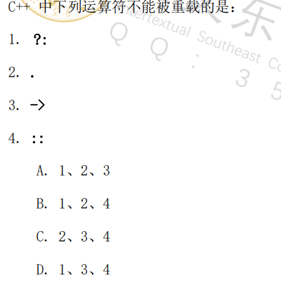
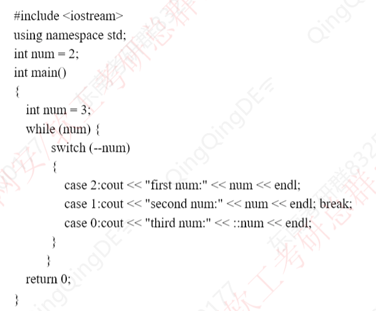
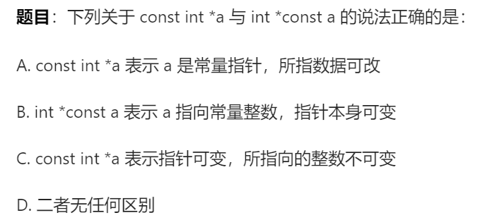
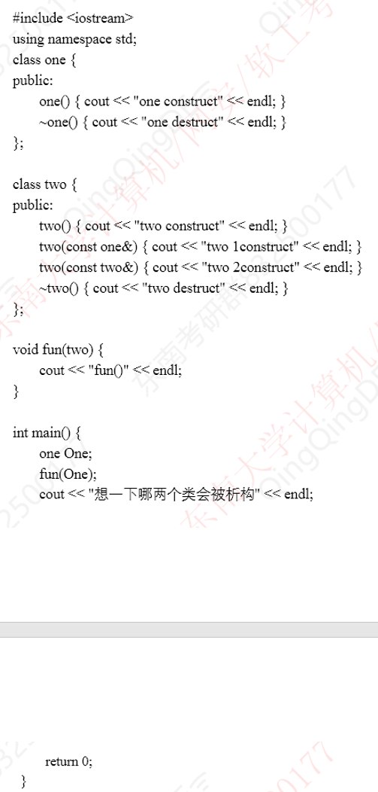

# 一、 特殊运算符

### 1.sizeof

计算数据类型/变量/表达式字节大小，编译时确定结果，不执行表达式。
```c++
int a=3
int b=sizeof(a++);
cout<< a << b <<endl; // 3 4
```

### 2. ? : (三目运算符)

```text
条件表达式 ? 表达式1 : 表达式2
```
不可重载

### 3. ::（作用域解析运算符）

访问全局变量，类静态成员，命名空间，不可重载。

### 4. ->与 .

```text
. 对象直接访问，不可重载。
-> 指针访问，可重载。
```

```c++
#include<bits/stdc++.h>
using namespace std;
class Text{
	public:
		static int static_val;
}
int main(){
	Test t;
	Test* p=&t;
	cout<<t.static_val<<endl;
	cout<<p->static_val<<endl;
	return;
}
```

### 5. new/delete , new[]/delete[]

可重载

### 6.相关例题

- **例题1**

答案：B  分析：见上笔记
- **例题2**

答案：
```c++
first num:2
second num:2
second num:1
third num:2
```

# 二、常量

### 1. const/constexpr

1. 修饰变量：定义时初始化，后续不可改
2. 修饰指针：
```c++
const int* p; //修饰指针指向内容
int* const p; //修饰指针本身
const int* const p; //既修饰指针本身，也修饰指针指向内容
```
3. 修饰成员函数：
```c++
void func() const //函数内不能修改成员变量，只能调用其他const成员函数
```
4. 例子：
```c++
#include<bits/stdc++.h>
using namespace std;
class Test{
private:
	int x;
public:
	Test(int val):x(val){}
	void print() const{
		x=10; //❌错误，常含数中修改变量属性
		cout<<x<<endl; 
	}
	void setX(int val){x:val}
};
int mian(){
	const int a=5;
	a=10; //❌错误，修改常量属性
	int b=10;
	
	const int* p1=&b;
	*p1=20; //❌错误，const int*修饰指针指向内容
	b=20;
	
	int* const p2=&b;
	p2=&a; //❌错误，int* const修饰指针本身
	*p2=30;
	
	const int* const p3=&b
	p3=&a; //❌，const int* const既修饰指针本身，也修饰指针指向内容
	*p3=40; //❌，const int* const既修饰指针本身，也修饰指针指向内容
	
	const Test t(10);
	t.print();
	t.setX(20); //❌，函数内不能修改成员变量，只能调用其他const成员函数
	
	Test t(20);
	t.print();
	t.setX(10);
	
	return 0;
}
```

### 2. 相关例题

答案：C  解析：见上笔记

# 三、构造和析构

### 1. 构造

- 局部对象：定义时构造（进入作用域时构造）。
- 全局对象：程序启动/main函数执行前构造。
- 静态对象：第一次进入作用域时构造，生命周期贯穿程序。

### 2. 析构

局部对象：作用域结束时（如函数返回、代码块家属）析构。
全局/静态对象：程序结束（main函数执行后）析构。

### 3.例题

、
答案：
```c++
one construct
two 1construct
fun()
two destruct
想一下那两个类会被析构
one destruct
```

# 四、赋值构造函数（拷贝）

### 1. 调用时机

- 用一个对象初始化另一个对象时 class a(b)；。
- 函数以值传递方式传参时。
- 函数返回值为对象时。
```c++
#include<bits/stdc++.h>
using namespace std;

class Test{
public:
	int x
	Test(int a):x(a){cout<<"普通构造"<<endl;}
	
	Test(const Test& t){
		this->x=t.x;
		cout<<"拷贝构造"<<endl;
	}
	
	void func(Test e){
		return t;
	}
	
	int main(){
		Test a(10);
		Test b=a; //Test b(a);
		func(b);
	}

}
```

# 五、父/子类在中的构造与析构

### 1. 构造与析构的顺序

1. 构造顺序：
```text
父类->子类的内嵌对象->子类
```
2. 析构顺序：
```text
子类->子类的内嵌对象->父类
```

### 2. 相关例题

```c++
class A{
private:
	int n;
public:
	A(int a = 0) {
		n = a;
		cout << "A Constructor" << n << end1;
	}
	A(const A& a) {
		n = a.n;
		cout << "A copy constructor " << n << end1;
	}
	virtual void print(){
		cout << "A n=" << n << endl;
	}
):

class B :public A (
private:
	A a;
	int n;
public:
	B(int x = 0) :A(x), a(x) {
		n = x;
		cout << "B Constructor " << n << endl;
	}
	void print(){
		A::print();
		cout << "B m=" << N << end1;
	}
};

int main() {
	A a(5);
	A a1(a);
	B b(6);
	A* p = &a;
	p->print();
	p = &a1;
	p->print();
	p = &b;
	p->print():
	return 0;
}
```
答案：
 ```c++
 A con
 
 ```


