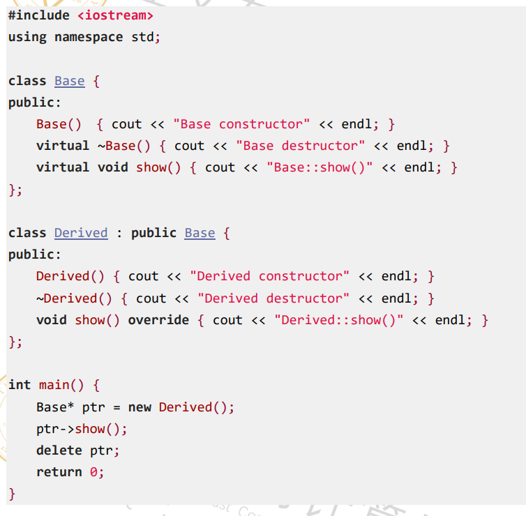

# 一、 特殊运算符

### 1.sizeof

计算数据类型/变量/表达式字节大小，编译时确定结果，不执行表达式。
```c++
int a=3
int b=sizeof(a++);
cout<< a << b <<endl; // 3 4
```

### 2. ? : (三目运算符)

```text
条件表达式 ? 表达式1 : 表达式2
```
不可重载

### 3. ::（作用域解析运算符）

访问全局变量，类静态成员，命名空间，不可重载。

### 4. ->与 .

```text
. 对象直接访问，不可重载。
-> 指针访问，可重载。
```

```c++
#include<bits/stdc++.h>
using namespace std;
class Text{
	public:
		static int static_val;
}
int main(){
	Test t;
	Test* p=&t;
	cout<<t.static_val<<endl;
	cout<<p->static_val<<endl;
	return;
}
```

### 5. new/delete , new[]/delete[]

可重载

### 6.相关例题

- **例题1**

答案：B  分析：见上笔记
- **例题2**

答案：
```c++
first num:2
second num:2
second num:1
third num:2
```

# 二、常量

### 1. const/constexpr

1. 修饰变量：定义时初始化，后续不可改
2. 修饰指针：
```c++
const int* p; //修饰指针指向内容
int* const p; //修饰指针本身
const int* const p; //既修饰指针本身，也修饰指针指向内容
```
3. 修饰成员函数：
```c++
void func() const //函数内不能修改成员变量，只能调用其他const成员函数
```
4. 例子：
```c++
#include<bits/stdc++.h>
using namespace std;
class Test{
private:
	int x;
public:
	Test(int val):x(val){}
	void print() const{
		x=10; //❌错误，常含数中修改变量属性
		cout<<x<<endl; 
	}
	void setX(int val){x:val}
};
int mian(){
	const int a=5;
	a=10; //❌错误，修改常量属性
	int b=10;
	
	const int* p1=&b;
	*p1=20; //❌错误，const int*修饰指针指向内容
	b=20;
	
	int* const p2=&b;
	p2=&a; //❌错误，int* const修饰指针本身
	*p2=30;
	
	const int* const p3=&b
	p3=&a; //❌，const int* const既修饰指针本身，也修饰指针指向内容
	*p3=40; //❌，const int* const既修饰指针本身，也修饰指针指向内容
	
	const Test t(10);
	t.print();
	t.setX(20); //❌，函数内不能修改成员变量，只能调用其他const成员函数
	
	Test t(20);
	t.print();
	t.setX(10);
	
	return 0;
}
```

### 2. 相关例题

答案：C  解析：见上笔记

# 三、构造和析构

### 1. 构造

- 局部对象：定义时构造（进入作用域时构造）。
- 全局对象：程序启动/main函数执行前构造。
- 静态对象：第一次进入作用域时构造，生命周期贯穿程序。

### 2. 析构

局部对象：作用域结束时（如函数返回、代码块家属）析构。
全局/静态对象：程序结束（main函数执行后）析构。

### 3.例题

、
答案：
```c++
one construct
two 1construct
fun()
two destruct
想一下那两个类会被析构
one destruct
```

# 四、赋值构造函数（拷贝）

### 1. 调用时机

- 用一个对象初始化另一个对象时 class a(b)；。
- 函数以值传递方式传参时。
- 函数返回值为对象时。
```c++
#include<bits/stdc++.h>
using namespace std;

class Test{
public:
	int x
	Test(int a):x(a){cout<<"普通构造"<<endl;}
	
	Test(const Test& t){
		this->x=t.x;
		cout<<"拷贝构造"<<endl;
	}
	
	void func(Test e){
		return t;
	}
	
	int main(){
		Test a(10);
		Test b=a; //Test b(a);
		func(b);
	}

}
```

# 五、父/子类在中的构造与析构

### 1. 构造与析构的顺序

1. 构造顺序：
```text
父类->子类的内嵌对象->子类
```
2. 析构顺序：
```text
子类->子类的内嵌对象->父类
```

### 2. 相关例题

- **例题一**
```c++
class A{
private:
	int n;
public:
	A(int a = 0) {
		n = a;
		cout << "A Constructor" << n << end1;
	}
	A(const A& a) {
		n = a.n;
		cout << "A copy constructor " << n << end1;
	}
	virtual void print(){
		cout << "A n=" << n << endl;
	}
):

class B :public A (
private:
	A a; 
	int n;
public:
	B(int x = 0) :A(x), a(x) {
		n = x;
		cout << "B Constructor " << n << endl;
	}
	void print(){
		A::print();
		cout << "B m=" << N << end1;
	}
};

int main() {
	A a(5);
	A a1(a);
	B b(6);
	A* p = &a;
	p->print();
	p = &a1;
	p->print();
	p = &b;
	p->print():
	return 0;
}
```
答案：
```c++
A constructor 5
A constructor 5
A constructor 6 //基类
A constructor 6 //内嵌对象
B constructor 6
A n=5
A n=5
A n=6
B m=6
```

- **例题二**

答案：
```c++
Base ConstructorDerived constructor
Derived:show()
Derived destructor
Base destructor
```

# 六、运算符重载

### 1. 规则

 - 不能创造新运算符，只能重载已有运算符
 - 优先级、结合性、操作数个数不变
 - 部分运算符必须重载为成员函数：=、（）、[]、->
 - 部分运算符不能重载
```c++
#include <iostream>
using namespace std;

class Point {
private:
    int x, y;
public:
    Point(int x=0, int y=0) : x(x), y(y) {}
    
    // 成员函数重载+：Point + Point
    Point operator+(const Point& p) const {
        return Point(x + p.x, y + p.y);
    }
    
    // 友元函数重载<<：cout << Point
    friend ostream& operator<<(ostream& os, const Point& p) {
        os << "(" << p.x << "," << p.y << ")";
        return os;
    }
    
    // 成员函数重载[]：访问x或y（0返回x，1返回y）
    int& operator[](int idx) {
        if (idx == 0) return x;
        else if (idx == 1) return y;
        throw "下标错误";
    }
};

int main() {
    Point p1(1,2), p2(3,4);
    Point p3 = p1 + p2; // 调用operator+
    cout << "p1 + p2 = " << p3 << endl; // 调用operator<<
    
    p3[0] = 5; // 调用operator[]
    p3[1] = 6;
    cout << "修改后p3 = " << p3 << endl;
    
    return 0;
}

```

### 2. 例题
设计一个MySet，是一个集合类，其中有2个数据成员，为整形指针ptr，表示大小的整数size，并且此数组中的成员不可以重复。要求实现以下功能:
(1) 有构造函数,析构函数,复制构造函数
(2) 可以实现插入一个元素,删除一个元素
(3) 重载运算符+和 <<
(4) 可以查找一个元素,返回下标
- **我的答案：**
```c++
class Myset{
private:
	int *ptr;
	int size;
public:
	//构造函数
	Myset(int a[],int size=0){
		for(int i=0;i<size;i++){
			*(ptr+i)=a[i];
		}
	}
	//析构函数
	~myset(){delete *ptr;}
	//复制构造函数
	Myset(Myset& a){
		a.size=size;
		for(int i=0;i<size;i++){
			a.*(ptr+i)=*(ptr+i);
		}
	}
	//插入一个元素
	void Insert(int x){
		*(ptr+size)=x;
		size++;
	}
	//删除一个元素
	int Delete(){
		int x=*(ptr+size);
		size--;
		delete *(ptr+size);
		return x;
	}
	//算术运算符+
	Myset operator+(Myset& a)
		Myset b;
		if(size=a.size) {
			b.size=size;
			for(int i=0;i<size;i++){
				b.*(ptr+i)=*(ptr+i)+a.*(ptr+i);
			}
			return b;
		}
		else {
			cout<<无法实现的加法;
			return;
		}
	}
	//算术运算符<<
	Myset ostream& operator<<(ostream& os,Myset& a){
		for(int i=0;i<a.size;i++){
			os<<a.*(ptr+i)<<" ";
		}
		return os;
	}
	//查找一个元素，返回下标
	int find(int x){
		for(int i=0;i<size;i++){
			if(*(ptr+i)==x){
				return i;
			}	
		}
	}
};
```
- **批改建议：**
构造函数中ptr是野指针，未动态分配内存就直接解引用赋值
析构函数delete ptr语法错误，==动态数组应使用delete[] ptr，单个变量用delete ptr==
Delete函数中delete (ptr+size)无意义，不能删除数组单个元素，数组内存是连续的，只能整体释放
析构函数名写错：类名是Myset，析构函数必须是~Myset()（大小写一致），原代码~myset()错误
成员访问语法错误：所有`a.(ptr+i)`、`b.(ptr+i)`都是错误写法，正确应为`(a.ptr+i)`或`a.ptr[i]`
运算符重载语法错误：operator+缺少函数体大括号
条件判断错误：if(size=a.size)是赋值操作，不是判断相等，正确应为if(size == a.size)
- **订正：**
```c++
class Myset{
private:
	int *ptr;
	int size;
public:
	//构造函数
	Myset(int a[], int n = 0) : size(n) {
        if (n > 0) {
            ptr = new int[n];
            for (int i = 0; i < n; i++)
                ptr[i] = a[i];           
        } 
		else
            ptr = nullptr;           
    }
	//析构函数
	~Myset(){delete [] ptr;}
	//复制构造函数
	Myset(Myset& a){
		a.size=size;
		for(int i=0;i<size;i++){
			*(a.ptr+i)=*(ptr+i);
		}
	}
	//插入一个元素
	void Insert(int x){
		*(ptr+size)=x;
		size++;
	}
	//删除一个元素
	int Delete(){
		if(size>0){
			size--;
			return *(ptr+size);
		}
		else {
			cout<<"无法删除元素，集合为空"<<endl;
			return -1; // 返回-1表示删除失败
		}
	}
	//算术运算符+
	Myset operator+(Myset& a){
		Myset b;
		if(size==a.size) {
			b.size=size;
			for(int i=0;i<size;i++){
				*(b.ptr+i)=*(ptr+i)+*(a.ptr+i);
			}
			return b;
		}
		else {
			cout<<"无法实现的加法"<<endl;
			return Myset(); // 返回一个空的Myset对象
		}
	}
	//算术运算符<<
	Myset ostream& operator<<(ostream& os,Myset& a){
		for(int i=0;i<a.size;i++){
			os<<*(a.ptr+i)<<" ";
		}
		return os;
	}
	//查找一个元素，返回下标
	int find(int x){
		for(int i=0;i<size;i++){
			if(*(ptr+i)==x){
				return i;
			}	
		}
		return -1; // 如果未找到元素，返回-1
	}
};
```

# 七、虚函数

### 1. 动态绑定vs静态绑定

（1）运行时确定 / 编译时执行
（2）虚函数的virtual必须加，继承的子类里override可以不加

```c++
class Base{
public:
	void show(){
		cout<<1<<endl;
	}
};
class Derived:public Base{
public:
	void show(){
		cout<<2<<endl;
	}
}
int main(){
	Base* p=new Derived; //调用父类
	p->show();
	return 0;
}
```

### 2. 例题

- **写出下面程序输出结果:**
```c++
#include <iostream>
using namespace std;

class Base {
public:
	Base() { cout << "Base constructor" << endl; }
	virtual ~Base() { cout << "Base destructor" << endl; }
	virtual void show() { cout << "Base :: show()" << endl; }
};

class Derived : public Base {
public:
	Derived() { cout << "Derived constructor" << endl; }
	~Derived() { cout << "Derived destructor" << endl; }
	void show() override { cout << "Derived: : show()" << endl; }
};

int main() {
	Base* ptr = new Derived();
	ptr->show();
	delete ptr;
	return 0;
}
```
- **输出：**
```c++
Base constructor
Derived constructor
Derived: : show()
Derived destructor
Base destructor
```

# 八、虚析构函数

不用虚析构函数，只会删除父类的空间，而子类的没有删除，在成内存泄漏，使用虚析构函数时则可以同时调用两个函数同时删除。

# 九、纯虚函数

### 1.`virtual 返回值 函数名()=0;` 

无函数体 将类变为抽象类
```c++
class shape{
public:
	virtual double getArea()=0;
};
class Circle:public Shape{
private:
	double r;
public:
	double getArea() override{
		return 3.14*r*r;
	}
}
class Rectangle:public Shape{
private:
	double w,h;
public:
	double 
}
```