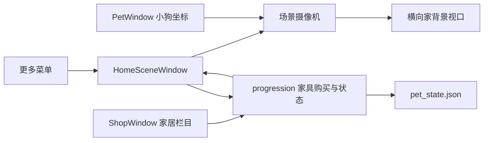

# 家场景系统设计

> [!summary] Summary
> 第一版新增一个可显示或隐藏的“家”场景。场景板固定在屏幕上，小狗在其内部移动；横向摄像机跟随小狗并在房间边界夹限。玩家可用 Pet 币购买家居并在场景内自由摆放。

## 目标

- 从 `更多 → 家` 进入或聚焦家场景。
- 显示一张可横向滚动的暖色家居背景，小狗位于背景前方。
- 在不修改小狗现有动画、物理和穿戴装饰逻辑的前提下，为家场景增加独立家具层。
- 扩展现有商店，使玩家可购买并布置家具。

## 第一版范围

- 一个“家”场景，背景世界宽度大于展示视口宽度。
- 固定尺寸的无边框场景板，打开时放置在当前小狗所在屏幕的可见区域内。
- 场景启用时，小狗位置限制在场景板范围内；小狗向左右移动时，背景视口横向跟随。
- 摄像机在背景左右边缘停止，小狗不会离开场景板可见范围。
- 场景板右上角提供显示/隐藏背景板按钮和“布置”入口。
- 家具只承担视觉摆放，不参与碰撞、重力、遮挡判定、属性变化或行为事件。
- 首批家居：地毯、沙发、绿植、壁画。每件为透明 PNG，可购买、拖动、持久化保存。

## 非目标

- 不制作多房间、上下滚动地图、家具动画、碰撞或任务系统。
- 不让家具改变饱腹、心情、精力、经验、好感或 Pet 币收益。
- 不把现有小狗穿戴装饰迁移为场景家具。

## 架构



- `HomeSceneWindow` 是固定在屏幕上的独立背景窗口，位于小狗窗口后方。
- `PetWindow` 继续负责小狗的动画、拖拽、物理和原有穿戴装饰；家模式仅为其活动位置增加场景边界夹限。
- 场景逻辑集中为独立模块：定义场景尺寸、摄像机偏移、坐标转换和家具位置夹限，避免向 `pet.py` 堆叠纯计算逻辑。
- 家具使用场景世界坐标保存。窗口视口发生变化时，通过 `world_x - camera_x` 绘制，故家具会与背景一起滚动。

## 数据模型

`pet_state.json` 在加载时补齐以下字段：

```json
{
  "home_scene": {
    "enabled": false,
    "background_visible": true,
    "screen_index": 0,
    "viewport_x": 0,
    "viewport_y": 0
  },
  "owned_home_decorations": [],
  "placed_home_decorations": {}
}
```

- `enabled`：是否处于家场景模式。
- `background_visible`：仅控制场景板视觉显示；关闭后不清除场景和家具数据。
- `screen_index`：场景板所在屏幕，用于多显示器恢复。
- `viewport_x`、`viewport_y`：固定尺寸场景板的屏幕位置。
- `owned_home_decorations`：已购买家具 ID 列表。
- `placed_home_decorations`：以家具 ID 为键，保存 `{ "x": number, "y": number }` 场景世界坐标。

购买会沿用 `pet_coins`、`coins_spent` 和现有存档归一化模式。家具定义与小狗穿戴装饰分开维护，以避免类别和绘制规则混用。

## 交互流程

1. 玩家从 `更多 → 家` 打开家场景；场景板落在当前小狗显示器内，场景板可见。
2. 小狗在场景板内走动、拖动或受物理影响时，位置被场景范围限制；摄像机随其世界 X 坐标移动。
3. 玩家点击右上角眼睛按钮，可隐藏或显示场景板；家具和摄像机状态保留。
4. 玩家点击“布置”，商店打开到“家居”栏目。
5. 购买成功的家具默认置于当前可见场景中心；玩家按住家具拖动，松开后立即保存位置。
6. 重启后，场景显示设置、场景板位置、已购家具和家具坐标均恢复。

## 视觉资产

- 制作一张暖色、低饱和、横向房间背景，具有窗户、地板、墙面、柜子等可滚动参照物。
- 背景以真实可检查的家居细节为主，避免抽象渐变或装饰性光斑。
- 制作与背景风格一致的透明家具 PNG：地毯、沙发、绿植、壁画。
- 资产放入 `assets/scenes/home/`，Windows 与 macOS PyInstaller 规格文件均需打包该目录。

## 验收与测试

- 旧存档加载后新增字段有效，且不修改现有状态、穿戴装饰和强化数据。
- 摄像机在小狗移动时跟随，在世界左右边界保持夹限。
- 小狗无法离开家场景板的可见活动范围。
- 家具购买正确扣除 Pet 币；余额不足、重复购买和未知家具不修改状态。
- 家具拖动坐标在世界边界内夹限，并跨重启恢复。
- 背景显示切换不丢失家具或摄像机状态。
- `更多` 菜单入口、场景窗口和商店家居栏目都可独立测试。
