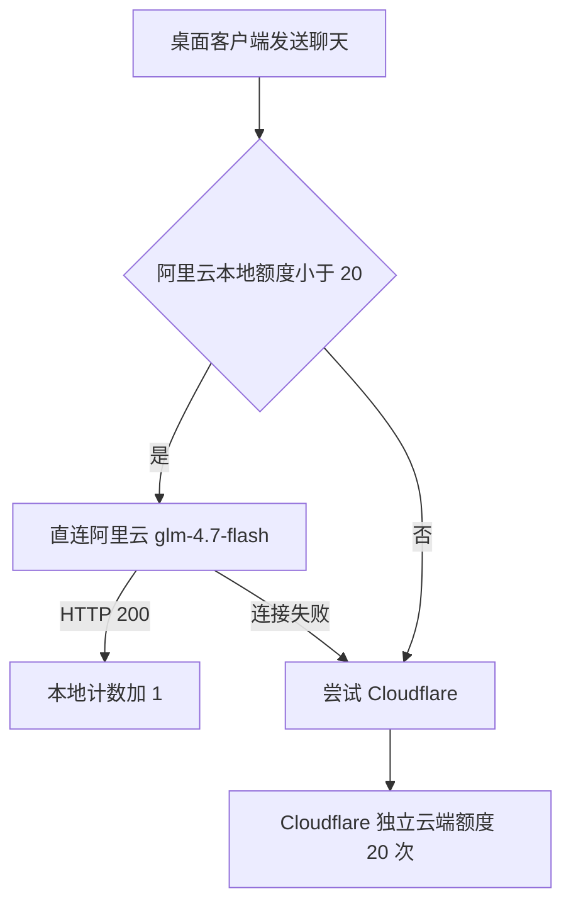

# 阿里云本地额度与 Cloudflare 独立额度设计

> [!success] 已确认决策
> 阿里云线路由桌面客户端本地记录每天 20 次；Cloudflare 继续云端独立记录每天 20 次。阿里云不再访问 Cloudflare。

## 目标

- 大陆玩家优先直连阿里云函数。
- 消除阿里云访问 `workers.dev` 失败造成的聊天不可用。
- 阿里云本地额度耗尽后尝试 Cloudflare，单个玩家每天最多约 40 次免费聊天。

## 数据流

## 本地额度

- 状态文件：`DATA_DIR/chat_quota_state.json`。
- 使用北京时间自然日，日期变化后自动归零。
- 只有阿里云返回有效 HTTP 200 才扣 1 次；连接前失败可切换 Cloudflare，收到任何 HTTP 响应后不再切换，避免重复回答。
- 同一个 `request_id` 只扣一次。
- 文件采用临时文件加原子替换保存；损坏时按当天 0 次恢复。

> [!warning] 已接受的取舍
> 本地额度不是安全或计费边界，重装或手工修改文件可以重置。这样可以避免增加阿里云数据库，并彻底移除跨境额度依赖。

## 阿里云函数调整

- 删除 Cloudflare 额度请求。
- 不再需要 `QUOTA_ENDPOINT` 和 `QUOTA_SHARED_SECRET`。
- 请求校验通过后直接调用智谱 `glm-4.7-flash` 并转发 SSE。
- 保留不记录聊天正文、IP 与密钥的安全诊断日志。

## Cloudflare

- `/v1/chat` 继续使用 Durable Object 独立限制每天 20 次。
- 保持 GLM 优先和 OpenRouter 兜底。
- 旧内部额度接口暂时保留兼容性，但新版客户端和阿里云函数不再调用。

## 测试要求

- 覆盖跨日重置、损坏恢复、原子保存和请求幂等。
- 第 20 次走阿里云，第 21 次直接切 Cloudflare。
- 阿里云失败不扣本地次数。
- 验证阿里云函数完全不再请求 Cloudflare。
- 保持 Cloudflare 独立额度测试通过。

## 关联记录

- [[阿里云优先与统一免费额度设计]]：旧的统一额度方案，本设计取代其中“阿里云调用 Cloudflare 额度接口”的部分。
- [[Petpet 总档案]]
