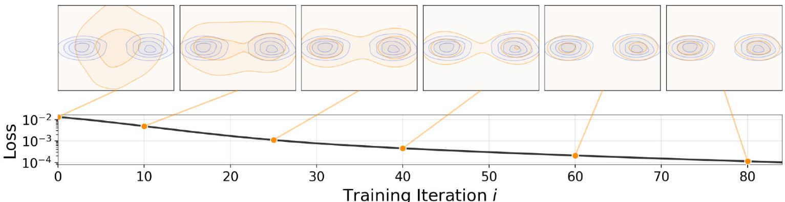

> [!Generative Modeling via Drifting]
> 发表日期:2026年2月4日
> 期刊:ArXiv.org
> 来源:[http://arxiv.org/abs/2602.04770](http://arxiv.org/abs/2602.04770)

# Abstract 摘要

生成建模可表述为学习一个映射 $f$，使其推前分布与数据分布匹配。扩散模型和流模型等方法通常在推理阶段迭代执行推前行为。本文提出一种新的范式：漂移模型（Drifting Models）。该方法在训练期间演化推前分布，并天然支持一步推理。作者引入漂移场来控制样本运动，当生成分布与数据分布匹配时漂移场达到平衡并趋于零。由此得到一个训练目标，使神经网络优化器能够演化分布。实验中，一步生成器在 ImageNet $256\times256$ 上取得了最先进结果：潜空间 FID 为 1.54，像素空间 FID 为 1.61。本文希望为高质量一步生成打开新的研究方向。

> [!图 1]
> 图 1：漂移模型。网络 $f$ 执行推前操作 $q=f_{\#}p_{\mathrm{prior}}$，把先验分布映射为推前分布 $q$。训练目标是逼近数据分布 $p_{\mathrm{data}}$。随着训练迭代，模型序列 $\{f_i\}$ 对应推前分布序列 $\{q_i\}$。漂移模型关注训练时推前分布的演化，并引入当 $q$ 匹配 $p_{\mathrm{data}}$ 时趋近零的漂移场。

# 1. Introduction 引言

生成模型通常比判别模型更具挑战性。判别建模主要关注把单个样本映射到标签，而生成建模关注把一个分布映射到另一个分布。它可以写成学习映射 $f$，使先验分布 $p_{\mathrm{prior}}$ 的推前分布匹配数据分布，即 $f_{\#}p_{\mathrm{prior}}\approx p_{\mathrm{data}}$。从概念上说，生成建模是在学习一个从函数到函数的泛函。

在扩散和流匹配等主流范式中，推前行为通常在推理阶段迭代实现：生成时，模型把较噪的样本映射为稍干净的样本，并逐步把样本分布推进到数据分布。这可以看作把复杂推前映射分解为一串更容易的变换。

本文提出漂移模型。其特点是学习一个在训练时演化的推前映射，从而不再需要迭代推理。映射 $f$ 由单次前向、非迭代网络表示。由于深度学习训练本身是迭代优化，模型更新自然对应推前分布 $f_{\#}p_{\mathrm{prior}}$ 的演化。

为驱动训练时推前分布演化，本文引入漂移场控制样本移动。该场依赖于生成分布和数据分布；当两者匹配时漂移场为零，样本停止漂移并达到平衡。基于此，作者提出一个简单训练目标：最小化生成样本的漂移。该目标诱导样本运动，并通过 SGD 等迭代优化演化底层推前分布。

漂移模型天然支持一步（1-NFE）生成。在 ImageNet $256\times256$ 上，其潜空间生成达到 1.54 FID，在一步方法中达到新的最先进水平；在更具挑战的像素空间生成中，达到 1.61 FID，显著优于此前像素空间方法。

# 2. 相关工作

#### 扩散/流模型

扩散模型和流模型通过 SDE 或 ODE 表述噪声到数据的映射。它们的推理核心是迭代更新，例如 $\mathbf{x}_{i+1}=\mathbf{x}_i+\Delta\mathbf{x}_i$。更新项依赖神经网络，因此生成通常需要多次网络评估。

大量工作尝试减少扩散/流模型步数。蒸馏方法将预训练多步模型压缩为单步模型；另一些方法从头训练一步扩散/流模型，并在训练中近似 SDE/ODE 诱导轨迹。本文范式不同，不依赖扩散或流模型的 SDE/ODE 形式。

#### 生成对抗网络

GAN 通过判别生成样本与真实数据来训练生成器。与 GAN 类似，本文也使用单次前向网络把噪声映射为数据，并用损失评估质量；不同之处是本文不依赖对抗优化。

#### 变分自编码器

VAE 优化证据下界，由重建损失和 KL 散度项组成。经典 VAE 使用高斯先验时是一步生成器。现代 VAE 往往作为分词器，其先验由扩散或自回归模型学习。

#### 归一化流

归一化流学习从数据到噪声的映射并优化对数似然，要求可逆架构和可计算雅可比。概念上，NF 推理时可作为一步生成器，但依赖网络逆映射。

#### 矩匹配

矩匹配方法最小化生成分布和数据分布之间的最大均值差异（MMD）。本文也使用核函数以及正/负样本，但重点是显式构造训练时控制样本漂移的漂移场。

#### 对比学习

漂移场由来自数据分布的正样本和来自生成分布的负样本驱动，与对比表示学习中的正负样本思想相关。对比学习思想也曾用于 GAN 或流匹配。

# 3. 用于生成的漂移模型

漂移模型把生成建模表述为通过漂移场在训练时演化推前分布，并天然实现一步推理。

### 3.1 训练时的推前

考虑神经网络 $f:\mathbb{R}^C\mapsto\mathbb{R}^D$。输入为 $\boldsymbol{\epsilon}\sim p_{\boldsymbol{\epsilon}}$，输出为 $\mathbf{x}=f(\boldsymbol{\epsilon})\in\mathbb{R}^D$。输入和输出维度不必相等。

记网络输出分布为 $q$，即 $\mathbf{x}=f(\boldsymbol{\epsilon})\sim q$。在概率论中，$q$ 是 $p_{\boldsymbol{\epsilon}}$ 经 $f$ 的推前分布：
$$

q=f_{\#}p_{\boldsymbol{\epsilon}}.

\hspace{1cm}(1)

$$
这里 $f_{\#}$ 表示由 $f$ 诱导的推前。生成建模目标是找到 $f$，使：
$$

f_{\#}p_{\boldsymbol{\epsilon}}\approx p_{\mathrm{data}}.

$$
由于神经网络训练本质上是迭代的，训练过程产生模型序列 $\{f_i\}$，对应推前分布序列 $\{q_i\}$，其中 $q_i=[f_i]_{\#}p_{\boldsymbol{\epsilon}}$。训练逐步把 $q_i$ 演化为匹配 $p_{\mathrm{data}}$。

当网络更新时，同一噪声输入对应的样本隐式漂移：
$$

\mathbf{x}_{i+1}=\mathbf{x}_i+\Delta\mathbf{x}_i,

$$
其中 $\Delta\mathbf{x}_i:=f_{i+1}(\boldsymbol{\epsilon})-f_i(\boldsymbol{\epsilon})$，由参数更新引起。这个残差即为“漂移”。

### 3.2 训练用漂移场

定义漂移场控制样本 $\mathbf{x}$ 以及推前分布 $q$ 的训练时演化。记漂移场为 $\mathbf{V}_{p,q}(\cdot):\mathbb{R}^d\to\mathbb{R}^d$，则：
$$

\mathbf{x}_{i+1}=\mathbf{x}_i+\mathbf{V}_{p,q_i}(\mathbf{x}_i).

\hspace{1cm}(2)

$$
其中 $\mathbf{x}_i=f_i(\boldsymbol{\epsilon})\sim q_i$。下标 $p,q$ 表示漂移场依赖目标分布 $p$（例如 $p=p_{\mathrm{data}}$）和当前生成分布 $q$。

理想情况下，当 $p=q$ 时所有样本应停止漂移，即 $\mathbf{V}=\mathbf{0}$。本文考虑如下命题。

**命题 3.1。** 若漂移场反对称：
$$

\mathbf{V}_{p,q}(\mathbf{x})=-\mathbf{V}_{q,p}(\mathbf{x}),\quad \forall\mathbf{x},

\hspace{1cm}(3)

$$
则有：
$$

q=p\quad\Rightarrow\quad\mathbf{V}_{p,q}(\mathbf{x})=\mathbf{0},\quad\forall\mathbf{x}.

$$
证明很直接：若 $q=p$，则 $\mathbf{V}_{p,q}=\mathbf{V}_{q,p}=-\mathbf{V}_{p,q}$，因此 $\mathbf{V}_{p,q}=0$。直观上，反对称表示交换 $p$ 与 $q$ 只会翻转漂移方向。

#### 训练目标

令 $f_\theta$ 为参数化网络，$\mathbf{x}=f_\theta(\boldsymbol{\epsilon})$。在平衡点 $\mathbf{V}=0$，可写固定点关系：
$$

f_{\hat{\theta}}(\boldsymbol{\epsilon})=f_{\hat{\theta}}(\boldsymbol{\epsilon})+\mathbf{V}_{p,q_{\hat{\theta}}}\big(f_{\hat{\theta}}(\boldsymbol{\epsilon})\big).

\hspace{1cm}(4)

$$
这启发训练时的固定点迭代：
$$

f_{\theta_{i+1}}(\boldsymbol{\epsilon})\leftarrow f_{\theta_i}(\boldsymbol{\epsilon})+\mathbf{V}_{p,q_{\theta_i}}\big(f_{\theta_i}(\boldsymbol{\epsilon})\big).

\hspace{1cm}(5)

$$
将其转化为损失：
$$

\mathcal{L}=\mathbb{E}_{\boldsymbol{\epsilon}}\left[\left\|\underbrace{f_\theta(\boldsymbol{\epsilon})}_{\mathrm{prediction}}-\underbrace{\mathrm{stopgrad}\big(f_\theta(\boldsymbol{\epsilon})+\mathbf{V}_{p,q_\theta}(f_\theta(\boldsymbol{\epsilon}))\big)}_{\mathrm{frozen\ target}}\right\|^2\right].

\hspace{1cm}(6)

$$
stop-gradient 操作给出冻结目标。损失数值等于 $\mathbb{E}_{\boldsymbol{\epsilon}}[\|\mathbf{V}(f(\boldsymbol{\epsilon}))\|^2]$，即漂移场平方范数。由于 $\mathbf{V}$ 依赖分布 $q_\theta$，直接对其反向传播并不简单；本文通过把 $\mathbf{x}+\Delta\mathbf{x}$ 作为冻结目标间接最小化漂移。

### 3.3 设计漂移场

漂移场依赖两个分布 $p$ 和 $q$。为得到可计算形式，考虑：
$$

\mathbf{V}_{p,q}(\mathbf{x})=\mathbb{E}_{\mathbf{y}^+\sim p}\mathbb{E}_{\mathbf{y}^-\sim q}\left[\mathcal{K}(x,\mathbf{y}^+,\mathbf{y}^-)\right],

\hspace{1cm}(7)

$$
其中 $\mathcal{K}$ 是描述三个样本交互的核状函数。

本文采用受 mean-shift 启发的吸引-排斥形式：
$$

\mathbf{V}^+_p(\mathbf{x}):=\frac{1}{Z_p}\mathbb{E}_p\left[k(\mathbf{x},\mathbf{y}^+)(\mathbf{y}^+-\mathbf{x})\right],

\hspace{1cm}(8)

$$
$$

\mathbf{V}^-_q(\mathbf{x}):=\frac{1}{Z_q}\mathbb{E}_q\left[k(\mathbf{x},\mathbf{y}^-)(\mathbf{y}^- - \mathbf{x})\right].

$$
其中归一化因子为：
$$

Z_p(\mathbf{x})=\mathbb{E}_p[k(\mathbf{x},\mathbf{y}^+)],\quad

Z_q(\mathbf{x})=\mathbb{E}_q[k(\mathbf{x},\mathbf{y}^-)].

\hspace{1cm}(9)

$$
定义漂移场：
$$

\mathbf{V}_{p,q}(\mathbf{x}):=\mathbf{V}^+_p(\mathbf{x})-\mathbf{V}^-_q(\mathbf{x}).

\hspace{1cm}(10)

$$
直观上，样本被数据分布吸引，并被当前生成分布排斥。代入可得：
$$

\mathbf{V}_{p,q}(\mathbf{x})=\frac{1}{Z_pZ_q}\mathbb{E}_{p,q}\left[k(\mathbf{x},\mathbf{y}^+)k(\mathbf{x},\mathbf{y}^-)(\mathbf{y}^+-\mathbf{y}^-)\right].

\hspace{1cm}(11)

$$
该形式是反对称的：$\mathbf{V}_{p,q}=-\mathbf{V}_{q,p}$。

图 2：样本漂移示意。生成样本 $\mathbf{x}$ 受到正样本均值漂移 $\mathbf{V}^+_p$ 的吸引，并受到负样本均值漂移 $\mathbf{V}^-_q$ 的排斥，因此 $\mathbf{V}=\mathbf{V}^+_p-\mathbf{V}^-_q$。

#### 核函数

本文采用：
$$

k(\mathbf{x},\mathbf{y})=\exp\left(-\frac{1}{\tau}\|\mathbf{x}-\mathbf{y}\|\right),

\hspace{1cm}(12)

$$
其中 $\tau$ 为温度，$\|\cdot\|$ 为 $\ell_2$ 距离。实践中用 softmax 实现归一化核，logits 为 $-\frac{1}{\tau}\|\mathbf{x}-\mathbf{y}\|$。

#### 平衡与分布匹配

训练损失鼓励最小化 $\|\mathbf{V}\|^2$。虽然一般情况下 $\mathbf{V}=0$ 不必然推出 $p=q$，但对本文核化构造，零漂移条件施加大量双线性约束；在温和非退化假设下，可近似迫使 $p$ 与 $q$ 匹配。实验也观察到漂移损失降低与生成质量提升相关。

算法 1：训练损失。每步采样噪声并生成 $x=f(e)$，把同批生成样本作为负样本，从数据中取正样本，计算漂移 $V$，构造冻结目标 $x_{\mathrm{drifted}}=\mathrm{stopgrad}(x+V)$，并最小化 $\mathrm{mse\_loss}(x-x_{\mathrm{drifted}})$。

#### 随机训练

小批量训练中，用经验均值估计式 11 的期望。每个训练步采样 $N$ 个噪声并生成样本，生成样本也作为负样本；同时采样 $N_{\mathrm{pos}}$ 个真实数据作为正样本。漂移场在该正负样本批次上计算。

### 3.4 特征空间中的漂移

上述目标可扩展到任意特征空间。令 $\phi$ 为特征提取器，则损失可写为：
$$

\mathbb{E}\left[\left\|\phi(\mathbf{x})-\mathrm{stopgrad}\Big(\phi(\mathbf{x})+\mathbf{V}(\phi(\mathbf{x}))\Big)\right\|^2\right].

\hspace{1cm}(13)

$$
其中 $\mathbf{x}=f_\theta(\boldsymbol{\epsilon})$，漂移场定义在特征空间中。特征编码只在训练时使用，推理时不需要。

进一步可扩展为多尺度、多位置特征：
$$

\sum_j\mathbb{E}\left[\left\|\phi_j(\mathbf{x})-\mathrm{stopgrad}\Big(\phi_j(\mathbf{x})+\mathbf{V}(\phi_j(\mathbf{x}))\Big)\right\|^2\right].

\hspace{1cm}(14)

$$
本文使用自监督预训练图像编码器作为特征提取器，并在多个尺度上计算漂移损失。

#### 与感知损失的关系

感知损失最小化 $\|\phi(\mathbf{x})-\phi(\mathbf{x}_{\mathrm{target}})\|_2^2$，要求样本和目标配对。本文的目标是 $\phi(\mathbf{x})+\mathbf{V}(\phi(\mathbf{x}))$，无需配对，本质上匹配特征推前分布 $\phi_{\#}q$ 与 $\phi_{\#}p$。

#### 与潜空间生成的关系

特征空间损失与潜空间生成正交。生成器可以输出像素或 tokenizer 的潜变量；若生成器在潜空间而特征提取器在像素空间，则训练时先用 tokenizer 解码器映射到像素空间再提取特征。

### 3.5 分类器自由引导

给定类别 $c$ 时，目标分布为 $p_{\mathrm{data}}(\cdot|c)$。为实现引导，负样本可来自生成样本或来自其他类别的真实样本。定义负样本分布：
$$

\tilde{q}(\cdot|c)\triangleq(1-\gamma)q_\theta(\cdot|c)+\gamma p_{\mathrm{data}}(\cdot|\varnothing),

\hspace{1cm}(15)

$$
其中 $\gamma\in[0,1)$，$p_{\mathrm{data}}(\cdot|\varnothing)$ 表示无条件数据分布。若学习目标为 $\tilde{q}(\cdot|c)=p_{\mathrm{data}}(\cdot|c)$，则：
$$

q_\theta(\cdot|c)=\alpha p_{\mathrm{data}}(\cdot|c)-(\alpha-1)p_{\mathrm{data}}(\cdot|\varnothing),

\hspace{1cm}(16)

$$
其中 $\alpha=\frac{1}{1-\gamma}\geq1$。这与传统 CFG 中条件分布和无条件分布外推的思想一致。本文的 CFG 是训练时行为，推理时仍保持一步生成。

# 4. 图像生成实现

本文在 ImageNet $256\times256$ 上实现图像生成。

#### Tokenizer

默认在潜空间生成，采用标准 SD-VAE tokenizer，生成空间为 $32\times32\times4$。

#### 架构

生成器 $f_\theta$ 采用 DiT-like 架构。输入为 $32\times32\times4$ 高斯噪声，输出为同维度生成潜变量。patch size 为 2，并使用 adaLN-zero 处理类别条件或其他条件。

#### CFG 条件

训练时随机采样 CFG scale $\alpha$，根据式 15 准备负样本，并把 $\alpha$ 作为网络条件。推理时可自由指定 $\alpha$，无需重新训练。

#### 批处理

当使用类别标签时，采样 $N_c$ 个类别标签，并对每个标签独立执行训练步骤。有效批量大小为 $B=N_c\times N$。

#### 特征提取器

漂移损失在特征空间中计算。本文主要使用 ResNet 风格自监督编码器，如 MoCo、SimCLR，以及直接在潜空间预训练的 latent-MAE。多尺度特征共同参与漂移损失。

#### 像素空间生成

模型也支持直接在像素空间生成，此时输入和输出均为 $256\times256\times3$，采用 DiT/16 风格设置，特征提取器直接作用于像素空间。

图 3：生成分布演化。不同初始化下，生成分布均能在训练中靠近双峰目标分布，包括从塌缩单峰状态出发的情况。

# 5. 实验

### 5.1 玩具实验

#### 生成分布的演化

二维玩具实验表明，漂移模型能从不同初始分布逼近双峰目标分布，且不出现模式塌缩。若生成分布塌缩到一个模式，数据分布中其他模式仍会吸引样本，使分布继续演化。

图 4：样本演化。二维棋盘和瑞士卷实验中，随着训练迭代，损失 $\|V\|^2$ 下降，生成分布逐步收敛到目标分布。

表 1：反对称的重要性。默认反对称漂移场 $\mathbf{V}^+-\mathbf{V}^-$ 得到良好 FID；故意放大吸引或排斥、仅使用吸引等破坏反对称的设计会导致严重失败。

### 5.2 ImageNet 实验

实验评估 ImageNet $256\times256$。消融使用 B/2 模型、SD-VAE 潜空间，训练 100 epochs，漂移损失在 latent-MAE 特征空间计算，指标为 50K 生成图像 FID。

#### 反对称

反对称是平衡推导的核心。表 1 显示破坏反对称会导致 FID 从 8.46 大幅恶化到 41、46、86、112 甚至 177，说明吸引与排斥必须在分布匹配时抵消。

#### 正负样本分配

表 2 研究正样本数 $N_{\mathrm{pos}}$ 和负样本数 $N_{\mathrm{neg}}$。在固定计算预算下，增加正样本和负样本均能提升质量，因为漂移场估计更准确。

#### 漂移特征空间

表 3 比较自监督编码器。公开 SimCLR 和 MoCo 编码器表现不错；定制 latent-MAE 更优，且随着宽度和预训练 epochs 增加而提升。经分类微调的 latent-MAE 进一步提高性能。

#### 从消融到最终设置

表 4 展示从默认消融设置到最终设置的改进：更长训练、更合适超参数和更大模型持续降低 FID。

#### 系统级比较：潜空间生成

表 5 比较 ImageNet $256\times256$ 潜空间生成。本文方法以一步生成达到 1.54 FID，优于或竞争于多个多步扩散/流模型及一步模型，且无需从多步教师蒸馏。

#### 像素空间生成

表 6 比较像素空间生成。本文一步像素空间方法达到 1.61 FID，显著优于此前像素空间一步方法，并且计算量更低。

### 5.3 机器人控制实验

本文还将漂移思想用于机器人控制，用一步 Drifting Policy 替换多步 Diffusion Policy 生成器。表 7 显示，在多个单阶段和多阶段任务上，Drifting Policy 达到有竞争力或更好的成功率，同时推理更高效。

## 6. 讨论与结论

本文提出漂移模型，一种新的生成建模范式。它不在推理阶段迭代演化分布，而是在训练阶段通过漂移场演化推前分布。反对称漂移场保证当生成分布匹配数据分布时达到零漂移平衡。基于冻结目标的损失使神经网络可通过普通优化器学习该演化。实验表明，漂移模型可在 ImageNet 上实现高质量一步生成，并在潜空间和像素空间都取得强结果。

本文方法仍有值得研究的问题，例如漂移场零点与分布匹配之间的严格理论条件、特征空间选择、规模化训练效率，以及在更多模态和任务上的应用。