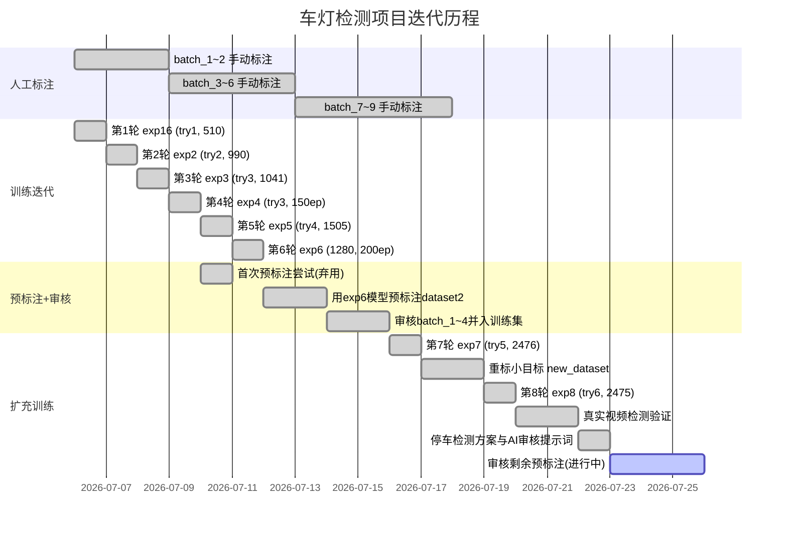
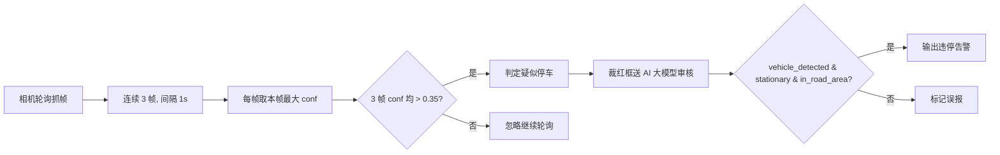
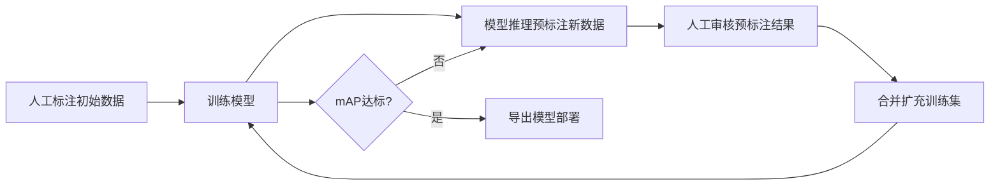

---
tags:
  - YOLOv7
  - vehicle-detection
  - cv
  - 项目文档
aliases:
  - 车灯检测
  - 车辆车灯检测
created: 2026-07-06
updated: 2026-08-07
title: 夜间车灯识别车辆文档（基于yolov7）
type: project
summary: 记录实习项目中的背景、实现过程、实验结果和实践经验。
migrated: 2026-08-05
---

> [!summary] Summary
> 记录实习项目中的背景、实现过程、实验结果和实践经验。

## 概述

本项目通过检测车辆车灯（前灯 head / 尾灯 tail）来识别车辆，基于 **YOLOv7** 目标检测框架实现。采用 **"训练 → 预标注 → 人工审核 → 扩充数据 → 再训练"** 的迭代式数据扩充策略，逐步提升模型精度。

| 项目 | 说明 |
|------|------|
| 项目根目录 | `/data2/ai/yolov7-main-WFS` |
| 数据集目录 | `/data2/ai/yolov7-main-WFS/dataset` |
| 检测类别 | 2 类 —— `head`（前灯, class 0）、`tail`（尾灯, class 1） |
| 标注工具 | labelImg（VOC XML 格式标注） |
| 硬件环境 | 2 × NVIDIA A10（各 23GB 显存，被 vLLM 占用部分显存） |
| 当前最佳模型 | `runs/train/yolo_light_exp8/weights/best.pt`（mAP@.5=0.923） |
| 业务目标 | 高速路边停车检测：轮询抓帧 → 置信度判定 → 红框送 AI 大模型审核确认 |

---

## 项目时间线



---

## 数据情况

### 数据来源与标注方式

| 数据批次 | 图片来源 | 标注方式 | 说明 |
|----------|----------|----------|------|
| `dataset/batch_1~9` | 视频抽帧 | 纯人工标注 | 原始训练数据，1505 个有效标注 |
| `dataset/dataset2/batch_1~4` | 视频抽帧 | **预标注 + 人工审核** | exp6 模型预标注，人工审核修正，971 个有效标注，已并入 try5 |
| `/data2/ai/dataset2/batch_1~9` | 视频抽帧 | **预标注 + 人工审核** | exp7 模型预标注，2742 个 XML，**待审核**，用于下一轮扩充 |
| `dataset/new_dataset/batch_11~24` | 覆盖 batch_1~9 + dataset2 | **重标注（重点补充小目标）** | exp8 数据集源，重点补齐漏检的小目标车灯，共 2475 个有效标注 |

> [!important] 新数据集
> `new_dataset` 对原有 batch_1~9 与 dataset2/batch_1~4 的全部有效图片做了**重新标注**，重点补充小目标车灯框，24 个预标注空 XML 已清理。第8轮 exp8 即基于此数据集训练。

> [!warning] 注意
> batch 中没有 XML 的图片是主动放弃的废图（无车灯或不可识别），**不可使用**。

### 各 batch 有效标注统计

**原始人工标注数据（`dataset/batch_1~9`）：**

| 目录 | jpg | 有效 xml |
|------|-----|---------|
| batch_1 | 500 | 235 |
| batch_2 | 500 | 224 |
| batch_3 | 500 | 165 |
| batch_4 | 500 | 145 |
| batch_5 | 500 | 170 |
| batch_6 | 288 | 102 |
| batch_7 | 500 | 166 |
| batch_8 | 500 | 142 |
| batch_9 | 500 | 156 |
| **小计** | **3788** | **1505** |

**预标注审核后数据（`dataset/dataset2/batch_1~4`，已并入训练集）：**

| 目录 | jpg | 预标注 xml | 审核后有效 |
|------|-----|-----------|-----------|
| batch_1 | 500 | 331 | 271 |
| batch_2 | 500 | 328 | 283 |
| batch_3 | 500 | 322 | 257 |
| batch_4 | 300 | 204 | 160 |
| **小计** | **1800** | **1185** | **971** |

> [!info] 预标注审核通过率
> 1185 个预标注框经人工审核后保留 971 个，通过率 82%。审核主要工作：删除误检框、修正偏移框、补充漏检框。

**预标注待审核数据（`/data2/ai/dataset2/batch_1~9`，用于下一轮扩充）：**

| 目录 | jpg | 预标注 xml |
|------|-----|-----------|
| batch_1 | 500 | 331 |
| batch_2 | 500 | 328 |
| batch_3 | 500 | 322 |
| batch_4 | 300 | 204 |
| batch_5 | 500 | 336 |
| batch_6 | 500 | 308 |
| batch_7 | 500 | 336 |
| batch_8 | 421 | 254 |
| batch_9 | 500 | 323 |
| **小计** | **4221** | **2742** |

**重标注数据（`dataset/new_dataset`，已用于第8轮）：**

| 目录 | 对应原批次 | jpg | 有效 xml |
|------|-----------|-----|---------|
| batch_11 | batch_1 | 248 | 248 |
| batch_12 | batch_2 | 224 | 224 |
| batch_13 | batch_3 | 165 | 165 |
| batch_14 | batch_4 | 145 | 145 |
| batch_15 | batch_5 | 170 | 170 |
| batch_16 | batch_6 | 102 | 102 |
| batch_17 | batch_7 | 166 | 166 |
| batch_18 | batch_8 | 142 | 142 |
| batch_19 | batch_9 | 156 | 156 |
| batch_21 | dataset2/batch_1 | 271 | 267 |
| batch_22 | dataset2/batch_2 | 283 | 278 |
| batch_23 | dataset2/batch_3 | 257 | 253 |
| batch_24 | dataset2/batch_4 | 160 | 159 |
| **小计** | - | **2489** | **2475** |

> [!info] 重标注清理记录
> - new_dataset 对原有 batch_1~9 + dataset2 全部图片重新标注，重点补充**小目标**车灯框（try5 漏检集中在远处小目标）
> - 清理 14 个空 XML（batch_21: 4、batch_22: 5、batch_23: 4、batch_24: 1）
> - 总框数 **10041** 个：head 4573 / tail 5468

**汇总：**

| 数据来源 | jpg | 有效标注 | 状态 |
|----------|-----|---------|------|
| 原始人工标注 | 3788 | 1505 | ✅ 已用于训练 |
| 预标注审核后 (dataset2) | 1800 | 971 | ✅ 已用于训练 |
| 预标注待审核 (/data2/ai/dataset2) | 4221 | 2742 | ⏳ 待人工审核 |
| **重标注 (new_dataset)** | **2489** | **2475** | ✅ 已用于训练 (exp8) |
| 去重后总计（重标注+待审核） | 6710 | 5217 | |

> [!info] 历史数据清理记录
> - batch_1: 263 → 235（删除 28 个空标注 XML）
> - batch_2: 247 → 224（删除 23 个空标注 XML）
> - batch_3/4/5: 无空标注
> - batch_7~9 原放入 `wait_for_tag_dataset/`，首次预标注效果不佳改手动标注，后随模型提升预标注质量改善

### 数据划分（7:2:1）

使用 `dataset/make_dataset.py` 脚本完成 XML→YOLO txt 转换 + 数据集划分。

各轮训练数据集：

| 数据集 | 来源 | 有效标注 | train | val | test | 训练轮次 |
|--------|------|---------|-------|-----|------|---------|
| yolo_dataset_try1 | batch_1~2 | 510 | 357 | 102 | 51 | 第1轮 |
| yolo_dataset_try2 | batch_1~5 | 990 | 693 | 198 | 99 | 第2轮 |
| yolo_dataset_try3 | batch_1~6 | 1041 | 728 | 208 | 105 | 第3轮 / 第4轮 |
| yolo_dataset_try4 | batch_1~9 | 1505 | 1053 | 301 | 151 | 第5轮 / 第6轮 |
| **yolo_dataset_try5** | **batch_1~9 + dataset2** | **2476** | **1733** | **495** | **248** | **第7轮** |
| **yolo_dataset_try6** | **new_dataset（重标小目标）** | **2475** | **1732** | **495** | **248** | **第8轮** |

### 输出数据集结构

当前训练使用：`dataset/yolo_dataset_try6/`

```tree
dataset/yolo_dataset_try6/
├── images/
│   ├── train/    # 1732 张训练图片
│   ├── val/      # 495 张验证图片
│   └── test/     # 248 张测试图片
├── labels/
│   ├── train/    # 1732 个 YOLO txt 标注
│   ├── val/      # 495 个 YOLO txt 标注
│   └── test/     # 248 个 YOLO txt 标注
├── train.txt     # 训练集图片绝对路径列表
├── val.txt       # 验证集图片绝对路径列表
├── test.txt      # 测试集图片绝对路径列表
├── train.cache   # 训练集缓存
└── val.cache     # 验证集缓存
```

### YOLO 标注格式

每行格式：`class_id center_x center_y width height`（坐标归一化到 0~1）

```yaml
0 0.232422 0.309028 0.027344 0.018056   # head
1 0.260547 0.238889 0.017969 0.013889   # tail
```

---

## 数据处理脚本

### make_dataset.py（XML 转 YOLO + 数据划分）

**路径**: `dataset/make_dataset.py`

**功能**:
1. 遍历多个 batch 目录，收集所有有 XML 标注的样本
2. 将 VOC XML 格式转换为 YOLO txt 格式（归一化坐标）
3. 按 7:2:1 比例随机划分 train/val/test（random_seed=42 保证可复现）
4. 复制图片到对应目录，生成 YOLO txt 标注文件
5. 生成 train.txt / val.txt / test.txt 路径列表文件

**用法**:

```bash
cd /data2/ai/yolov7-main-WFS/dataset
python3 make_dataset.py
```

**当前配置**（指向 new_dataset 全部批次，输出 try6）:

```python
src_dirs = [
    "/data2/ai/yolov7-main-WFS/dataset/new_dataset/batch_11" ~ "batch_19",
    "/data2/ai/yolov7-main-WFS/dataset/new_dataset/batch_21" ~ "batch_24",
]
out_root = "/data2/ai/yolov7-main-WFS/dataset/yolo_dataset_try6"
classes = {"head": 0, "tail": 1}
train_ratio = 0.7
val_ratio   = 0.2
test_ratio  = 0.1
random_seed = 42
```

### analyze_test.py（逐张测试分析）

**路径**: `dataset/analyze_test.py`

**功能**: 对测试集逐张对比 GT 真实标注 vs 预测结果，计算 TP/FP/FN，输出每张图的状态（全漏检/有漏检/完全匹配等）。

### yolo2xml.py（YOLO txt 转 labelImg XML）

**路径**: `dataset/yolo2xml.py`

**功能**: 将 detect.py 输出的 YOLO txt 标注转换为 labelImg 可读的 VOC XML 格式，供人工审核预标注结果。

> [!important] 预标注核心工具
> 这是预标注流水线的关键环节：`detect.py` 推理生成 txt → `yolo2xml.py` 转为 XML → 导入 labelImg 人工审核。

### 预标注流水线（detect.py + yolo2xml.py）

**工作流程**:

```bash
# 1. 用 best.pt 对新图片批量推理，保存 txt 结果
python3 detect.py \
  --weights runs/train/yolo_light_exp7/weights/best.pt \
  --source /data2/ai/dataset2/batch_1 \
  --img-size 1280 \
  --conf-thres 0.25 \
  --iou-thres 0.45 \
  --device 1 \
  --save-txt --save-conf --exist-ok

# 2. 将 txt 转为 labelImg XML
python3 dataset/yolo2xml.py

# 3. XML 放回对应 batch 目录，用 labelImg 打开审核
```

> [!success] 预标注成效
> - 第一次预标注（exp4 模型，640 分辨率）：检出率 43%，误检多，审核成本高，**弃用**
> - 第二次预标注（exp6 模型，1280 分辨率）：检出率 65%，框精度大幅改善，**成功**
> - 审核后 dataset2/batch_1~4（971 样本）并入 try5，第7轮训练 mAP 从 0.810 提升至 0.880

### 首次预标注尝试（已弃用）

曾用 `pre_annotate.py` 脚本 + exp4 best.pt 对 batch_7~9 进行预标注：

| 方案 | 参数 | 结果 | 评价 |
|------|------|------|------|
| 方案1 | conf=0.25, img-size=640 | 646/1500 张有框（43%） | 检出率太低 |
| 方案2 | conf=0.1, img-size=1280 | 1368/1500 张有框 | 误检太多 |

> [!caution] 弃用原因
> exp4 模型精度不足（mAP@.5=0.488），小目标检出率低，预标注框偏移严重。`pre_annotate.py` 脚本本身也有坐标转换 bug 和 git 下载错误。后改用 detect.py 原生推理 + yolo2xml.py 转换，问题解决。

### 其他数据处理脚本

| 脚本 | 功能 |
|------|------|
| `dataset/labelImg2yolo.py` | 单独的 XML→YOLO 转换脚本（原始 Windows 路径版本，未更新） |
| `dataset/mp4_2_pic.py` | 视频抽帧脚本 |
| `dataset/png2jpg.py` | PNG 转 JPG 格式 |
| `dataset/rename_pinyin.py` | 文件名拼音重命名 |
| `dataset/cal_0_txt.py` | 标注统计脚本 |
| `dataset/pre_annotate.py` | 早期预标注脚本（已弃用，保留备用） |

---

## 配置文件

### 数据集配置 —— my_yolo_dataset.yaml

**路径**: `data/my_yolo_dataset.yaml`

```yaml
# 车灯检测数据集 (head/tail) 配置
train: /data2/ai/yolov7-main-WFS/dataset/yolo_dataset_try6/train.txt
val: /data2/ai/yolov7-main-WFS/dataset/yolo_dataset_try6/val.txt
test: /data2/ai/yolov7-main-WFS/dataset/yolo_dataset_try6/test.txt

nc: 2
names: ["head", "tail"]
```

### 模型配置 —— yolov7_my.yaml

**路径**: `cfg/training/yolov7_my.yaml`

基于 `cfg/training/yolov7.yaml` 复制修改，仅改动类别数：

```yaml
nc: 2  # number of classes (head, tail)，原文件为 nc: 80（COCO）
```

其余结构（backbone、head、anchors）与标准 yolov7.yaml 完全一致。

### 超参数 —— hyp.scratch.custom.yaml

**路径**: `data/hyp.scratch.custom.yaml`

使用 YOLOv7 自定义训练超参数，主要参数：

| 参数 | 值 | 说明 |
|------|-----|------|
| lr0 | 0.01 | 初始学习率 |
| lrf | 0.1 | 最终学习率衰减系数 |
| momentum | 0.937 | SGD 动量 |
| weight_decay | 0.0005 | 权重衰减 |
| warmup_epochs | 3.0 | 预热轮数 |
| box | 0.05 | 框回归损失权重 |
| cls | 0.3 | 分类损失权重 |
| obj | 0.7 | 置信度损失权重 |
| mosaic | 1.0 | 马赛克增强概率 |
| fliplr | 0.5 | 水平翻转概率 |
| hsv_h/s/v | 0.015/0.7/0.4 | HSV 颜色扰动 |

---

## 代码修改记录

为兼容 PyTorch 2.6+（`torch.load` 默认 `weights_only=True`），修改了以下文件：

| 文件 | 行号 | 修改内容 |
|------|------|----------|
| `train.py` | 71 | `torch.load(...)` → `torch.load(..., weights_only=False)` |
| `train.py` | 87 | `torch.load(weights, map_location=device)` → 加 `weights_only=False` |
| `utils/datasets.py` | 392 | `torch.load(cache_path)` → 加 `weights_only=False` |
| `utils/general.py` | 802 | `torch.load(f, map_location=...)` → 加 `weights_only=False` |
| `models/experimental.py` | 252 | 已自带 `weights_only=False`，无需修改 |

> [!note]
> `detect.py` 第48行加载 resnet101 的 `torch.load` 未修改（暂不影响训练）。

---

## 训练记录

### 各轮训练结果对比

| 指标 | 第1轮 | 第2轮 | 第3轮 | 第4轮 | 第5轮 | 第6轮 | 第7轮 | **第8轮** |
|------|-------|-------|-------|-------|-------|------|----------|----------|
| 实验 | exp16 | exp2 | exp3 | exp4 | exp5 | exp6 | exp7 | **exp8** |
| 数据集 | try1 | try2 | try3 | try3 | try4 | try4 | try5 | **try6** |
| 训练集 | 357 | 693 | 728 | 728 | 1053 | 1053 | 1733 | **1732** |
| 数据来源 | 人工 | 人工 | 人工 | 人工 | 人工 | 人工 | 人工+预标注 | **重标注小目标** |
| epochs | 100 | 100 | 96(断) | 150 | 150 | 200 | 200 | **200** |
| img-size | 640 | 640 | 640 | 640 | 640 | 1280 | 1280 | **1280** |
| batch | 4 | 4 | 4 | 4 | 4 | 2 | 2 | **2** |
| **mAP@.5** | 0.224 | 0.341 | 0.351 | 0.488 | 0.766 | 0.810 | 0.880 | **0.923** |
| mAP@.5:.95 | 0.069 | 0.118 | 0.120 | 0.176 | 0.329 | 0.363 | 0.498 | **0.460** |
| Precision | 0.443 | 0.406 | 0.628 | 0.546 | 0.826 | 0.745 | 0.807 | **0.884** |
| Recall | 0.283 | 0.390 | 0.301 | 0.540 | 0.693 | 0.808 | 0.865 | **0.883** |
| head mAP@.5 | 0.241 | 0.467 | 0.425 | 0.554 | 0.841 | 0.847 | 0.900 | **0.948** |
| tail mAP@.5 | 0.206 | 0.214 | 0.278 | 0.421 | 0.691 | 0.772 | 0.860 | **0.898** |
| 推理速度 | 12.8ms | 10.3ms | 9.5ms | 9.3ms | 7.0ms | 16.6ms | 14.5ms | **13.5ms** |

> [!tip] 关键节点
> - **第5轮**：mAP 突破 0.766，模型首次可用于预标注
> - **第6轮**：img-size 升至 1280，mAP 0.810，预标注检出率达 65%
> - **第7轮**：首次使用预标注审核数据（+971样本），mAP 0.880，验证预标注扩充策略有效
> - **第8轮**：基于 new_dataset（重标小目标）训练，mAP 0.923，成为当前最佳

> [!success] 最佳模型
> 第八轮 `runs/train/yolo_light_exp8/weights/best.pt`
> 测试评估: conf-thres=0.001, iou-thres=0.65, img-size 1280，mAP@.5=0.923

**逐张检测分析（conf=0.25，try6 测试集 955 GT）:**
- TP: 878, FP: 280, FN: 77
- Precision: 0.76, Recall: 0.92
- head Recall: 0.94 | tail Recall: 0.90
- 注：try6 测试集标注（含新补小目标）比 try5 更全，GT 从 530 增至 955

**第8轮 vs 第7轮 关键提升（同为官方 test.py 指标）:**

| 指标 | 第7轮 | 第8轮 | 提升幅度 |
|------|-------|-------|---------|
| mAP@.5 | 0.880 | 0.923 | **+4.9%** |
| Precision | 0.807 | 0.884 | **+9.5%** |
| head mAP@.5 | 0.900 | 0.948 | **+5.3%** |
| tail mAP@.5 | 0.860 | 0.898 | **+4.4%** |
| 推理速度 | 14.5ms | 13.5ms | 更快 |
| 关键改动 | try5 预标注 | try6 重标小目标 | 小目标检出显著提升 |

> [!quote] 预标注扩充验证
> 第7轮实验直接证明了预标注策略的有效性：模型训练越多，预标注质量越高，人工审核成本越低，形成正向循环。

---

### 第一轮训练（yolo_light_exp16）—— 510 样本

- 数据集: yolo_dataset_try1（510 样本，train 357 / val 102 / test 51）
- epochs: 100，batch-size: 4，img-size: 640
- 预训练参数迁移: 552/566
- 训练完成 100/100 epochs

**逐张分析（conf-thres=0.25, IoU=0.5）:**
- 总GT: 148, TP: 24, FP: 22, FN: 124
- Precision: 0.52, Recall: 0.16
- 全漏检: 31张 | 有漏检: 11张 | 完全匹配: 2张
- 分析报告: `runs/detect/test_results/analysis.txt`

### 第二轮训练（yolo_light_exp2）—— 990 样本

- 数据集: yolo_dataset_try2（990 样本，train 693 / val 198 / test 99）
- epochs: 100，batch-size: 4，img-size: 640
- 训练完成 100/100 epochs

**逐张分析（conf-thres=0.25, IoU=0.5）:**
- 总GT: 262, TP: 80, FP: 94, FN: 182
- Precision: 0.46, Recall: 0.31

### 第三轮训练（yolo_light_exp3）—— 1041 样本

- 数据集: yolo_dataset_try3（1041 样本，train 728 / val 208 / test 105）
- epochs: 100，batch-size: 4，img-size: 640
- 训练在 epoch 96 被中断，但 best.pt 已保存

### 第四轮训练（yolo_light_exp4）—— 增加 epochs

- 数据集: yolo_dataset_try3（1041 样本，train 728 / val 208 / test 105）
- epochs: **150**，batch-size: 4，img-size: 640
- GPU: 1，训练日志: `train4.log`，tmux 会话: `yolo_train4`
- 训练完成 150/150 epochs

**测试集结果:**

| 类别 | P | R | mAP@.5 | mAP@.5:.95 |
|------|-----|-----|--------|------------|
| all | 0.546 | 0.540 | 0.488 | 0.176 |
| head | 0.588 | 0.611 | 0.554 | 0.212 |
| tail | 0.505 | 0.469 | 0.421 | 0.140 |

### 第五轮训练（yolo_light_exp5）—— 1505 样本

- 数据集: yolo_dataset_try4（1505 样本，train 1053 / val 301 / test 151）
- epochs: 150，batch-size 4，img-size 640
- 训练完成 150/150 epochs，无过拟合
- 详细分析: `runs/train/yolo_light_exp5/数据分析报告.md`

**测试集结果（conf=0.001, iou=0.65）:**

| 类别 | P | R | mAP@.5 | mAP@.5:.95 |
|------|-----|-----|--------|------------|
| all | 0.826 | 0.693 | 0.766 | 0.329 |
| head | 0.827 | 0.786 | 0.841 | 0.393 |
| tail | 0.825 | 0.600 | 0.691 | 0.266 |

### 第六轮训练（yolo_light_exp6）—— img-size 1280

- 数据集: yolo_dataset_try4（1505 样本，train 1053 / val 301 / test 151）
- epochs: **200**，batch-size: 2，**img-size: 1280**
- GPU: 1，训练日志: `train6.log`，tmux 会话: `yolo_train6`
- 训练完成 200/200 epochs

**核心改进**：提高输入分辨率至 1280 以改善小目标检测

**测试集结果（conf=0.001, iou=0.65, img-size 1280）:**

| 类别 | P | R | mAP@.5 | mAP@.5:.95 |
|------|-----|-----|--------|------------|
| all | 0.745 | **0.808** | **0.810** | **0.363** |
| head | 0.785 | 0.822 | 0.847 | 0.412 |
| tail | 0.704 | 0.793 | 0.772 | 0.315 |

> [!info] 模型达到可用阈值
> mAP@.5=0.810 时预标注检出率达 65%，人工审核成本可接受，开始预标注扩充流程。

### 第七轮训练（yolo_light_exp7）

- 数据集: yolo_dataset_try5（2476 样本，train 1733 / val 495 / test 248）
- epochs: **200**，batch-size: 2，**img-size: 1280**
- GPU: 1，训练日志: `train7.log`，tmux 会话: `yolo_train7`
- 训练完成 200/200 epochs

**核心改进**：首次使用预标注审核数据（dataset2/batch_1~4，+971 样本），总训练集达 1733

**测试集结果（conf=0.001, iou=0.65, img-size 1280）:**

| 类别 | P | R | mAP@.5 | mAP@.5:.95 |
|------|-----|-----|--------|------------|
| all | **0.807** | **0.865** | **0.880** | **0.498** |
| head | 0.829 | 0.872 | **0.900** | 0.513 |
| tail | 0.784 | 0.857 | **0.860** | 0.482 |

**逐张检测分析（conf=0.25）:**

| 指标 | 值 |
|------|-----|
| TP | 481 |
| FP | 227 |
| FN | 44 |
| Precision | 0.68 |
| Recall | 0.92 |
| head R | 0.91 |
| tail R | 0.92 |
| 完全匹配 | 102张(41.1%) |
| 全漏检 | 10张(4.0%) |

### 第八轮训练（yolo_light_exp8）—— 当前最佳

- 数据集: yolo_dataset_try6（2475 样本，train 1732 / val 495 / test 248）
- epochs: **200**，batch-size: 2，**img-size: 1280**
- GPU: 1，训练日志: `train8.log`，tmux 会话: `yolo_train8`
- 训练完成 200/200 epochs（耗时约 9.5 小时）

**核心改进**：使用 new_dataset 重标注数据（2489 张，覆盖 2475 张有效），重点补齐 **try5 漏检的小目标**车灯；train/val/test 均独立划分，避免图片在同一模型训练中重复

**测试集结果（conf=0.001, iou=0.65, img-size 1280）:**

| 类别 | P | R | mAP@.5 | mAP@.5:.95 |
|------|-----|-----|--------|------------|
| all | **0.884** | **0.883** | **0.923** | **0.460** |
| head | 0.922 | 0.891 | **0.948** | 0.485 |
| tail | 0.847 | 0.875 | **0.898** | 0.435 |

**逐张检测分析（conf=0.25）:**

| 指标 | 值 |
|------|-----|
| TP | 878 |
| FP | 280 |
| FN | 77 |
| Precision | 0.76 |
| Recall | 0.92 |
| head R | 0.94 |
| tail R | 0.90 |

> [!note] 评估口径说明
> exp8 逐张分析基于 try6 测试集（GT 955 框，含新增小目标标注），与 exp7 基于 try5 测试集（GT 530 框）不可直接对比，但 mAP 类指标均为同口径测试集评估，具有可比性。

### 训练命令

**tmux 后台运行（推荐）**:

```bash
# 第8轮（当前最佳）示例
tmux new-session -d -s yolo_train8 "cd /data2/ai/yolov7-main-WFS && python3 train.py \
  --weights weights/yolov7.pt \
  --cfg cfg/training/yolov7_my.yaml \
  --data data/my_yolo_dataset.yaml \
  --hyp data/hyp.scratch.custom.yaml \
  --epochs 200 \
  --batch-size 2 \
  --img-size 1280 1280 \
  --device 1 \
  --name yolo_light_exp8 \
  --workers 4 2>&1 | tee train8.log"
```

### tmux 常用命令

```bash
tmux attach -t yolo_train8       # 进入 tmux 会话查看实时输出
# 在 tmux 内按 Ctrl+B 然后 D       # 退出 tmux（不停止训练）
tmux ls                           # 查看所有 tmux 会话
tmux kill-session -t yolo_train8 # 停止训练并关闭会话
tail -f /data2/ai/yolov7-main-WFS/train8.log   # 查看训练日志
```

---

## 推理/测试

### 检测单张图片

```bash
python3 detect.py \
  --weights runs/train/yolo_light_exp8/weights/best.pt \
  --source /path/to/image.jpg \
  --img-size 1280 \
  --conf-thres 0.25 \
  --iou-thres 0.45 \
  --device 1
```

### 测试集评估

```bash
python3 test.py \
  --weights runs/train/yolo_light_exp8/weights/best.pt \
  --data data/my_yolo_dataset.yaml \
  --task test \
  --img-size 1280 \
  --conf-thres 0.001 \
  --iou-thres 0.65 \
  --device 1 \
  --batch-size 8
```

### 逐张检测分析

```bash
# 1. detect.py 推理并保存结果
python3 detect.py --weights runs/train/yolo_light_exp8/weights/best.pt \
  --source dataset/yolo_dataset_try6/images/test \
  --img-size 1280 --conf-thres 0.25 --iou-thres 0.45 \
  --device 1 --name test_results8 --save-txt --save-conf --exist-ok

# 2. 逐张分析
python3 dataset/analyze_test.py
```

### 视频检测

```bash
# 单视频（attention: 视频输出保存在 runs/detect/<name> 下）
python3 detect.py \
  --weights runs/train/yolo_light_exp8/weights/best.pt \
  --source /path/to/video.mp4 \
  --img-size 1280 \
  --conf-thres 0.25 \
  --iou-thres 0.45 \
  --device 1 \
  --name video0_exp8 --exist-ok
```

### 模型导出（计划）

```bash
# 导出 ONNX
python3 export.py \
  --weights runs/train/yolo_light_exp8/weights/best.pt \
  --grid --simplify \
  --include onnx

# 导出 TensorRT（需部署环境支持）
python3 export.py \
  --weights runs/train/yolo_light_exp8/weights/best.pt \
  --include engine \
  --device 0
```

---

## 视频真实场景验证（第8轮）

> [!info] 目的
> 在实际高速监控视频上验证 exp8 检测效果与推理速度，评估是否满足"1000+ 路摄像头轮询、每路约 10 分钟一次检测机会"的部署约束。

以下视频均有**人为设置的违停车辆**特征（双闪灯/连续亮灯且静态），用于验证停车检测可行性：

| 视频 | 帧数 | 时长 | 结果目录 |
|------|------|------|----------|
| 02_10 K273+400 上海侧 南京方向 | 1553 | 51.8s | `runs/detect/video0_exp8/` |
| 02_20 K273+400 上海侧 南京方向 | 1930 | 64.3s | `runs/detect/video1/`（exp8） |
| 02_30 K273+400 上海侧 南京方向 | 2024 | 67.5s | `runs/detect/video2/`（exp8） |
| 08-04 03_00 K278+250 南京侧 上海方向 | 1927 | 64.2s | `runs/detect/video_k278/` |

**exp7 vs exp8 对比（02-10 视频，同机同源）：**

| 指标 | exp7 | exp8 |
|------|------|------|
| 推理速度 | 16.5 ms/帧 | 11.1 ms/帧 |
| 结果目录 | video0_exp7 | video0_exp8 |
| 视频处理总时长 | ~86s | ~86s |

> [!tip] 速度结论
> 一次检测机会在 10 分钟内轮询 1000+ 摄像头，单摄单次只需 3-5 帧推理（每帧约 11ms），完全满足实时性要求。

---

## 停车检测业务方案（应用层）

### 检测逻辑（约束：只判置信度，不依赖框位置）



- 每帧取 3 张截图中本帧置信度最高的检测框（head/tail 均视为灯）
- 3 帧置信度**全部** > 阈值（阈值建议 0.35，可调 0.30~0.40）才触发，过滤抖动
- 判定后将该车灯照片裁下（红框+crop）发送给 **AI 大模型二次确认**，降低路灯/车灯混淆误报
- AI 审核提示词见 `prompt.txt`，返回 JSON {vehicle_detected, is_stationary, in_road_area, violation_confirmed, confidence, reason}
- 服务区/普通公路内停车 → vehicle_detected 或 in_road_area=false，不告警

### 误报两类重点

1. **服务区内停车**：AI 提示词要求识别服务区特征（加油站雨棚/停车位/建筑）判 false
2. **路灯/室内灯/远处灯**：AI 提示词要求仅看到光点/灯柱/建筑窗而无车身 → vehicle_detected=false

### 参数参考

| 参数 | 建议值 | 说明 |
|------|--------|------|
| 轮询间隔 | 每摄像头约 10 分钟一次 | 1000+ 路轮询 |
| 单次抓帧数 | 3-5 帧（建议 3） | 帧数越多越稳但耗时 |
| 帧间隔 | 1s | 需覆盖停车抖动 |
| conf 阈值 | 0.35 | 越低召回越高但误报多（0.25 误报多，0.45 漏检多） |
| AI 审核模型 | 大模型（如多模态） | 二次确认违停 |

---

## 预标注策略

### 迭代式数据扩充核心思路



### 两次预标注对比

| 项目 | 第一次（弃用） | 第二次（成功） |
|------|--------------|--------------|
| 使用模型 | exp4 best.pt (mAP=0.488) | exp6 best.pt (mAP=0.810) |
| 推理工具 | `pre_annotate.py` 自定义脚本 | `detect.py` 原生推理 |
| 转换工具 | 脚本内嵌（坐标有 bug） | `yolo2xml.py` 独立转换 |
| img-size | 640 / 1280 | 1280 |
| conf 阈值 | 0.25 / 0.1 | 0.25 |
| 目标数据 | batch_7~9 (1500张) | /data2/ai/dataset2 (4221张) |
| 检出率 | 43% / 91%(误检多) | 65% |
| 误检情况 | 严重 | 可接受 |
| 审核成本 | 极高（不如手动标注） | 中等（可接受） |
| 结果 | **弃用** | **成功，971样本已并入训练** |

> [!tip] 经验总结
> 1. 模型 mAP@.5 需达到 **0.8 以上**，预标注才具有实用价值
> 2. 使用 `detect.py` 原生推理比自定义脚本更可靠（避免坐标转换 bug）
> 3. img-size 1280 对小目标（车灯）检出率提升显著
> 4. 人工审核仍不可省略，但预标注大幅减少画框工作量

### 预标注流水线（detect.py + yolo2xml.py）

```bash
# 1. 用 best.pt 对新图片批量推理，保存 txt 结果
python3 detect.py \
  --weights runs/train/yolo_light_exp7/weights/best.pt \
  --source /data2/ai/dataset2/batch_1 \
  --img-size 1280 \
  --conf-thres 0.25 \
  --iou-thres 0.45 \
  --device 1 \
  --save-txt --save-conf --exist-ok

# 2. 将 txt 转为 labelImg XML
python3 dataset/yolo2xml.py

# 3. XML 放回对应 batch 目录，用 labelImg 打开审核
```

---

## 遇到的问题与解决方案

| 问题 | 原因 | 解决方案 |
|------|------|----------|
| `torch.load` 报 `weights_only` 错误 | PyTorch 2.6+ 默认 `weights_only=True` | 在多个文件中加 `weights_only=False` |
| 数据集找不到（Dataset not found） | yaml 中路径与实际目录名不符 | 修正 yaml 指向正确目录，txt 路径同步修改 |
| 后台进程被杀（nohup 方式） | shell 会话结束时 SIGHUP 传播 | 改用 tmux 运行训练 |
| GPU 显存不足 | vLLM Worker 各占 ~14GB | 使用 batch-size 2，GPU 1 显存较空 |
| 空标注 XML 残留 | labelImg 清空标注后仍生成空 XML | 脚本扫描删除无 `<object>` 的 XML |
| 首次预标注失败 | exp4 模型精度不足(mAP=0.488) | 模型提升至 mAP=0.810 后重新预标注 |
| `pre_annotate.py` 坐标偏移 | 脚本内坐标转换逻辑有 bug | 改用 detect.py 原生推理 + yolo2xml.py 独立转换 |
| `attempt_load` 报 git 错误 | 非 git 仓库，attempt_download 失败 | detect.py 原生调用无需 attempt_download |

---

## 目录结构总览

```tree
/data2/ai/yolov7-main-WFS/
├── cfg/training/
│   ├── yolov7.yaml               # 原始 80 类配置
│   └── yolov7_my.yaml            # 车灯检测 2 类配置
├── data/
│   ├── my_yolo_dataset.yaml      # 数据集配置（当前指向 try6）
│   ├── hyp.scratch.custom.yaml   # 超参数
│   └── coco_my.yaml              # 旧的数据集配置（未使用）
├── dataset/
│   ├── batch_1/                  # 原始人工标注（235 有效）
│   ├── batch_2/                  # 原始人工标注（224 有效）
│   ├── batch_3/                  # 原始人工标注（165 有效）
│   ├── batch_4/                  # 原始人工标注（145 有效）
│   ├── batch_5/                  # 原始人工标注（170 有效）
│   ├── batch_6/                  # 原始人工标注（102 有效）
│   ├── batch_7/                  # 原始人工标注（166 有效）
│   ├── batch_8/                  # 原始人工标注（142 有效）
│   ├── batch_9/                  # 原始人工标注（156 有效）
│   ├── dataset2/
│   │   ├── batch_1/              # 预标注审核后（271 有效）
│   │   ├── batch_2/              # 预标注审核后（283 有效）
│   │   ├── batch_3/              # 预标注审核后（257 有效）
│   │   └── batch_4/              # 预标注审核后（160 有效）
│   ├── new_dataset/              # 重标注数据（重点补小目标，2489 jpg）
│   │   ├── batch_11~19/          # 对应 batch_1~9 重标注（1518 有效）
│   │   └── batch_21~24/          # 对应 dataset2 重标注（957 有效）
│   ├── wait_for_tag_dataset/     # 废弃（首次预标注失败数据）
│   ├── yolo_dataset_try1/        # 第一轮数据集（510 样本）
│   ├── yolo_dataset_try2/        # 第二轮数据集（990 样本）
│   ├── yolo_dataset_try3/        # 第三/四轮数据集（1041 样本）
│   ├── yolo_dataset_try4/        # 第五/六轮数据集（1505 样本）
│   ├── yolo_dataset_try5/        # 第七轮数据集（2476 样本）
│   ├── yolo_dataset_try6/        # 第八轮数据集（2475 样本，当前）
│   ├── make_dataset.py           # XML→YOLO + 数据划分脚本
│   ├── analyze_test.py           # 逐张测试分析脚本
│   ├── yolo2xml.py               # YOLO txt → labelImg XML 转换脚本
│   └── pre_annotate.py           # 早期预标注脚本（已弃用，保留备用）
├── weights/
│   └── yolov7.pt                 # COCO 预训练权重
├── runs/
│   ├── train/
│   │   ├── yolo_light_exp16/     # 第一轮训练
│   │   ├── yolo_light_exp2/      # 第二轮训练
│   │   ├── yolo_light_exp3/      # 第三轮训练
│   │   ├── yolo_light_exp4/      # 第四轮训练
│   │   ├── yolo_light_exp5/      # 第五轮训练（640, 1505样本）
│   │   ├── yolo_light_exp6/      # 第六轮训练（1280, 200轮）
│   │   ├── yolo_light_exp7/      # 第七轮训练（1280, 2476样本）
│   │   └── yolo_light_exp8/      # 第八轮训练（1280, 2475样本, 当前最佳）
│   ├── test/
│   │   ├── exp/ ~ exp5/          # 第1-5轮测试
│   │   ├── exp6/                 # 第六轮测试
│   │   ├── exp7/                 # 第七轮测试
│   │   ├── exp8/                 # 第八轮测试
│   │   └── exp9/                 # 第八轮重测（最终评估）
│   └── detect/
│       ├── test_results/         # 第1轮逐张检测
│       ├── test_results2/        # 第2轮逐张检测
│       ├── test_results5/        # 第5轮逐张检测
│       ├── test_results6/        # 第6轮逐张检测
│       ├── test_results7/        # 第7轮逐张检测
│       ├── test_results8/        # 第8轮逐张检测（当前）
│       ├── video1/ video2/       # 02_20/02_30 视频检测（exp8）
│       ├── video1_exp7/ video2_exp7/  # 02_20/02_30 视频检测（exp7 对比）
│       ├── video0_exp7/ video0_exp8/  # 02_10 视频检测（对比）
│       └── video_k278/           # 08-04 K278+250 视频检测（exp8）
├── train.py                      # 训练入口（已修改 torch.load）
├── test.py                       # 测试/评估脚本
├── detect.py                     # 推理检测脚本
├── export.py                     # 模型导出脚本（ONNX/TensorRT）
├── prompt.txt                    # AI 审核提示词（违停二次确认）
├── 第一周.txt                    # 第一周工作总结
├── 车灯检测.md                   # 本文档
└── train*.log                    # 各轮训练日志

/data2/ai/dataset2/               # 预标注数据（独立目录，待审核）
├── batch_1/                      # 331 XML
├── batch_2/                      # 328 XML
├── batch_3/                      # 322 XML
├── batch_4/                      # 204 XML
├── batch_5/                      # 336 XML
├── batch_6/                      # 308 XML
├── batch_7/                      # 336 XML
├── batch_8/                      # 254 XML
└── batch_9/                      # 323 XML
```

---

## 后续计划

### 已完成

- [x] batch_1~9 纯人工标注（1505 个有效标注）
- [x] 第1~4轮训练：mAP@.5 从 0.224 提升至 0.488
- [x] 第5轮训练（640, 1505样本）mAP@.5=0.766
- [x] 第6轮训练（1280, 200ep）mAP@.5=0.810，模型可用于预标注
- [x] 用 exp6 模型对 /data2/ai/dataset2 预标注（2742 XML）
- [x] 审核 dataset2/batch_1~4（971 样本）并入训练集
- [x] 第7轮训练（1280, 200ep, 1733样本）mAP@.5=0.880
- [x] new_dataset 重标注全部数据（2489 jpg，重点补小目标，10041 框）
- [x] 第8轮训练（1280, 200ep, 1732样本）mAP@.5=0.923，当前最佳
- [x] 第8轮测试集评估与逐张分析（mAP 0.923 / P 0.884 / R 0.883）
- [x] 4 段真实监控视频检测验证（exp8 约 11ms/帧）
- [x] 停车检测方案设计 + AI 审核提示词（prompt.txt）

### 进行中 / 待办

- [ ] 审核剩余预标注数据（/data2/ai/dataset2/batch_1~9, 2742 XML），预计扩充至 4000+ 样本
- [ ] 基于审核后的数据生成 try7，启动第9轮训练（目标 mAP@.5 ≥ 0.94）
- [ ] 落地停车检测主流程代码（轮询抓帧 → 3 帧 conf 判定 → AI 审核联动）
- [ ] 调优 conf 阈值（0.30 / 0.35 / 0.40）在真实视频上验证误报率
- [ ] 用 AI 大模型审核结果评估停车检测端到端准确率
- [ ] 如效果达标，导出模型（export.py 导出 ONNX/TensorRT），部署到推理环境

---

> [!quote] 项目文档版本
> 最后更新: 2026-08-07
> 维护者: ai
> 相关文件: [[make_dataset.py]] · [[analyze_test.py]] · [[yolo2xml.py]] · [[pre_annotate.py]]

## 关键概念

- yolo、vehicle-detection、cv、项目文档、车灯检测、车辆车灯检测

## 关联笔记

- [[../../../../笔记/知识库/知识库索引]]
- [[../../../../笔记/心得/Codex介绍]]
