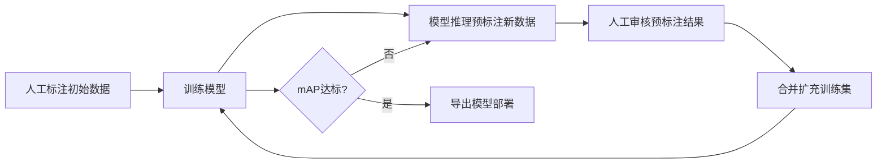

---
tags:
  - YOLOv7
  - 训练
  - 复盘
aliases:
  - 模型训练复盘
  - 训练指南
created: 2026-07-28
updated: 2026-07-28
title: 模型训练复盘 —— YOLOv7 车灯检测
type: project
summary: 记录实习项目中的背景、实现过程、实验结果和实践经验。
migrated: 2026-08-05
---

# 模型训练复盘 —— YOLOv7 车灯检测

> [!summary] Summary
> 记录实习项目中的背景、实现过程、实验结果和实践经验。

## 一、让模型跑起来的 5 个要素

YOLOv7 训练只需要 5 样东西：

```
weights/yolov7.pt           ← 预训练权重（迁移学习起点）
cfg/training/yolov7_my.yaml  ← 模型结构配置（nc=2）
data/my_yolo_dataset.yaml    ← 数据集配置（路径+类别）
data/hyp.scratch.custom.yaml ← 超参数（lr、损失权重、增强）
train.py                     ← 训练入口脚本
```

一条命令全搞定：

```bash
tmux new-session -d -s yolo_train7 \
"cd /data2/ai/yolov7-main-WFS && python3 train.py \
  --weights weights/yolov7.pt \
  --cfg cfg/training/yolov7_my.yaml \
  --data data/my_yolo_dataset.yaml \
  --hyp data/hyp.scratch.custom.yaml \
  --epochs 200 --batch-size 2 --img-size 1280 1280 \
  --device 1 --name yolo_light_exp7 --workers 4 \
  2>&1 | tee train7.log"
```

---

## 二、5 个要素详解

### 要素 1：预训练权重 `--weights`

```bash
weights/yolov7.pt   # COCO 80类预训练权重
```

COCO 上 80 类学到的特征（边缘、纹理、形状）对车灯检测也有用。`train.py` 加载时做了关键操作：

```python
# train.py:88-93
model = Model(opt.cfg, ch=3, nc=2, anchors=...)  # 用你的cfg建模型（2类输出层）
state_dict = ckpt['model'].float().state_dict()  # 取COCO权重
state_dict = intersect_dicts(state_dict, model.state_dict(), exclude=['anchor'])  # 只保留形状匹配的
model.load_state_dict(state_dict, strict=False)  # 非严格加载
# → Transferred 552/566 items（输出层因类别数不同被跳过）
```

> [!important] 关键理解
> `exclude=['anchor']` 排除 anchor 参数，`strict=False` 允许跳过不匹配的层。所以 80 类的 COCO 权重能完美迁移到 2 类的车灯模型——只有最后的检测头需要从头学。

### 要素 2：模型配置 `--cfg`

```yaml
# cfg/training/yolov7_my.yaml（从 yolov7.yaml 复制，只改了1行）
nc: 2                    # ← 唯一改动的行（原始是80）
depth_multiple: 1.0
width_multiple: 1.0
anchors:
  - [12,16, 19,36, 40,28]      # P3/8  小目标
  - [36,75, 76,55, 72,146]     # P4/16 中目标
  - [142,110, 192,243, 459,401] # P5/32 大目标

backbone:  # 50层，ELAN结构，输出 P3/P4/P5 三个尺度特征图
  ...

head:      # FPN融合 + 3个检测头
  ...
  [[102,103,104], 1, IDetect, [nc, anchors]]  # ← nc=2 在这里生效
```

`Model` 类读取这个 YAML 动态构建网络。backbone 提取特征 → head 做 FPN 融合 → 3 个尺度的 IDetect 检测头。

### 要素 3：数据集配置 `--data`

```yaml
# data/my_yolo_dataset.yaml（当前指向 try7）
train: /data2/ai/yolov7-main-WFS/dataset/yolo_dataset_try7/train.txt
val:   /data2/ai/yolov7-main-WFS/dataset/yolo_dataset_try7/val.txt
test:  /data2/ai/yolov7-main-WFS/dataset/yolo_dataset_try7/test.txt
nc: 2
names: ["head", "tail"]
```

`train.txt` 每行一个图片绝对路径，YOLOv7 自动找 `labels/` 目录下同名 `.txt` 标注文件。

### 要素 4：超参数 `--hyp`

```yaml
# data/hyp.scratch.custom.yaml
lr0: 0.01          # 初始学习率（SGD）
lrf: 0.1           # 最终学习率 = lr0 × lrf = 0.001
momentum: 0.937    # SGD 动量
weight_decay: 0.0005
warmup_epochs: 3.0
box: 0.05          # 框回归损失权重
cls: 0.3           # 分类损失权重
obj: 0.7           # 置信度损失权重
mosaic: 1.0        # 马赛克增强概率
fliplr: 0.5        # 水平翻转概率
loss_ota: 1        # 用 OTA 损失（最优传输分配）
```

### 要素 5：训练命令参数选择

| 参数 | 值 | 为什么 |
|------|-----|--------|
| `--weights` | yolov7.pt | COCO 预训练迁移学习 |
| `--batch-size 2` | 不用 4 | GPU 被 vLLM 占 14GB，仅剩 6GB，1280 分辨率 batch 4 会 OOM |
| `--img-size 1280` | 不用 640 | 车灯是小目标，高分辨率检出率从 43% → 65% |
| `--device 1` | 不用 0 | GPU 0 被 vLLM 占满 |
| `--epochs 200` | 不用 100 | 数据量增大后需更多轮次才能收敛 |
| `--workers 4` | | 数据加载进程数，太快会占内存 |

---

## 三、train.py 内部执行流程

```
1. 加载超参数 hyp + 数据配置 data_dict
2. 加载预训练权重 → 迁移 552/566 层（跳过输出层）
3. 建模型 Model(cfg, nc=2) → 放到 GPU
4. freeze=0 → 冻结 backbone 前 0 层（全解冻训练）
5. 优化器：SGD(lr=0.01, momentum=0.937, nesterov=True)
   - BN 层 weight → pg0（无权重衰减）
   - Conv 层 weight → pg1（有权重衰减）
   - bias → pg2
6. 学习率调度：OneCycleLR（余弦退火 1 → 0.1）
7. EMA 指数移动平均 → 验证用 EMA 模型而非原始模型
8. 训练循环：
   for epoch in 200:
     for batch in dataloader:
       前向传播 → pred = model(imgs)
       计算损失 → ComputeLossOTA（OTA 最优传输分配）
       梯度累积（nbs=64 / batch=2 → accumulate=32 步）
       反向传播 → scaler.scale(loss).backward()
       每 32 步 → optimizer.step() + EMA.update()
     每轮验证 → test.test() → 计算 mAP / P / R
     保存 best.pt + last.pt + 每 25 轮 epoch_xxx.pt
9. 训练结束 → strip_optimizer 去掉优化器状态，精简模型
```

> [!tip] 梯度累积
> `nbs=64`（名义 batch），实际 `batch_size=2`，所以 `accumulate=32`。每 32 个 batch 才实际更新一次权重，模拟了 batch=64 的效果。这是显存不够时的小 batch 救命技巧。

---

## 四、数据 pipeline

```
视频 → mp4_2_pic.py 抽帧 → batch_1~9 jpg 图片
    ↓
labelImg 标注 → VOC XML 文件
    ↓
make_dataset.py → XML 转 YOLO txt + 7:2:1 划分
    ↓
yolo_dataset_try5/
  images/train/ val/ test/  ← 图片
  labels/train/ val/ test/  ← txt 标注
  train.txt val.txt test.txt ← 路径列表
    ↓
my_yolo_dataset.yaml 指向 → train.py 读取
```

`make_dataset.py` 核心逻辑：

```python
# 1. 遍历所有 batch，收集有 XML 标注的样本
for d in src_dirs:
    for fn in os.listdir(d):
        if fn.endswith(".xml"):
            samples.append((xml_path, jpg_path))

# 2. 随机划分（seed=42 保证可复现）
random.shuffle(samples)
train = samples[:70%]
val   = samples[70%:90%]
test  = samples[90%:]

# 3. XML → YOLO 格式转换：xyxy → 归一化中心坐标
x = (xmin + xmax) / 2 / img_w    # 中心点 x，归一化到 0~1
y = (ymin + ymax) / 2 / img_h    # 中心点 y
w = (xmax - xmin) / img_w        # 宽度
h = (ymax - ymin) / img_h        # 高度
```

---

## 五、9 轮训练演进路线

```
510样本    → 990     → 1041    → 1505    → 1505(1280) → 2476(预标注) → 2475(重标小目标) → 3249(+新场景)
mAP: 0.224 → 0.341  → 0.351   → 0.488   → 0.766      → 0.810 → 0.880 → 0.923 → 0.876*
```
\* 第9轮原场景 mAP 略降，换来新场景泛化（F1=0.926）。

| 轮次 | 改了什么 | mAP@.5 变化 | 原因 |
|------|---------|-------------|------|
| 1→2 | 数据 510→990 | 0.224→0.341 | 数据翻倍，模型见多了 |
| 2→3 | 990→1041 | 0.341→0.351 | 仅+51张，增幅小 |
| 3→4 | epochs 100→150 | 0.351→0.488 | **欠训练**，150 轮还有提升空间 |
| 4→5 | 数据 1041→1505 | 0.488→0.766 | **+57% 大幅提升**，数据量是关键 |
| 5→6 | img-size 640→1280 | 0.766→0.810 | 小目标检出率提升，tail mAP +8% |
| 6→7 | 数据 1053→1733（+预标注 971） | 0.810→0.880 | **预标注数据首次生效** |
| 7→8 | 换 new_dataset 重标小目标（2475） | 0.880→0.923 | **补齐漏检小目标**，原场景最佳 |
| 8→9 | +dataset3 新场景 774 张微调（lr 1/10，50 轮） | 0.923→0.876（原场景） | 原场景略降，**新场景 F1 0→0.926** |

### 关键转折点

1. **第 5 轮**：数据量突破 1000，mAP 从 0.48 跳到 0.77 — 量变引起质变
2. **第 6 轮**：分辨率 640→1280 — 小目标（车灯）必须高分辨率
3. **第 7 轮**：预标注数据首次并入 — 验证了迭代扩充策略
4. **第 8 轮**：重标注补齐小目标 — 数据质量 > 数据数量，少量补标换来 +4.3 个点
5. **第 9 轮**：新场景泛化微调 — 低学习率 + 新场景数据，泛化与原场景精度的取舍

### 各轮详细参数

| 指标 | 第1轮 | 第2轮 | 第3轮 | 第4轮 | 第5轮 | 第6轮 | 第7轮 | 第8轮 | **第9轮** |
|------|-------|-------|-------|-------|-------|------|-------|-------|----------|
| 实验 | exp16 | exp2 | exp3 | exp4 | exp5 | exp6 | exp7 | exp8 | **exp9** |
| 数据集 | try1 | try2 | try3 | try3 | try4 | try4 | try5 | try6 | **try7** |
| 训练集 | 357 | 693 | 728 | 728 | 1053 | 1053 | 1733 | 1732 | **2274** |
| 数据来源 | 人工 | 人工 | 人工 | 人工 | 人工 | 人工 | 人工+预标注 | 重标注小目标 | **+新场景微调** |
| epochs | 100 | 100 | 96(断) | 150 | 150 | 200 | 200 | 200 | **50** |
| img-size | 640 | 640 | 640 | 640 | 640 | 1280 | 1280 | 1280 | **1280** |
| batch | 4 | 4 | 4 | 4 | 4 | 2 | 2 | 2 | **8** |
| **mAP@.5** | 0.224 | 0.341 | 0.351 | 0.488 | 0.766 | 0.810 | 0.880 | **0.923** | 0.876 |
| mAP@.5:.95 | 0.069 | 0.118 | 0.120 | 0.176 | 0.329 | 0.363 | 0.498 | 0.460 | **0.512** |
| Precision | 0.443 | 0.406 | 0.628 | 0.546 | 0.826 | 0.745 | 0.807 | 0.884 | **0.780** |
| Recall | 0.283 | 0.390 | 0.301 | 0.540 | 0.693 | 0.808 | 0.865 | 0.883 | **0.930** |
| head mAP@.5 | 0.241 | 0.467 | 0.425 | 0.554 | 0.841 | 0.847 | 0.900 | 0.948 | **0.873** |
| tail mAP@.5 | 0.206 | 0.214 | 0.278 | 0.421 | 0.691 | 0.772 | 0.860 | 0.898 | **0.880** |

> [!note] 第 8、9 轮补充
> 第 8 轮 `runs/train/yolo_light_exp8/weights/best.pt` 为原场景最佳（mAP@.5=0.923）；第 9 轮从 exp8 权重续训（`hyp.finetune.yaml`，lr0=0.001），新场景测试集 F1=0.926、混合 F1=0.860，误检率从 3.7 框/图 降至 0.42 框/图。三轮测试集口径不同（try5/6 测试集 248 张，try7 混合 326 张），mAP 不可直接纵向比较。

---

## 六、预标注迭代策略



### 两次预标注对比

| 项目 | 第一次（弃用） | 第二次（成功） |
|------|--------------|--------------|
| 使用模型 | exp4 (mAP=0.488) | exp6 (mAP=0.810) |
| 推理工具 | `pre_annotate.py` 自定义脚本 | `detect.py` 原生推理 |
| 转换工具 | 脚本内嵌（坐标有 bug） | `yolo2xml.py` 独立转换 |
| img-size | 640 / 1280 | 1280 |
| 检出率 | 43% / 91%(误检多) | 65% |
| 结果 | **弃用** | **971 样本已并入训练** |

> [!tip] 预标注门槛
> 模型 mAP@.5 需达到 **0.8 以上**，预标注才具有实用价值。低于此阈值误检太多，审核成本比手动标注还高。

### 预标注流水线命令

```bash
# 1. 用 best.pt 批量推理，保存 txt 结果
python3 detect.py \
  --weights runs/train/yolo_light_exp7/weights/best.pt \
  --source /data2/ai/dataset2/batch_1 \
  --img-size 1280 --conf-thres 0.25 --iou-thres 0.45 \
  --device 1 --save-txt --save-conf --exist-ok

# 2. txt 转 labelImg XML
python3 dataset/yolo2xml.py

# 3. XML 放回 batch 目录，用 labelImg 打开审核修正
```

---

## 七、踩过的坑

| 坑 | 现象 | 原因 | 解决 |
|----|------|------|------|
| PyTorch 2.6 `weights_only` | `torch.load` 报错 | 2.6+ 默认 `weights_only=True` | 4 个文件加 `weights_only=False` |
| nohup 被杀 | 后台训练中断 | shell 退出时 SIGHUP 传播 | 改用 tmux |
| GPU OOM | batch 4 + 1280 爆显存 | vLLM 占 14GB，仅剩 6GB | 降到 batch 2 |
| 空 XML 残留 | 训练报错 | labelImg 清空后仍生成空文件 | 脚本扫描删除无 `<object>` 的 XML |
| 首次预标注失败 | 检出率 43%，误检多 | exp4 模型 mAP=0.488 太差 | 等模型 mAP>0.8 再预标注 |
| `pre_annotate.py` 坐标偏移 | 预标注框位置不对 | 脚本内坐标转换逻辑有 bug | 改用 `detect.py` 原生 + `yolo2xml.py` 独立转换 |
| `attempt_load` 报 git 错误 | 加载模型失败 | 非 git 仓库，attempt_download 失败 | detect.py 原生调用无需 attempt_download |

---

## 八、代码修改记录

| 文件 | 行号 | 修改内容 | 原因 |
|------|------|----------|------|
| `train.py` | 71 | `torch.load(weights, ...)` → 加 `weights_only=False` | PyTorch 2.6 兼容 |
| `train.py` | 87 | `torch.load(weights, map_location=device)` → 加 `weights_only=False` | 同上 |
| `utils/datasets.py` | 392 | `torch.load(cache_path)` → 加 `weights_only=False` | 同上 |
| `utils/general.py` | 802 | `torch.load(f, map_location=...)` → 加 `weights_only=False` | 同上 |
| `models/experimental.py` | 252 | 已自带 `weights_only=False` | 无需修改 |

---

## 九、总结的规律

1. **数据 > 一切**：每次瓶颈都是靠加数据突破的，不是调参
2. **小目标必须高分辨率**：img-size 1280 对车灯这种小目标至关重要
3. **预标注有门槛**：mAP@.5 需达到 0.8 以上，预标注才有实用价值
4. **迭代循环**：模型越好 → 预标注越好 → 审核越快 → 数据越多 → 模型更好
5. **batch-size 不是越大越好**：梯度累积可弥补小 batch 的不足（nbs=64, accumulate=32）

---

## 十、下一轮训练 SOP

> 第 8、9 轮即按此流程完成：第 8 轮换 `new_dataset` 源，第 9 轮再并入 `dataset3_new` 并改用 `hyp.finetune.yaml` 微调。下轮把 `tryN`/`expN` 顺延编号即可。

```bash
# 1. 审核完 /data2/ai/dataset2/ 预标注数据后

# 2. 修改 make_dataset.py
#    - src_dirs 加入新审核数据目录
#    - out_root 改为 yolo_dataset_tryN（下一轮编号）

# 3. 运行数据划分
cd /data2/ai/yolov7-main-WFS/dataset && python3 make_dataset.py

# 4. 修改 data/my_yolo_dataset.yaml，路径指向新数据集

# 5. 启动训练
tmux new-session -d -s yolo_trainN \
"cd /data2/ai/yolov7-main-WFS && python3 train.py \
  --weights weights/yolov7.pt \
  --cfg cfg/training/yolov7_my.yaml \
  --data data/my_yolo_dataset.yaml \
  --hyp data/hyp.scratch.custom.yaml \
  --epochs 200 --batch-size 2 --img-size 1280 1280 \
  --device 1 --name yolo_light_expN --workers 4 \
  2>&1 | tee trainN.log"

# 6. 监控训练
tmux attach -t yolo_trainN        # 看实时输出
# Ctrl+B 然后 D 退出 tmux

# 7. 训练完成后评估
python3 test.py \
  --weights runs/train/yolo_light_expN/weights/best.pt \
  --data data/my_yolo_dataset.yaml \
  --task test --img-size 1280 \
  --conf-thres 0.001 --iou-thres 0.65 \
  --device 1 --batch-size 8
```

> [!quote] 核心就 5 个文件 + 1 条命令
> **权重、cfg、data yaml、hyp yaml、train.py**
> 其余都是围绕数据质量和工程问题的辅助工作。

## 关键概念

- yolo、训练、复盘、模型训练复盘、训练指南

## 关联笔记

- [[项目工作总结报告]]：实习期两个检测项目的整体工作总结。
- [[车灯检测/夜间车灯识别车辆文档（基于yolov7）]]：本项目完整流程文档。
- [[笔记/知识库/知识库索引]]：返回全库主题索引。
- [[笔记/心得/Codex介绍]]：本项目的 AI 协作维护方式。

## 规划

- [ ] 审核剩余预标注数据（`/data2/ai/dataset2/batch_1~9`，2742 XML），扩充后按第十节 SOP 启动下一轮训练。
- [ ] 跟进 [[车灯检测/夜间车灯识别车辆文档（基于yolov7）]] 待办：停车检测主流程落地、conf 阈值调优、模型导出部署。
