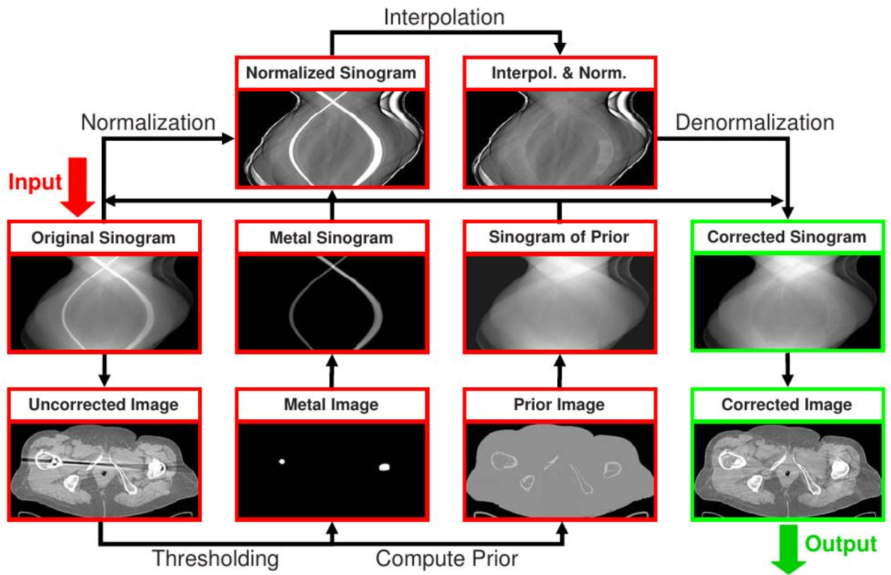
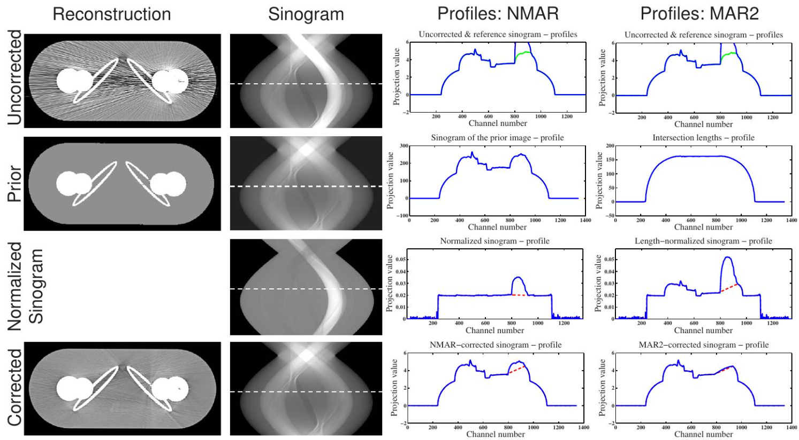
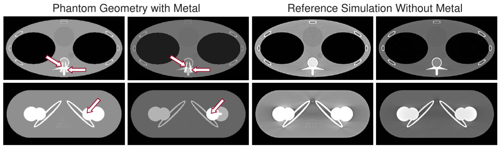
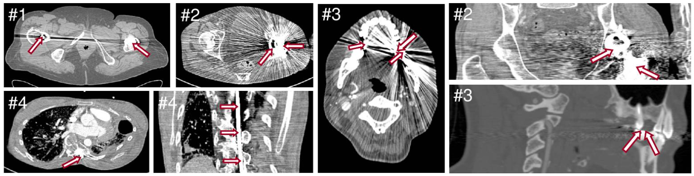
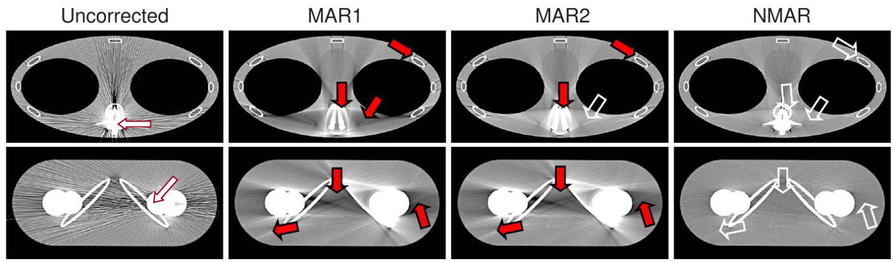

# Normalized metal artifact reduction （NMAR） in computed tomography

**归一化金属伪影抑制（NMAR）在计算机断层扫描中的应用**

View online: [http://dx.doi.org/10.1118/1.3484090](http://dx.doi.org/10.1118/1.3484090)

# abstract 摘要

### Purpose:

目的：虽然现代临床CT扫描仪在正常情况下能产生高质量的图像，但如果测量场中存在金属假体或其他金属物体，严重的伪影会降低图像质量和诊断价值。金属伪影抑制（MAR）的**标准方法**是用插值法替换受金属影响的投影数据部分（所谓的金属轨迹或金属阴影）。然而，虽然投影图插值法能有效地去除金属伪影，但由于插值法无法完全恢复金属轨迹中的信息，因此常常会引入新的伪影。本工作的目的**是介绍一种通用的MAR归一化技术，能够有效抑制金属伪影，同时几乎不引入新的伪影**。将所提出的方法与标准的MAR方法以及使用简单长度归一化的MAR方法进行了比较。

### Methods:

方法：在第一步中，通过**阈值分割**在图像域中分割金属。**三维前向投影**识别原始投影中的金属轨迹。在插值之前，基于先前图像的三维前向投影**对投影进行归一化**。该先前图像例如通过初始图像的多阈值分割获得。原始数据除以先前图像的投影数据，并在插值后再次反归一化。进行模拟和测量以比较归一化金属伪影校正（NMAR）与线性插值的标准MAR以及基于简单长度归一化的MAR。

### Results:

结果：本研究展示了临床螺旋锥束数据的有希望的结果。其中包括带有髋关节假体、牙科填充物和脊柱固定器的患者，这些患者以 0.9 至 3.2 的螺距值进行扫描。图像质量得到了显著改善，特别是对于骨骼结构内或其附近的金属植入物。通过比较不同方法的图像和正弦图的剖面以及检查感兴趣区域 (ROI) 来评估改进。**NMAR 在所有情况下均优于其他两种方法。它将金属伪影减少到最低限度，即使在靠近金属区域也是如此**。即使对于引起最严重伪影的牙科填充物患者，使用 NMAR 也获得了满意的结果。与其他方法相比，如果金属伪影适中，NMAR 可以防止金属植入物附近结构的通常模糊。

### Conclusions:

结论：**对于中度和重度伪影，NMAR 的性能明显优于其他方法**。所提出的方法能够可靠地减少模拟 CT 数据和临床 CT 数据中的金属伪影。与迭代方法相比，NMAR 在计算上更有效且成本更低，可以作为任何传统投影图修复方法的附加步骤。© 2010 美国医学物理学家协会。

### Key words:

metal artifact reduction, metal artifact correction, metal artifacts, image quality, sinogram inpainting

关键词：金属伪影抑制，金属伪影校正，金属伪影，图像质量，投影数据修复

# I. INTRODUCTION 引言

### I.A. Overview 概述

现代CT扫描仪能够产生高质量的图像，在理想情况下（例如，在校准良好的扫描仪中对水体进行扫描），CT值可以达到1 HU的精度。然而，如果测量场中存在金属物体，高达数百HU的严重伪影会降低图像质量和诊断价值。

在金属物体存在的情况下，有多种效应会导致伪影的形成。与人体组织相比，金属的密度和原子序数要高得多。此外，金属植入物通常具有清晰定义的边界。由于这些原因，与没有金属的情况相比，噪声、束硬化伪影、散射伪影和非线性部分容积伪影更为严重。**金属伪影一词是所有这些伪影的总称**。

**低对比度结构可能很容易被金属伪影所遮蔽**。例如，在存在牙科填充物的情况下，舌部肿瘤可能仍未被检测到。可能需要进行额外的扫描，提高管电流和管电压，或者调整患者体位以避开扫描平面内的金属植入物。因此，患者剂量增加。

自首次发表关于金属伪影减除（MAR）的文献以来，已提出了多种金属伪影减除（MAR）方法。这些方法可分为**投影数据修复法、迭代法、统计法和滤波法**。据我们所知，目前没有商用CT扫描仪提供金属伪影减除软件，因此，金属植入物仍然是计算机断层扫描中伪影的主要来源。

**正弦图修复方法**是最常用的金属伪影去除（MAR）方法，它们通过插值或前向投影,来补全正弦图，其中将受金属影响的值视为缺失数据。**滤波方法**试图利用所有可用信息，而不是替换投影的一部分。**迭代方法**提供了一种结合额外知识的途径，例如，采集过程背后的物理原理或光子统计学。**统计方法**比滤波反投影对噪声的敏感度较低。如文献所示，结合不同方法可能是有益的。另一种被追求的有趣方法是具有全变分最小化的金属伪影去除（MAR）。

### I.B. Sinogram inpainting 正弦图修复

正弦图修复方法在金属伪影校正（MAR）方法中应用最为广泛，该类方法将投影数据中受金属影响的部分（即所谓的金属轨迹或金属阴影）视为**缺失数据**。其基本理念是：只要对应的射线穿过金属物体，该正弦图数值就应被视为完全不可靠。

这些方法利用插值或前向投影，通过修复替代数据到金属轨迹中来完成 the sinogram。最简单的例子是在通道方向上的**线性插值**，如文献3中所提出的。本工作中将此方法称为**MAR1**。金属通过在未校正图像中的阈值操作来检测。仅包含金属的图像进行前向投影。获得的金属 the sinogram 中的非零项定义了金属轨迹，该轨迹确定了需要替换的原始原始数据的部分。插值后，重建图像。纯插值方法的一个**主要缺点**是信息丢失，尤其是在金属轨迹中的边缘信息丢失，这会导致图像中相应边缘的模糊。另一个负面影响是形成与金属物体相切的条纹伪影，如果原始和插值投影数据之间的过渡不够平滑，就会引入这些伪影。这些效应在靠近金属物体的区域最为明显，因为替代 the sinogram 值在这些区域的贡献更大。靠近植入物的图像质量严重下降，当假体与患者安排CT的原因相关时，尤其令人不安。因此，有必要注意金属物体的邻近性，并避免在那里产生新的伪影。除了线性插值 （MAR1） 外，还应用了许多不同且更复杂的插值方案，以获得更准确的替代数据。例如，在文献4和18-21中研究了**距离加权、定向、样条与傅里叶基和光滑插值**。问题本身——金属轨迹中的信息丢失以及由此引入的新伪影——仍然存在。

在参考文献17中，在**插值之前对正弦图(sinogram) 进行长度归一化**，以获得空气与水当量材料物体之间更好的对比度。该方法在本工作中称为 **MAR2**。然而，靠近骨骼结构以及骨骼和金属之间的区域仍然受到损害。本研究引入了归一化金属伪影校正方法（NMAR）来克服这些不足。

# II. METHOD 方法

### II.A. Idea 思路

本研究展示了如何通过归一化金属伪影去除（NMAR）克服纯粹的投影图插值方法的典型缺点。投影图插值的一个问题是原始数据和插值数据过渡区域的平滑度不足，这会导致条状伪影。在均匀数据中，插值问题较小。**适当归一化的思想是通过某种方式转换投影图，使其变得相对平坦**。如果在近乎平坦的归一化投影图上执行插值，则原始数据和插值之间的过渡将非常平滑。

一种将投影图转换为更均匀形式的方法在文献17中有描述。本研究将此方法称为MAR2。在第一步中，重建一个未经校正的图像。金属伪影的确定方法与MAR1完全相同（阈值化和金属前向投影）。然后，通过将投影图中的每个条目除以其对应射线与被扫描对象的交集长度来对未经校正的投影图进行归一化。金属投影决定了归一化投影图中的数据将被何处插值替换（例如线性插值）。随后，通过反归一化获得校正后的投影图。这是通过将插值和归一化后的投影图再次乘以交集长度来实现的。对该校正后投影图的重建产生校正后的图像。

与MAR1相反，MAR2对于**仅由一种材料加上空气和金属组成的简单对象**可以得到精确结果：投影值p = Rf共，其中Rf是扫描对象f的Radon变换或x射线变换，它不仅取决于材料的衰减系数，还取决于射线与材料的交线长度。如果将每个投影值除以相应的交线长度，那么仅由金属、一种非金属材料和空气组成的对象的投影图将在金属轨迹外部的任何地方获得平均衰减值。这些长度可以通过对所考虑对象的二值化版本的正向投影来计算，二值化版本可以通过阈值处理找到。除法之后，进行金属轨迹的插值。整个投影图现在在任何地方都获得平均衰减值。之后，将投影图与交线长度相乘。

MAR2在**无高对比度**的情况下可获得优异的结果。然而，在骨骼存在的情况下，具有交集长度的归一化并未产生非常平坦的正弦图，并且无法避免新的伪影。为了将此思想推广到更多材料，NMAR使用**先验图像fprior**，该图像也考虑了骨骼及其他潜在的高对比度结构。

纯粹插值方法的另一个缺点，如前一节所述，是金属痕迹中的边缘信息丢失，特别是对于高对比度结构。通过本节后面将介绍的去归一化，NMAR 恢复了金属阴影中高对比度物体的痕迹。这些痕迹的形状信息包含在先前图像的投影图中。与仅仅用先前图像的投影图值替换投影图值不同，NMAR 确保了代理数据的无缝拟合以及先前图像中包含的物体的痕迹的恢复。同时，插值至少近似地连接了未包含在先前图像的投影图中的痕迹，因此在归一化投影图中没有被完全展平。

### II.B. Algorithm 算法

图1展示了NMAR不同步骤的示意图。从**原始数据**中重建出**未校正的图像**。通过==阈值处理==获得**金属图像**。**先验图像**通过软组织和骨骼的==分割计算==得出。==前向投影==得到**先验图像的投影图**。然后通过==除以==**前向投影的先验图像**来==归一化==**原始投影图**。该除法是逐像素进行的。为了避免除以零，必须选择一个小的正值teps作为执行除法的阈值。严格来说，只有接近金属轨迹的值才需要归一化和反归一化，因为只有这些值才对插值有贡献。**归一化后的投影** $p^{norm}$ 进行==基于插值的MAR运算M==（本工作中为MAR1）。随后，通过对**插值后的归一化投影图**进行==反归一化==，得到**校正后的投影图** $p^{corr}$ 。这是通过将其与投影值 $p^{prior}$ ==相乘==来实现的。

> [!图1]
> 图 1. NMAR 方案—从原始数据中重建未校正图像。通过阈值处理得到金属图像和先验图像。前向投影得到相应的投影图。然后通过将原始投影图除以先验图像的投影图进行归一化。金属投影决定了归一化投影图中的哪些数据被插值替换。插值和归一化后的投影图通过再次乘以先验图像的投影图进行去归一化。重建得到校正后的图像。

在此步骤中，来自先验图像的结构信息被带回到金属轨迹。先验图像的正弦图 (sinogram) 中包含高对比度物体的痕迹。归一化和乘法过程确保原始数据数据之间没有偏移。软组织中**低对比度物体**（例如肿瘤）的痕迹，这些痕迹未包含在先前图像中，仍然可以通过归一化正弦图(sinogram) 的插值来近似连接。重建后，将金属插回校正后的图像。这是为 NMAR、MAR1 和 MAR2 完成的。

为了解释NMAR不同步骤的效果及其与MAR2的区别，图2展示了使用模拟髋部体模的NMAR和MAR2校正。展示了图像和相应的投影图，并比较了通过投影图的剖面。

> [!图2]
> 图 2. 为了说明 NMAR 的步骤及其与 MAR2 的区别，展示了包含金属伪影校正（MAR）的髋部模型图像、相应的投影图和穿过投影图的剖面图。MAR1 和 MAR2 的校正结果见图 5。未校正的数据显示在上行，校正结果显示在下行。右侧列显示了 MAR2 相应步骤的投影图剖面。对于 NMAR，通过将未校正的投影图除以先验图像的投影图共（第二行）来获得归一化投影图。对于 MAR2，未校正投影图的每个条目除以相应射线与扫描物体相交的长度共第二行。第三行：剖面图中的虚线表示金属轨迹中线性插值的值。MAR2 剖面图比原始数据更均匀，但骨骼轨迹仍然可见。NMAR 剖面图比 MAR2 剖面图更均匀。底行：插值剖面的去归一化得到校正后的数据。图中的实线是校正后的剖面，虚线显示了 MAR1 的结果以供比较。MAR2 和 NMAR 的结果都比 MAR1 的结果更平滑。然而，MAR2 的结果在骨骼轨迹中的值不够准确。（C=0 HU/W=1000 HU）。

为了可靠地替换金属投影，需要以**三维方式**执行前向投影，并采用未校正投影的精确几何形状。使用了**约瑟夫方法的三维版本**。约瑟夫前向投影器是一种射线驱动的前向投影器，它应用梯形法则来近似通过体积的线积分。采样点的数值通过离散体积的网格点之间的线性插值来确定。为了获得前向投影的足够精度，对于使用 Definition Flash 扫描仪扫描的患者，以 1.2 毫米的切片厚度和 0.6 毫米的增量进行重建（对于使用 Sensation 16 扫描仪扫描的患者，切片厚度为 1 毫米，增量为 1 毫米）。为了减少混叠，通过在通道方向上进行三倍过采样来模拟孔径为 2，即对每个探测器像素进行三个射线的平均。

对于MAR1、MAR2和NMAR，首先需要计算三维前向投影以识别金属阴影。由于需要先前图像的投影数据，与MAR1等纯插值方法相比，NMAR具有一些额外的计算成本。然而，额外的成本是微不足道的：仅需要金属轨迹附近和内部的投影图值来进行归一化和反归一化。因此，根据植入物的大小，**只需要对先前图像的非常小部分进行前向投影**。如果使用MAR1进行预校正，NMAR需要一次额外的重建。

### II.C. Prior image 先验图像

对于NMAR而言，寻找一个好的先验图像是一个重要的步骤。它应该尽可能地模拟图像，但不包含任何伪影。为了实现这一点，必须识别出空气区域、软组织区域和骨骼区域。在这项工作中，在图像用**高斯平滑**后，应用了一个**简单的阈值分割**来分割空气、软组织和骨骼。为了在分割之前减少条状伪影，按照参考文献17中所述，在金属轨迹中进行平滑也是有益的。参考文献7描述了一种**寻找合适阈值的自动程序**。然后将空气区域设置为-1000 HU，软组织部分设置为0 HU。骨骼像素保留其值，因为它们变化太大，无法用一个值来恰当地模拟它们。分配给金属的值是任意的。它不影响归一化和插值，因为只有靠近金属轨迹但不在其内部的正弦图部分才有贡献。在校正后的图像中，最终重新插入原始金属值以可视化植入物。

对于密度中等的较小金属物体，可以在未校正的图像中进行分割。与仅显示少量和小型金属植入物引起的轻微伪影的体积切片相比，NMAR的**优点**在于校正结果不会受到影响。这在MAR1和MAR2中很常见，其中靠近金属的区域会被模糊化。更多细节将在下一节中提供。对于伪影含量较高的情况，通过分割预校正图像（例如使用MAR1校正）中的骨骼可以获得更可靠的结果。患者2和患者3使用MAR1进行了预校正。在这种情况下，首先需要重建一个MAR1校正后的图像。在这些情况下，NMAR包含三次重建而非两次。当然，也可以使用其他的预校正方法。

# III. SIMULATIONS AND MEASUREMENTS 模拟与测量

### III.A. Simulations 模拟

为评估NMAR的潜力，模拟了两种发生金属伪影的临床情况下的模体扫描：钛合金假体行髋关节置换术和椎弓根螺钉行脊柱融合术。使用DRASIM（西门子医疗，福希海姆，德国）模拟了来自FORBILD小组的[半人体模型软件模体](http://www.imp.uni-erlangen.de/phantoms/)。模体的几何结构如图3所示。图3也显示了无金属、无噪声模体的模拟结果，并作为参考。模拟中考虑了噪声、束硬化和非线性部分容积效应。模拟了软组织和骨组织的真实材料成分。模拟参数为120 kV，0.6 mm层宽，672通道，每次旋转1160个视角。为了获得有限的束宽，模拟了每个探测器单元25条射线。

> [!图3]
> 图 3. FORBILD 髋部模型和 FORBILD 胸部模型。箭头标记了金属植入物的位置。左侧展示了模型的几何结构。右侧展示了无金属、无噪声模型的模拟结果。（C=0 HU/W=1000 HU）和 （C=500 HU/W=2500 HU）。

### III.B. Measurements 测量

为了展示NMAR相对于MAR1和MAR2的优势，本研究展示了四名患者的结果，其扫描螺距值范围为0.9至3.2。图4显示了每位患者的未校正图像。患者1是一名患有双侧髋关节假体的病例。患者2有一侧全髋关节假体，而患者3有金属牙科填充物。患者4的脊柱用Harrington杆固定。患者1的扫描使用Somatom Sensation 16共140 kV、320 mAs、16×0.75 mm准直和1.0螺旋螺距获得。患者2-4使用Somatom Definition Flash扫描仪获得。该扫描仪是第三代临床双源扫描仪，每个探测器有64个探测器排，具有飞行焦点，并且允许的螺距值高达3.4。

> [!图4]
> 图 4. 本工作中考虑的四名患者。患者 1：双侧髋关节假体（C=0 HU/W=500 HU）。患者 2：单侧髋关节假体（C=0 HU/W=500 HU）。患者 3：牙科填充物（C=100 HU/W=750 HU）和（C=300 HU/W=1500 HU）。患者 4：用于脊柱固定的 Harrington rod（C=0 HU/W=1000 HU）。箭头标记了金属植入物的位置。

# IV. RESULTS 结果

本节将展示使用 MAR1、MAR2 和 NMAR 方法校正后的模拟和临床数据集的结果。实心箭头用于突出显示由校正方法引入的伪影的位置。为了进行比较，轮廓箭头标记了图像中不存在伪影的相同位置，从而暗示所使用的校正方法更优。未校正图像中的金属伪影，即穿过金属的条纹，是显而易见的。未校正图像中的箭头标记了金属部件的位置。患者的结果以两种窗口设置呈现——一种窄窗口用于更好地评估条纹伪影，另一种宽窗口用于检查骨骼以及金属植入物的位置和形状。

### IV.A. Simulation模拟

图 5 显示了模拟髋部模型和模拟胸部模型的重建图像，包括未校正以及使用 MAR1、MAR2 和 NMAR 进行校正后的图像。原始的条纹伪影被每种方法成功去除。然而，**MAR1 在两种情况下都会导致严重的新的伪影**：由于边缘信息丢失导致植入物附近的骨骼模糊，以及切线于植入物先前区域的条纹伪影。与 MAR1 相比，MAR2 明显提高了胸部模型的图像质量，但**对髋部模型无效**。在胸部模型中，肺部充满空气。与 MAR2 一起用于计算交集长度的二值图像包含有关肺部形状的信息。因此，可以避免由肺部轨迹误差引起的伪影。使用 MAR2 校正后，靠近骨骼的伪影仍然存在。使用 NMAR 校正后，两种模型的图像伪影明显减少。模拟表明，即使是精细的骨骼结构也可以被保留。

> [!图5]
> 图 5. 髋部模型和胸部模型的对比。未校正图像中的箭头标示了金属植入物的位置。在校正后的图像中，实心箭头突出了校正方法引入的伪影的位置。轮廓箭头标示了同一位置，但该位置的图像中不存在伪影，因此暗示所使用的校正方法更优。原始的条状伪影被每种方法成功校正。然而，MAR1和MAR2引入了新的伪影。执行NMAR后，图像显示的伪影明显减少，并且模拟显示即使是精细的骨骼结构也能被保留（C=0 HU/W=500 HU）。

### IV.B. Measurements 测量

#### IV.B.1. Patient 1 患者 1

对于患者1，即植入了两个植入物的患者，结果如图6所示。未经校正的图像在两个植入物之间存在细条纹伪影和明显的束硬化伪影。MAR1、MAR2和NMAR均消除了这些伪影。然而，MAR1引入了与植入物相切的虚假条纹。MAR2也引入了虚假条纹，但有些不太严重。MAR1和MAR2还会导致模糊，在右侧假体周围骨骼的上部区域最为严重。只有NMAR能够生成几乎没有引入新条纹且不会模糊植入物附近区域的图像。NMAR处理后，假体周围的骨骼清晰可见。

#### IV.B.2. Patient 2 患者 2

图示了患者2（一位接受了髋关节置换术的患者）的影像，其在图7-9中呈现出更强的伪影。所有三种金属伪影去除（MAR）方法均显著提高了整个容积的图像质量。金属由具有圆形横截面的单个物体组成的切片（如图7所示）是基于插值的金属伪影去除（MAR）的理想情况。尽管如此，与MAR1相比，MAR2和NMAR仍有改进。使用MAR2和NMAR进行的校正可获得更均匀的结果，并减少与假体相切的伪影。然而，使用MAR2校正后，骨骼结构附近会出现一些黑暗伪影。这是由于金属轨迹中的投影图值过低所致，因为MAR2未考虑骨组织的更高衰减。在图8中，由于金属的横截面更大，所述效应更为明显。

图9展示了与假体固定端部相交的切片的测量结果。未校正图像中的伪影非常轻微。然而，如果对整个体积进行校正，该切片也会被校正。MAR1和MAR2的校正结果比未校正版本更差；固定端附近的精细骨骼结构变得模糊。在NMAR校正图像中，模糊和条状伪影不再可见。

图 5. 髋部模型和胸部模型的对比。未校正图像中的箭头标记了金属植入物的位置。在校正后的图像中，实心箭头突出了校正方法引入的伪影的位置。轮廓箭头标记了图像中相同的位置，但该位置没有伪影，因此表明所使用的校正方法更优越。原始的条纹伪影被每种方法成功校正。然而，MAR1和MAR2引入了新的伪影。执行NMAR后，图像显示的伪影明显减少，并且模拟显示即使是精细的骨骼结构也能被保留共C=0 HU/W=500 HU兲。

图 6. 患者 1 接受双侧髋关节假体植入术。箭头指示与图 5 类似。MAR1 和 MAR2 导致骨骼模糊并引入条纹伪影。与 MAR1 相比，MAR2 的新条纹伪影略有减少。NMAR 可生成几乎没有新条纹的图像。底部行的放大图显示，只有在 NMAR 后，右侧假体周围的骨骼才清晰可见。顶行：共C=0 HU/W=500 HU兲。中间行和底行：共C=500 HU/W=1500 HU兲。

#### IV.B.3. Patient 3 患者 3

图10-12展示了患者3（有牙科填充物）的三张切片。在存在牙科填充物或牙冠的情况下，金属伪影的减少尤其具有挑战性。通常存在多个高密度和不规则形状的金属物体。此外，牙釉质是人体中天然存在的最致密材料。因此，通过插值可能产生的绝对误差比其他情况更高。

图 10 显示了下颌骨的切片，其中一颗后牙有充填物。伪影在很大程度上遮挡了舌头区域。使用 MAR1 和 MAR2 进行校正可以去除强烈的条纹伪影以及过度的束硬化伪影。使用 NMAR，图像在靠近充填物的区域也能得到恢复，并且新引入的伪影最不明显。

图 7. 患者 2 的单侧全髋关节假体。箭头指示类比图 5。所有三种 MAR 方法均可提高图像质量。具有圆形横截面的单个假体是基于插值法的 MAR 的理想情况。与 MAR1 相比，MAR2 和 NMAR 均可获得更均匀的结果，并减少假体切线方向的伪影。使用 MAR2 校正后，可见骨骼结构附近的暗伪影，NMAR 可避免这些伪影。顶行和中间行：共C=0 HU/W=750 HU兲。底行：共C=500 HU/W=1500 HU兲。

图 8. 患者 2 的单侧全髋关节假体—显示了一个金属横截面大于图 7 的切片。箭头指示类似于图 5。使用 MAR2 和 NMAR 进行校正可获得更均匀的结果，并减少假体切线方向的伪影。与图 7 相同，使用 MAR2 校正后，骨骼结构附近可见暗伪影，而 NMAR 可避免这些伪影。顶行和中行：共C=0 HU/W=750 HU兲。底行：共C =500 HU/W=1500 HU兲。

图 11 所示的切片几乎可以看作是最坏情况的场景：两侧均有多个牙科填充物

图 9. 患者 2 接受单侧全髋关节假体植入术。箭头指示同图 5。所显示的切片与假体固定端相交。未校正图像中的伪影非常轻微。在 MAR1 和 MAR2 的校正结果中，固定件附近的精细骨骼结构变得模糊。在 NMAR 校正图像中，未见模糊或条状伪影。顶行和中行：共C=0 HU/W=750 HU兲。底行：共C =500 HU/W=1500 HU兲。

图 10. 患者 3，穿过下颌牙齿填充物的切片。箭头类比图 5。在未校正的图像中，伪影遮挡了舌部的大部分区域。使用 MAR1 和 MAR2 进行校正可去除强烈的条状伪影以及过度的束硬化伪影，但引入了一些新的条状伪影和模糊。使用 NMAR，即使在靠近填充物的区域，图像也得到了恢复。顶行和中行：共C =100 HU/W=750 HU兲。底行：共C=1000 HU/W=4000 HU兲。

下颌骨。在狭窄的窗口中，解剖学特征在前部几乎不可见。同样，金属伪影可以在一定程度上通过MAR1和MAR2去除，但代价是引入新的且严重的插值伪影。不幸的是，即使使用NMAR，一些伪影仍然存在。然而，结果优于MAR1和MAR2，后两者会损害切片大部分区域的图像质量。

在第三个切片（图12所示）中，可以看到一个牙科填充物的下端被截断，该填充物仅具有很小的横截面。精细条纹伪影主要出现在后部。可以使用MAR1、MAR2和NMAR去除这些伪影，其中MAR1和MAR2会引入新的伪影，主要出现在牙齿区域，而使用NMAR获得的结果则没有伪影。

#### IV.B.4. Patient 4 患者 4

患者4的结果如图13所示。患者的脊柱用Harrington棒固定。金属棒的横截面相对较小，会引起细条伪影和中度束硬化伪影。MAR1和MAR2甚至会损害图像质量。使用MAR1或MAR2校正后，椎骨的右侧横突模糊，骨骼之间出现暗伪影。NMAR在完美保留骨骼结构的同时校正了金属伪影。

从该示例以及图9和12中展示的结果来看，NMAR的一个重要优势在于：即使是仅有少量金属植入物、伪影不严重的切片图像，经过NMAR校正后也不会比校正前的图像效果更差。NMAR保留了所有结构，因为它使用了先验图像，而先验图像在这些情况下非常准确。

图 11. 患者 3，颌骨两侧有多处牙齿填充物。箭头指示同图 5。在顶部行未校正的图像中，解剖结构在前方区域几乎不可见。使用 MAR1 和 MAR2 可以去除一些伪影，但会产生新的伪影。即使使用 NMAR，在这种最坏的情况下仍然存在一些伪影。与 MAR1 和 MAR2 引入的伪影相比，剩余的伪影强度要小得多，后者会影响切片的很大一部分。中间行显示了视场为 100 厘米的重建的一部分。顶部行和中间行：共C =100 HU/W=750 HU兲。底部行：共C=1000 HU/W=4000 HU兲。

# V. DISCUSSION 讨论

NMAR已显示出为不同类型的金属植入物提供有希望的结果。然而，本工作中对患者数据结果的评估当然是主观的。通过目视检查，NMAR优于其他两种方法。定量评估存在问题，因为患者数据没有真实情况，并且使用模体的结果不能完全转移。为充分证明该算法的有效性，计划进行一项涉及更多病例的临床研究，并由训练有素的放射科医生进行系统评估。

图 12. 患者 3，穿过牙科填充物下端的切片，该填充物仅具有很小的横截面。箭头类比于图 5。细条状伪影主要在后部可见。MAR1 和 MAR2 引入的伪影幅度与去除的伪影幅度相同。NMAR 去除了伪影并保留了所有结构。顶行和中行：共C=100 HU/W=750 HU兲。底行：共C=1000 HU/W=4000 HU兲。

寻找一个好的先验图像是该算法的一个关键点。错误的分割结果可能导致残留伪影，如图11所示。更高级的分割算法无疑会比简单的阈值分割增强结果，但这超出了本工作的范围。患者3证明了所提出算法的局限性。如果先验图像即使在预处理后仍包含分割错误，则残留伪影是不可避免的。如果存在过多或过大的金属植入物，特别是当这些植入物靠近骨骼时，这种情况很可能发生。在这种情况下，如图11所示，在NMAR结果中发现了剩余的伪影。部分暗的束硬化伪影被错误地分割为空气，一些亮的区域被错误地分割为骨骼。这些错误值是从MAR1校正图像分割出来的，因此校正结果不会比该图像更差。另一方面，只有足够严重以至于落入错误组织类别的MAR1图像中的伪影才会产生负面影响。尽管如此，一些条纹和模糊可以被去除，结果明显优于MAR1结果。

# VI. CONCLUSION 结论

将NMAR应用于模拟数据和临床数据均可获得优异的结果。即使在金属伪影含量高且靠近植入物的情况下，NMAR也能在很大程度上减少伪影。在距离金属植入物较远的区域，经过NMAR校正后几乎没有伪影残留。虽然MAR2在某些情况下优于MAR1，但在本研究考虑的所有情况下，NMAR均优于MAR1和MAR2。对于具有非常小的金属植入物和少量伪影的图像，MAR1和MAR2甚至会降低图像质量，而在这些情况下NMAR可提供几乎无伪影的结果。

图 13. 展示了接受脊柱固定术的 4 号患者。箭头指示类似于图 5。图像中，金属棒位于椎骨下方。由此产生细条状伪影和中度束硬化伪影。该患者金属伪影少且中等，是 MAR1 和 MAR2 甚至会损害图像质量的一个例子。椎骨右侧的横突模糊，使用 MAR1 或 MAR2 校正后，骨骼之间出现暗伪影。NMAR 在保留骨骼结构的同时校正了金属伪影。顶行和中行：共C=0 HU/W=1000 HU兲。底行：共C=500 HU/W=1500 HU兲。

# VII. SUMMARY 总结

基于塞诺图插值的方法是最常见的金属伪影抑制（MAR）方法类型，但由于无法完全恢复金属阴影的全部信息，它们常常引入新的伪影。当存在高对比度结构（例如牙齿）时，这些伪影尤其严重。为了克服这一缺点，本研究介绍并评估了一种广义塞诺图归一化技术。NMAR旨在有效减少金属伪影并防止引入新的伪影。归一化基于先验图像的3D前向投影，该先验图像通过多阈值分割获得。先验图像模拟了空气、软组织和骨骼区域。归一化后的投影经过基于插值的MAR操作。在本工作中，NMAR与线性插值一起使用。可以选择任何适合MAR的插值方案，但我们没有发现使用更复杂的插值方案对NMAR有额外的好处。校正后的塞诺图是通过对插值后的、归一化后的塞诺图进行反归一化得到的。

本文展示了四例患有髋关节假体、牙科填充物和脊柱固定术的患者的治疗结果。三名患者使用 Somatom Definition Flash 扫描仪以 0.9 至 3.2 的螺距值进行扫描，一名患者使用 Somatom Sensation 16 扫描仪以 1 的螺距进行扫描。NMAR 可可靠地减少从模拟数据和临床数据重建的图像中的金属伪影。与使用线性插值的 MAR 和简单的长度归一化 MAR 相比，图像质量总体上有所提高。细节，尤其是在靠近金属物体和骨骼的细节，得到了更好的保留。与迭代方法相比，所提出的方法计算成本低廉，并且可以作为常规基于正弦图插值的 MAR 方法的附加步骤。即使对于有牙科填充物的患者，所提出的方法也能获得满意的结果，这一点很重要，因为有牙科填充物的患者占体内有金属的患者的大部分，而且这里的伪影尤其严重。

纯粹的插值方法，如MAR1，完全忽略了金属伪影的信息，导致金属植入物附近的图像模糊。NMAR也完全替换了金属伪影，但通过使用包含整个图像信息的先验图像的投影，间接利用了部分金属伪影的信息。MAR1和MAR2在本次工作中考虑的所有情况下都引入了一些新的伪影。NMAR减少了即使在金属植入物附近的伪影。在轻度至中度伪影的情况下，NMAR不会遭受植入物附近信息丢失的问题。在这些情况下，使用NMAR校正后，远离金属植入物的区域几乎没有伪影残留。计划进行一项涉及更多病例的临床研究，以充分证明该算法的有效性。