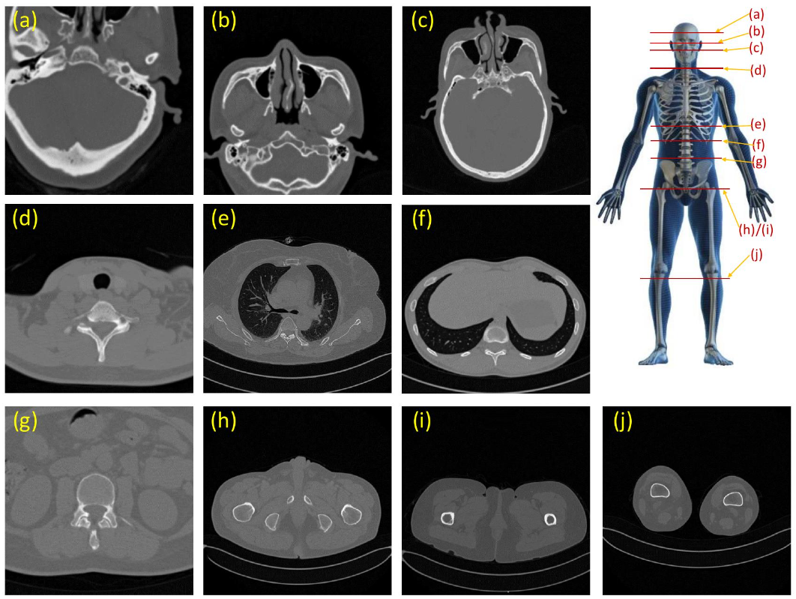
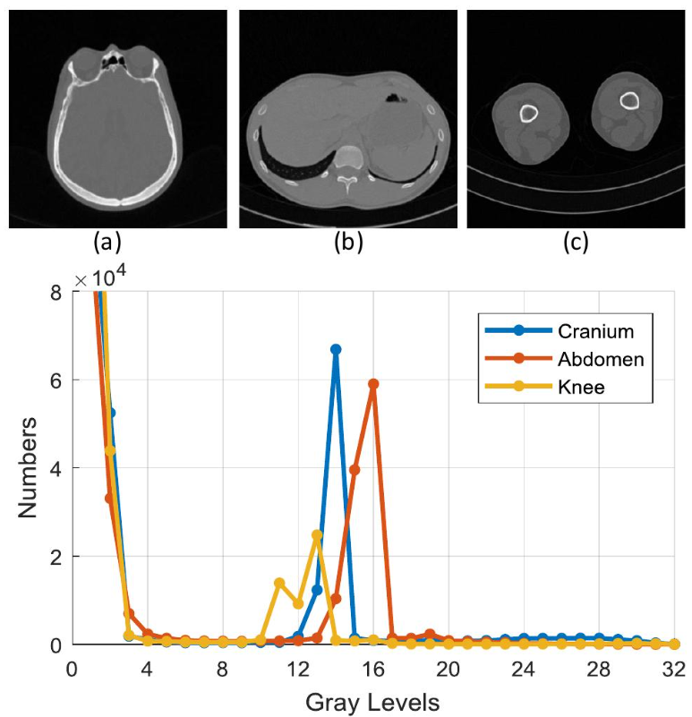
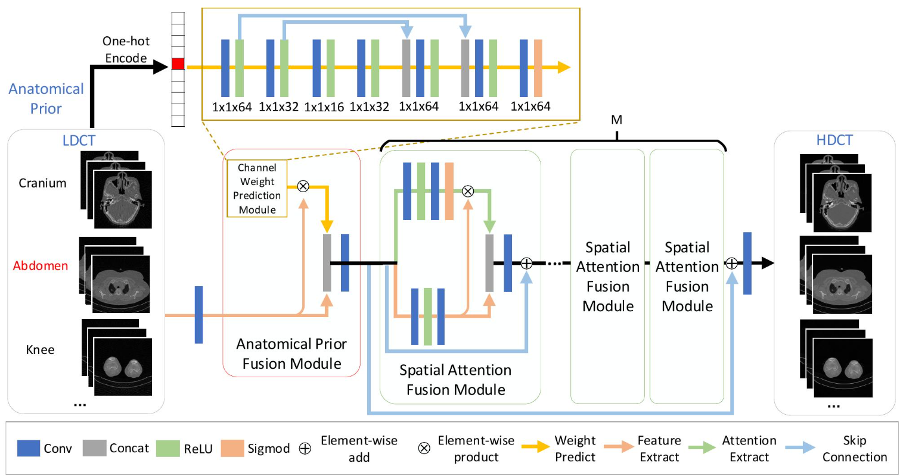
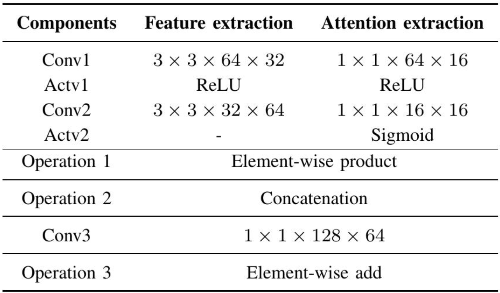

**Learning a Deep CNN Denoising Approach Using Anatomical Prior Information Implemented with Attention Mechanism for Low-dose CT Imaging on Clinical Patient Data from Multiple Anatomical Sites**

# Abstract 摘要

在临床应用中，计算机断层扫描（CT）的剂量降低因其可降低辐射风险而备受关注。然而，**较低的剂量会在低剂量计算机断层扫描（LDCT）图像中产生噪声**。先前基于深度学习（DL）的工作已经研究了解决这一病态问题的方法，以提高诊断性能。然而，其中大多数在构建LDCT图像与其**高分辨率常规剂量CT（NDCT）** 对应物之间的映射函数时，忽略了不同人体部位的解剖学差异。在本文中，我们提出了一种新颖的深度卷积神经网络（CNN）去噪方法，通过引入解剖学先验信息。我们采用统一的网络框架来处理解剖学信息，而不是为每个独立的人体解剖学部位设计多个网络。**解剖学先验**在解剖学先验融合模块中表示为从相应LDCT图像中提取的特征的权重模式。为了促进上下文信息的多样性，引入了空间注意力融合机制来捕获注意力融合模块中的许多局部感兴趣区域。尽管节省了许多网络参数，**但实验结果表明，我们结合了解剖学先验信息的方法在去噪LDCT图像方面是有效的**。此外，**解剖学先验融合模块**可以方便地集成到其他基于DL的方法中，并有助于在多个解剖学数据上提高性能。

### Index Terms 索引词

Image denosing, low-dose CT, anatomical prior information, attention mechanism.
图像去噪，低剂量CT，解剖先验信息，注意力机制。

# I. INTRODUCTION 引言

鉴于对高剂量X射线辐射健康风险的担忧，低剂量计算机断层扫描（LDCT）成像的研究已引起广泛关注[1]。与X射线（例如胸部X射线）相比，LDCT可显著提高肺癌诊断和评估的准确性，从而降低癌症死亡率[2]。**降低辐射剂量的常用方法是减少X射线通量和投影视图的数量**。然而，较低的剂量可能导致诊断性能下降，这通常表现为所得图像中的噪声和伪影[3]。

为解决此问题，已提出多种方法来提高低剂量CT（LDCT）的图像质量。通常，这些LDCT方法可分为三种子方法：**投影域滤波方法、迭代重建方法和后处理方法**。首先，已提出几种基于投影域滤波的工作[4]、[5]，用于在图像重建之前处理原始数据。尽管可以应用投影域中已知的噪声分布，但这些投影域方法可能会导致图像域中的空间分辨率损失。特别是，对于投影域方法而言，恢复高频结构细节（例如，边缘和纹理）带来了巨大的挑战。其次，迭代重建方法[6]–[12]变得流行，因为它们允许构建多种先验，例如全变分[13]和非局部均值[14]。尽管这些方法产生了出色的输出，但它们在细节重建方面受到限制且计算成本高昂。在最近的研究中，**深度学习（DL）后处理方法**[15]–[34]已成为LDCT领域有前景、流行的方法，通过端到端网络来估计高剂量CT（CT）图像。例如，Chen等人[16]提出了一种用于LDCT图像的残差自编码器网络，该网络取得了有希望的恢复结果。与传统方法相比，基于DL的方法由于其**出色的特征提取和不确定噪声模型的表示能力**，更适合恢复高剂量CT图像。

> [!图1]
> 图 1：来自不同解剖部位的临床患者数据：（a）颅骨，（b）眼眶，（c）鼻窦，（d）颈部，（e）肺部，（f）腹部，（g）腰部，（h）男性骨盆，（i）女性骨盆和（j）膝盖。数据显示CT成像中不同解剖部位之间存在显著的解剖学差异。

尽管以往的研究在提高图像质量方面取得了很大进展，但大多数研究都忽略了低剂量CT（LDCT）图像的解剖先验信息。通常，这些信息在不同人体部位（如图1所示的鼻窦、颈部和颅骨）之间显示出巨大的解剖结构差异。另一方面，在实际应用中，**不同人体部位的扫描参数设置通常是不同的**。例如，腰部扫描剂量通常高于颅骨。**一个特定训练的深度网络模型通常适用于特定的解剖部位**。不同解剖部位的解剖差异和扫描设置导致训练数据中的数据分布复杂。LDCT图像的解剖信息可以被视为额外的先验信息，以提高LDCT成像中的去噪性能。

在本文中，我们提出了一种**深度卷积神经网络（CNN）去噪方法**，通过引入解剖学先验，我们称之为**DeACNN**，用于低剂量CT（LDCT）成像中的降噪。通过**解剖学先验融合模块**，将解剖学先验与从其对应的LDCT图像中提取的特征进行融合。受注意力机制[35]–[37]的启发，我们**级联了几个空间注意力融合模块**。为避免信息丢失，我们在这些级联融合模块中将卷积层提取的**原始特征与注意力特征相结合**。为减少网络参数，我们在整个网络框架中采用了几个具有**1×1核的卷积**。

我们提出了三项主要贡献：1）考虑到不同人体部位之间明显的**解剖学差异**，我们将解剖学生成先验引入低剂量CT（LDCT）成像的图像去噪。2）我们没有为每个解剖学部位设计多个独立的网络，而是在一个**统一的框架**内解决解剖学生成先验信息和LDCT图像的问题，这意味着我们提出的网络可以处理来自不同解剖学部位的CT图像。3）受**注意力机制**的启发，我们设计了**解剖学生成先验融合模块**和**空间注意力融合模块**。为了减少信息损失，还采用了**跳跃连接和拼接**。解剖学生成先验融合模块可以被嵌入到其他基于深度学习的方法中，用于处理多解剖学数据以提高性能。

本文其余部分组织如下：方法在第二节中进行了描述。在本节中，将解释解剖学先验。接着，我们描述了网络架构，包括两个融合模块。在下一节，即第三节，将进行实验以验证我们提出的方法的有效性。此外，在本节中，我们提供了实现细节并展示了实验结果。讨论和结论在第四节中给出。

# II. METHODS 方法

本节中，我们描述我们的方法。首先，我们介绍了解剖学先验。其次，我们阐述了总体框架。最后，我们阐明了两个模块：先验融合模块和注意力融合模块。

### A. Anatomical Prior Information 解剖先验信息

通常，在不同人体部位之间会观察到大的解剖结构差异。如图2所示，我们计算了来自三个解剖部位的三个正常CT图像的数据分布。**该分布反映了不同解剖部位之间数据的巨大差异**。当扫描参数固定时，每个解剖部位的噪声分布似乎也不同。对于来自多个解剖部位的临床患者数据，当给出解剖部位时，这种差异有利于去噪性能。额外的解剖部位被视为LDCT图像的先验信息。

> [!图2]
> 图 2：三个解剖学示例在 32 灰度级别上的直方图分布：(a) 颅骨，(b) 腹部和 (c) 膝盖。

在我们的实验中，我们采用了10个解剖部位的临床解剖学数据：鼻窦、颈部、大脑、乳房、腹部、膝盖、眼眶、腰部、骨盆（男性）和骨盆（女性）；这些部位如图1所示。首先，我们通过**独热编码**转换这些解剖学描述。因此，低剂量图像遵循一个解剖学向量，该向量是所提出方法的输入模式，输出是去噪后得到的高分辨率估计CT图像。

### B. Framework Overview 框架概述

我们的网络采用低剂量CT（LDCT）图像及其对应的解剖向量作为两个输入，**如图3所示**。我们主要采用独热编码（one-hot encoding）来表示解剖描述，并且一个权重预测模块紧随输入解剖向量之后。解剖先验信息在先验融合模块中进行融合。为了充分利用第一模块的解剖融合信息，我们级联了M个注意力融合模块来加深网络。给定LDCT图像x = {x1, x2, x3, · · · , xn}和对应的解剖向量a = {a1, a2, a3, · · · , an}，在去噪过程后估计出常规剂量CT图（NDCT）y = {y1, y2, y3, · · · , yn}。该恢复过程使用均方误差（MSE）成本函数，可以表述如下：
$$
L= \frac{1}{n}\sum_{i=1}^n||G(x_i;a_i;Θ)−y_i||_2^2,
$$
其中 Θ 表示网络参数，G(·) 表示估计函数。与几种其他去噪方法不同，我们的方法需要解剖学先验信息，而该信息对放射科医生来说很容易获得。

> [!图3]
> 图 3：**DeACNN框架概述**。整体网络包含先验融合模块和注意力融合模块两大部分，其中权重预测模块利用解剖学先验获得从LDCT图像提取的特征通道的权重掩码。

### C. Anatomical Prior Fusion 解剖先验融合

考虑到人体不同部位的解剖学差异，我们在去噪过程中引入了**解剖学先验**。我们没有为每个解剖部位采用不同的网络，而是使用输入的解剖向量来预测通道权重掩码，以适应特征图。通过权重模式，可以在网络中区分解剖学先验。为了避免信息丢失，**将从原始LDCT图像中提取的原始输入特征进行拼接**。对于权重预测模块，使用了7个具有1×1卷积核的卷积滤波器（如图3所示）。**拼接操作用于合并特征图以避免信息丢失**。在拼接操作之后，使用具有1×1卷积核的卷积层将通道数缩小到64，这是该模块的输入通道数。**Sigmoid激活函数**有助于将通道权重缩小到0~1，这表征了不同解剖部位对后续图像特征的影响。

先验融合模块可表述如下：
$$
Fo =Conv2(Conv1(xi),Pc(ai) ⊗ Conv1(xi)),
$$
其中 Pc(·) 表示通道权重预测，Conv1 和 Conv2 表示通过拼接实现的联合特征的卷积操作。此外，“ ⊗ ”表示逐元素乘积运算，Fo 表示解剖融合结果信息。Conv1 和 Conv2 的核大小分别固定为 3 × 3 和 1 × 1。

### D. Spatial Attention Fusion 空间注意力融合

为了充分利用解剖融合信息，我们在级联模块架构设计的基础上加深了网络。与ResNet [38]类似，局部级联模块在级联模块中采用了下采样和上采样单元，其中下**采样单元通过卷积操作实现**，**上采样单元通过反卷积操作实现**。受[37]的启发，我们引入了空间注意力机制来获得感兴趣的局部区域（**ROIs**）。此外，卷积流提取的原始特征与空间注意力流提取的特征相结合。**我们应用两个卷积层来提取原始特征，另外两个卷积层用于注意力提取**。参数细节如表I所示。我们缩小和扩展通道数以减少参数量。在注意力提取过程中采用了滤波器大小为1×1的卷积层。第i个空间注意力融合模块的输出Fi可表示如下：
$$
Fi=Conv3(Pcs(Fi−1),Pa(Fi−1)⊗Pcs(Fi−1))⊕Fi−1
$$
其中 Pa(·) 表示空间注意力掩码预测，Conv3 表示通过拼接对联合特征进行卷积操作。此外，“ ⊗ ”表示逐元素乘法运算，Pcs 表示使用两次卷积操作而不改变图像尺寸的特征提取过程。“ ⊕ ”表示逐元素加法运算。

> [!表 I]
> 表 I：空间注意力融合模块的参数设置。“Conv”表示卷积层，“Actv”表示使用的激活函数。

# III. EXPERIMENTS 实验

In this section, we conduct experiments to validate the effectiveness of our method. First, the patient data and training details are described. Second, we evaluate the performance of our method compared with that of several other DL-based methods. Last, the experimental results and ablation studies are described.

在本节中，我们进行实验以验证我们方法的有效性。首先，描述了患者数据和训练细节。其次，我们将我们方法的性能与几种其他基于深度学习的方法的性能进行了比较评估。最后，描述了实验结果和消融研究。

A. Clinical Patient Data and Details of Implementation

A. 临床患者数据与实施细节

With the research data support of Guizhou Provincial People’s Hospital (Guiyang, Guizhou, China), we are able to utilize clinical data collected from more than 200 patients, with an image size of 512 × 512. The age distribution for these patients ranges from 7 to 82. Among these patients, 55% of them are male and 45% are female. The total number of CT images exceeds 80,000; 10% of the data are utilized as validation data, and 10% of the data are utilized as test data. The remainder of the data are employed for network training. The dataset contains high-resolution NDCT images and their descriptions tagged by professional radiologists for 10 human body sites: sinus, neck, brain, breast, abdomen, knee, orbit, waist, pelvis (male) and pelvis (female). Considering the continuity of the whole body, the descriptions partially overlap, which increases the robustness of the proposed method. The dataset is acquired under a Semens CT scanner(SOMATOM Definition). As shown in Table II, the scan tube voltage is 120 kVp, and the thickness is set to 1 mm for the routine NDCT images. We conduct the simulation process to obtain LDCT images via the MRIT toolbox1 [39] implemented by Matlab 2017a. For the MIRT, the scanning parameters are fixed, as shown in Table II, and the system projection matrix are calculated. With the aid of the projection matrix, we obtain sinogram data under 360 projection views as the referenced NDCT images. Via uniform sparse sampling, the LDCT sinogram data under 120, 150 and 180 projection views are gained. The simulated LDCT images are reconstructed using the FBP algorithm.

在贵州省人民医院（中国贵州省贵阳市）的研究数据支持下，我们能够利用从200多名患者收集的临床数据，图像尺寸为512×512。这些患者的年龄分布范围为7至82岁。在这些患者中，55%为男性，45%为女性。CT图像总数超过80,000张；10%的数据用作验证数据，10%的数据用作测试数据。其余数据用于网络训练。该数据集包含高分辨率NDCT图像及其由专业放射科医生标记的10个人体部位的描述：鼻窦、颈部、大脑、乳房、腹部、膝盖、眼眶、腰部、骨盆（男性）和骨盆（女性）。考虑到全身的连续性，这些描述存在部分重叠，这增加了所提出方法的鲁棒性。数据集是在西门子CT扫描仪（SOMATOM Definition）下采集的。如表II所示，对于常规NDCT图像，扫描管电压为120 kVp，层厚设置为1 mm。我们使用Matlab 2017a实现的MRIT工具箱1 [39]进行模拟过程以获得LDCT图像。对于MIRT，扫描参数固定，如表II所示，并计算系统投影矩阵。借助投影矩阵，我们获得了360个投影视角的正弦图数据，作为参考NDCT图像。通过均匀稀疏采样，获得了120、150和180个投影视角的LDCT正弦图数据。使用FBP算法重建模拟的LDCT图像。

Fig. 4: Three network models for image denoising in low-dose imaging: (a) Residual encoder-decoder CNN (REDCNN), (b) Deep cascade projection network with the down-to-up projection operation (DCPN-DU), (c) Our proposed network (DeACNN).

图 4：低剂量成像中图像去噪的三种网络模型：(a) 残差编码器-解码器卷积神经网络 (REDCNN)，(b) 具有下-上投影操作的深度级联投影网络 (DCPN-DU)，(c) 本文提出的网络 (DeACNN)。

For the input data, several data augmentations are adopted, such as random rotating and flipping. To reduce the training time, we use patches with an image size of 64 × 64. The learning rate is set to 0.0001. The ADAM optimizer [40] is applied to minimize the cost function during the network training process. We implement our model in the PyTorch framework on Ubuntu 16.04 with a Titan 1080Ti GPU during the training and test process.

对于输入数据，采用了多种数据增强方法，例如随机旋转和翻转。为了减少训练时间，我们使用了图像尺寸为 64 × 64 的块。学习率设置为 0.0001。在网络训练过程中，应用 ADAM 优化器 [40] 来最小化成本函数。我们在 Ubuntu 16.04 的 PyTorch 框架中实现我们的模型，在训练和测试过程中使用 Titan 1080Ti GPU。

We compare our method with several other methods, including the CNN [15], the residual encoder-decoder CNN

我们将我们的方法与几种其他方法进行了比较，包括CNN [15]，残差编码器-解码器CNN

1The code is available at [https://web.eecs.umich.edu/ ˜fessler/code/](https://web.eecs.umich.edu/˜fessler/code/) TABLE II: Scanning parameter settings for routine high-dose CT images under a Semens CT scanner.

1The code is available at [https://web.eecs.umich.edu/ ˜fessler/code/](https://web.eecs.umich.edu/˜fessler/code/) 表 II：西门子 CT 扫描仪下常规高剂量 CT 图像的扫描参数设置。

TABLE III: Parameter counts and running times of each test example for different methods.

表 III：不同方法对每个测试示例的参数计数和运行时间。

(REDCNN) [16] and a baseline model named the deep cascade projection network with the down-to-up projection operation (DCPN-DU). To visually describe the network model architecture, the REDCNN and DCPN-DU are shown in Fig. 4(a) and (b). The most obvious difference is that we introduce anatomical information instead of directly applying an endto-end network compared with another two network methods. For comparison models, we apply the kernel size 3 × 3 for convolution and deconvolution layers according to parameter settings following [16]. For a fair comparison, these models are retrained with the same settings as our model on our training and test datasets. Furthermore, popular metrics—the peak signal-to-noise ratio (PSNR) and structural similarity index measure (SSIM)—are adopted to evaluate the qualitative results. As shown in Table. III, we compare the parameter counts and running times of each test example for different methods. Due to multiple multiplication operations and multibranch data processing, the running time of our method for each test example is the slowest compared with the other three methods. Because of the reduction in the number of channels and the use of a filter size of 1 × 1, the parameter counts of our method are significantly less than those of other methods.

（REDCNN）[16]以及一个名为具有下到上投影操作的深度级联投影网络（DCPN-DU）的基线模型。为了直观地描述网络模型架构，图4（a）和（b）分别展示了REDCNN和DCPN-DU。最明显的区别在于，与另外两种网络方法相比，我们引入了解剖学信息，而不是直接应用端到端网络。对于比较模型，我们根据[16]中的参数设置，对卷积层和反卷积层应用3×3的核大小。为了公平比较，这些模型在我们自己的训练和测试数据集上使用与我们的模型相同的设置进行了重新训练。此外，采用了流行的指标——峰值信噪比（PSNR）和结构相似性指数度量（SSIM）——来评估定性结果。如表III所示。我们比较了不同方法的每个测试示例的参数数量和运行时间。由于多次乘法运算和多分支数据处理，我们方法每个测试示例的运行时间与其他三种方法相比最慢。由于通道数量的减少和1×1滤波器尺寸的使用，我们方法的参数数量明显少于其他方法。

Fig. 5: Knee results of 120 sparse projection views for different methods. ROIs are marked by red boxes. Several visual differences are marked by yellow arrows.

图 5：不同方法下 120 个稀疏投影视图的膝部结果。感兴趣区域由红色框标出。几个视觉差异由黄色箭头标出。

Fig. 6: Cranium results of 120 sparse projection views for different methods. ROIs are marked by red boxes. Several visual differences are marked by yellow arrows.

图 6：不同方法下 120 个稀疏投影视图的颅骨结果。感兴趣区域（ROIs）用红色框标出。几处视觉差异用黄色箭头标出。

Fig. 7: Waist results of 150 sparse projection views for different methods. ROIs are marked by red boxes. Several visual differences are marked by yellow arrows.

图 7：150个稀疏投影视图在不同方法下的腰部结果。感兴趣区域（ROIs）用红色框标出。几个视觉差异用黄色箭头标出。

Fig. 8: Sinus results of 180 sparse projection views for different methods. ROIs are marked by red boxes. Several visual differences are marked by yellow arrows.

图 8：不同方法下 180 个稀疏投影视图的正弦图结果。感兴趣区域（ROIs）用红色框标出。几个视觉差异用黄色箭头标出。

Fig. 9: Statistical results for different methods in terms of the PSNR for the whole images Figure 5, Figure 6, Figure 7 and Figure 8.

图 9：不同方法在整个图 5、图 6、图 7 和图 8 图像上的 PSNR 统计结果。

B. Quantitative and Qualitative Results on Multiple Anatomical Sites

B. 多解剖部位的定量与定性结果

The visual and quantitative results for different methods on multiple anatomical sites are given in this section. As shown in Figure 5, the boundary of the soft tissue marked by the yellow arrow is distinct in Figure 5 for the DeACNN, while the other results are blurred. In Figure 6, the results generated by the DeACNN are similar to the reference results, and there is no blurring of the corner bones. More visual results and qualitative results for 150 and 180 projection views are shown in Figure 7 and Figure 8, respectively, which also illustrates the superiority of our method. In particular, the connecting lines of the bones in our method can be clearly observed in Figure 8. We calculate the PSNR in Figure 9 for the whole images in Figure 5, Figure 6, Figure 7 and Figure 8. Note that our method, the DeACNN, gains over 1.5 dB improvement in the PSNR in 120 and 180 projection views for the sinus and cranium anatomical sites shown in Figure 6 and Figure 8.

本节给出了不同方法在多个解剖部位的视觉和定量结果。如图 5 所示，DeACNN 在黄色箭头所标记的软组织边界处具有清晰的边界，而其他方法的结果则较为模糊。在图 6 中，DeACNN 生成的结果与参考结果相似，并且没有出现角骨模糊的情况。图 7 和图 8 分别展示了 150 和 180 投影视图的更多视觉和定性结果，这也说明了本方法的优越性。特别是，本方法生成的骨骼连接线在图 8 中可以被清晰地观察到。我们计算了图 5、图 6、图 7 和图 8 中整个图像的 PSNR，结果如图 9 所示。值得注意的是，在图 6 和图 8 所示的鼻窦和颅骨解剖部位的 120 和 180 投影视图中，本方法 DeACNN 在 PSNR 上获得了超过 1.5 dB 的提升。

TABLE IV: Quantitative results (Mean ± SDs) for test datasets, including 120, 150, and 180 projection views, in terms of the PSNR and SSIM.

表 IV：测试数据集（包括 120、150 和 180 个投影视图）的定量结果（平均值 ± 标准差），以 PSNR 和 SSIM 为衡量标准。

Fig. 10: Estimated results for 180-view projections. The green boxes indicate the three ROIs.

图 10：180视图投影的估计结果。绿色框表示三个感兴趣区域（ROI）。

The quantitative results for local ROIs are also calculated. As shown in Figure 10, we selected three ROIs, which are marked with green boxes, including the center, middle and edge of the abdomen site. As shown in Figure 11, the statistical results for the PSNR and SSIM demonstrate the superiority of the DeACNN against the other methods on the ROIs. Specifically, the DeACNN performs better on ROI3 in terms of the PSNR compared with the other methods.

还计算了局部感兴趣区域（ROI）的定量结果。如图10所示，我们选取了三个感兴趣区域（ROI），并用绿色框标出，包括腹部位置的中心、中部和边缘。如图11所示，PSNR和SSIM的统计结果证明了DeACNN在感兴趣区域（ROI）上优于其他方法。具体而言，在PSNR方面，DeACNN在ROI3上的表现优于其他方法。

For the test dataset, we randomly selected 300 LDCT images, including 120, 150 and 180 projection views, to evaluate the denoising performance among different methods. The qualitative results are shown in Table IV. Our method shows improved denoising performance compared to the other methods, especially at low projection angles. In addition, we adopt the statistical test P-value, which shows the significant difference in these qualitative results.

为了评估不同去噪方法的性能，我们在测试数据集中随机选取了300张LDCT图像，其中包括120、150和180个投影视图。定性结果如表IV所示。我们的方法与其他方法相比，显示出改进的去噪性能，尤其是在低投影角度下。此外，我们采用了统计检验P值，该P值显示了这些定性结果的显著差异。

Fig. 11: Statistical results (PSNR and SSIM) for the whole image and three ROIs marked in Figure 10.

图 11：整个图像和图 10 中标记的三个 ROI 的统计结果（PSNR 和 SSIM）。

C. Quantitative and Qualitative Results on Single Anatomical Site

C. 单个解剖部位的定量与定性结果

Although our method is validated effective for the previously mentioned multiple anatomical sites, the denoising performance in a single anatomical site is also explored. We compare our method with several other methods, including the CNN, REDCNN and DCPN-DU. We retrain these models on two single anatomical sites, including the cranium and abdomen.

尽管我们的方法在先前提到的多个解剖部位被验证有效，但我们也探索了其在单个解剖部位的去噪性能。我们将我们的方法与几种其他方法进行了比较，包括CNN、REDCNN和DCPN-DU。我们在两个单一解剖部位（包括颅骨和腹部）上重新训练了这些模型。

Fig. 12: Visual results of 120, 150 and180 sparse projection views for different methods on the abdomen anatomical site. ROIs are marked by red boxes. Several visual differences are marked by yellow arrows.

图 12：腹部解剖部位不同方法在 120、150 和 180 个稀疏投影视图下的可视化结果。感兴趣区域（ROIs）用红色框标出。几个视觉差异用黄色箭头标出。

Fig. 13: Statistical quantitative results (Mean ± SDs) comparison on two single anatomical sites under 120, 150, and 180 projection views, in terms of the PSNR and SSIM. (a) and (b) are calculated on the cranium. (c) and (d) are calculated on the abdomen.

图 13：在 120、150 和 180 投影视图下，两个单一解剖部位在 PSNR 和 SSIM 方面的统计定量结果（平均值 ± 标准差）比较。（a）和（b）在颅骨上计算。（c）和（d）在腹部计算。

In Figure 12, the visual results generated by different CNNbased methods are given under 120, 150 and 180 projection views. In the first row, our method appears to clearly carve the edges. The results in the CNN, DCPN-DU and REDCNN are blurry. In the second row, the results of other methods do not seem to carve the local regions marked by yellow arrows.

图 12 展示了在 120、150 和 180 个投影视图下，不同基于 CNN 的方法生成的视觉结果。在第一行中，我们的方法似乎能够清晰地勾勒出边缘。CNN、DCPN-DU 和 REDCNN 的结果则比较模糊。在第二行中，其他方法的生成结果未能勾勒出由黄色箭头标记的局部区域。

The results of our method are closer to the ground truth. In the third row, our method can display the boundary between two organs.

我们的方法结果更接近真实值。在第三行中，我们的方法可以显示两个器官之间的边界。

Fig. 14: Quantitative results (Mean) comparison of different settings under 120, 150, and 180 projection views, in terms of the PSNR and SSIM.

图 14：在 120、150 和 180 个投影视图下，不同设置在 PSNR 和 SSIM 方面的定量结果（均值）比较。

For the test dataset, we randomly selected 30 LDCT images, including 120, 150 and 180 projection views, to evaluate the denoising performance among different methods on two single anatomical sites. The qualitative results are shown in Figure 13. The statistical quantitative results demonstrate that the DCPN-DU achieves the best performance while our method with less parameters gains quite excellent performance. Although the anatomical prior on a single site has minimal significance, our method can achieve considerable denoising performance.

对于测试数据集，我们随机选择了30张低剂量CT图像，包括120、150和180个投影视图，以评估不同方法在两个单一解剖部位上的去噪性能。定性结果如图13所示。统计定量结果表明，DCPN-DU取得了最佳性能，而我们提出的参数量较少的方法也获得了相当优异的性能。尽管单一解剖部位的解剖先验意义不大，但我们的方法仍能取得可观的去噪性能。

D. Ablation Studies

D. 消融研究

In this section, we conduct ablation studies of our method. First, we explore the performance of our method with different numbers of spatial attention fusion modules. Second, we validate the effectiveness of anatomical prior information. Third, we validate the effectiveness of the anatomical prior and attention fusion module. Last, we compare the performance of our method during the network training process. These ablation studies are trained for 200 epochs on 10 anatomical sites; we calculate the PSNR on the same validation data.

在本节中，我们进行了消融研究以评估我们的方法。首先，我们探讨了我们的方法在不同数量的空间注意力融合模块下的性能。其次，我们验证了先验解剖学信息的有效性。第三，我们验证了先验解剖学信息和注意力融合模块的有效性。最后，我们比较了网络训练过程中我们方法的性能。这些消融研究在10个解剖学位点上进行了200个训练周期；我们在相同的验证数据集上计算了PSNR。

• The number of spatial attention fusion modules. We explore the influence on performance of the depth of

• 空间注意力融合模块的数量。我们探索其深度对性能的影响

the network. We set the number of spatial attention fusion modules as 5, 10, 15 and 20. The quantitative results would improve as the depth increases shown in Figure 14(a) and Figure 14(b). While deeper networks could results in huge computation cost. In Figure 15, we fix the number of spatial attention fusion modules at 15, and there is no significant improvement when it is increased to 20. Thus, we set the number of attention fusion modules to 15.

网络。我们将空间注意力融合模块的数量设置为 5、10、15 和 20。如图 14(a) 和图 14(b) 所示，随着深度的增加，定量结果会得到改善。然而，更深的网络可能会导致巨大的计算成本。在图 15 中，我们将空间注意力融合模块的数量固定为 15，当增加到 20 时没有显著的改进。因此，我们将注意力融合模块的数量设置为 15。

Fig. 15: PSNR with the validation datasets for different numbers of attention fusion modules.

图 15：不同注意力融合模块数量下验证数据集的 PSNR。

• The effectiveness of the anatomical prior information. We validate the effectiveness of anatomical prior information by input the correct and random anatomical tags into the trained model. As is shown in Figure 16, it would achieve better performance in PSNR and SSIM in

• 解剖学先验信息的有效性。我们通过将正确和随机的解剖学标签输入到训练好的模型中来验证解剖学先验信息的有效性。如图16所示，在PSNR和SSIM方面将取得更好的性能，

Fig. 16: Quantitative results comparison when the correct or random anatomical tags are input for test datasets, including 120, 150, and 180 projection views, in terms of the PSNR and SSIM. For each box, the central line in red denotes the median, the edges of the box represent the 25% and 75%. “+” in red indicates the outliers.

图 16：当输入正确或随机的解剖学标签时，在包含 120、150 和 180 个投影视图的测试数据集上的定量结果比较，以 PSNR 和 SSIM 为衡量标准。对于每个箱体，红色的中心线表示中位数，箱体的边缘表示 25% 和 75%。红色的“+”表示异常值。

TABLE V: Quantitative results (Mean ± SDs) for test datasets, including 120, 150, and 180 projection views, in terms of the PSNR and SSIM. REDCNN∗ denotes the REDCNN with an anatomical prior fusion module, and DCPN-DU∗ denotes the DCPN-DU with an anatomical prior fusion module.

表 V：测试数据集（包括 120、150 和 180 个投影视图）的定量结果（平均值 ± 标准差），包括 PSNR 和 SSIM。REDCNN∗ 表示具有解剖先验融合模块的 REDCNN，DCPN-DU∗ 表示具有解剖先验融合模块的 DCPN-DU。

Fig. 17: PSNR with the validation datasets for different settings of the network framework.

图 17：不同网络框架设置下，使用验证数据集的 PSNR。

Fig. 18: PSNR with the validation datasets for different DLbased methods.

图 18：不同深度学习方法在验证数据集上的PSNR。

correct anatomical tags than random ones. Besides, the value distribution on correct tags are more centralized than random tags, which proves that anatomical prior information avails the proposed method.

比随机标签更准确的解剖学标签。此外，正确标签上的值分布比随机标签更集中，这证明了解剖学先验信息有助于所提出的方法。

• The effect of the anatomical prior and attention fusion module. We validate the effectiveness of the channel weight prediction and the spatial attention stream for the baseline model (shown in Figure 17). The performance gains on PSNR show the effectiveness of these two streams. As is shown in Figure 14(c) and Figure 14(d), the quantitative results also proves that anatomical prior information and spatial attention avails PSNR improvements. In particular, the anatomical prior stream plays a vital role compared with the spatial attention.

• 解剖学先验和注意力融合模块的效果。我们验证了通道权重预测和空间注意力流对基线模型的有效性（如图17所示）。PSNR上的性能提升证明了这两个流的有效性。如图14(c)和图14(d)所示，定量结果也证明了解剖学先验信息和空间注意力有助于PSNR的提高。特别是，与空间注意力相比，解剖学先验流起着至关重要的作用。

• The effectiveness of the whole network framework. Finally, we compare the qualitative results for PSNR during the training process (shown in Figure 18); the results in Figure 14(e) and Figure 14(f) also show that our method outperforms other methods during the training process.

• 整个网络框架的有效性。最后，我们比较了训练过程中 PSNR 的定性结果（如图 18 所示）；图 14(e) 和图 14(f) 的结果也表明，我们的方法在训练过程中优于其他方法。

IV. DISCUSSION AND CONCLUSION

IV. 讨论与结论

From the ablation study to validate the effectiveness of the anatomical prior and attention fusion module, we discover that the anatomical prior is a key factor in noticeably improving performance. The experimental results for multiple anatomical sites can better reflect our advantages than those for the single anatomical site. The results for the single anatomical site could not reflect the difference in the learned weight caused by different parts, while the DeACNN still obtained quite excellent performance. We tend to migrate the anatomical prior fusion module to other DL-based methods, such as the REDCNN and DCPN-DU. We implement the enhanced models REDCNN∗ and DCPN-DU∗. The quantitative results are compared in Table V, and their parameter counts are compared in Table VI. Although the parameter counts of our method are significantly less than those of other methods, which could obtain excellent denoising results. The enhanced models embedded with anatomical priors would improve performance better than the original versions of these models. The spatial attention may lose structural information due to the local attention regions and produce a reasonable SSIM. Our spatial attention mechanism works on local modules and the primary latter attention module can be corrected by the latter primary attention operation, which may lose the part that causes global concern. In the future, we will seek a better fusion method to improve performance. In addition, we applied clinical patient data for only 10 human body sites. More than 10 sites should be considered for real clinical applications. Further exploration of additional sites as well as different scanning parameter settings are needed.

从消融研究中验证解剖学先验和注意力融合模块的有效性，我们发现解剖学先验是显著提高性能的关键因素。多个解剖部位的实验结果比单个解剖部位的实验结果更能反映我们的优势。单个解剖部位的结果不能反映不同部分引起的学习权重的差异，而DeACNN仍然获得了相当出色的性能。我们倾向于将解剖学先验融合模块迁移到其他基于深度学习的方法，例如REDCNN和DCPN-DU。我们实现了增强模型REDCNN∗和DCPN-DU∗。定量结果在表V中进行比较，参数数量在表VI中进行比较。尽管我们方法的参数数量明显少于其他方法，但仍能获得出色的去噪结果。嵌入解剖学先验的增强模型将比这些模型的原始版本更好地提高性能。空间注意力由于局部注意力区域可能会丢失结构信息，并产生合理的SSIM。我们的空间注意力机制作用于局部模块，主要后面的注意力模块可以通过后面的主要注意力操作进行校正，这可能会丢失引起全局关注的部分。未来，我们将寻求更好的融合方法来提高性能。此外，我们仅对10个人体部位的临床患者数据进行了应用。在实际临床应用中应考虑超过10个部位。需要对其他部位以及不同的扫描参数设置进行进一步的探索。

TABLE VI: Parameter counts for different methods with an anatomical prior fusion module. REDCNN∗ denotes the enhanced REDCNN with an anatomical prior fusion module, and DCPN-DU∗ denotes the enhanced DCPN-DU.

表 VI：具有解剖先验融合模块的不同方法的参数计数。REDCNN∗表示增强的REDCNN，具有解剖先验融合模块，而DCPN-DU∗表示增强的DCPN-DU。

In this paper, we introduce the anatomical prior for image denoising in low-dose imaging while considering the evident anatomical differences among human body sites. By using the channel weight prediction module, we fuse the anatomical prior with the coarse features extracted from the original LDCT images. Because the weight is different for each anatomical description, the united framework of our proposed method processes different anatomical prior inputs. In addition, the spatial attention fusion module is employed to explore the improved performance of our model while deepening the network. By this means, we incorporate anatomical descriptions into CT image denoising, which can be applied to realworld clinical data, especially in scanning certain human body sites. In ablation studies, the anatomical prior information is validated to be beneficial for proposed networks similar to the prior fusion and attention fusion module. Based on the qualitative results, the anatomical prior is proven to be a vital factor in noticeably improving performance. The experimental results demonstrate the effectiveness of our method both in terms of the visual effect and the qualitative measurements. Furthermore, our method can take advantage of clinical data from multiple anatomical sites rather than a single anatomical site.

本文在考虑人体部位间显著解剖差异的前提下，为低剂量成像中的图像去噪引入了解剖先验。通过使用通道权重预测模块，我们将解剖先验与从原始LDCT图像中提取的粗糙特征进行融合。由于每个解剖描述的权重不同，我们提出的方法的统一框架可以处理不同的解剖先验输入。此外，采用空间注意力融合模块来探索我们在加深网络的同时提升模型的性能。通过这种方式，我们将解剖描述纳入CT图像去噪中，这可以应用于实际临床数据，尤其是在扫描特定人体部位时。在消融研究中，解剖先验信息被验证有利于我们提出的网络，类似于先验融合和注意力融合模块。基于定性结果，解剖先验被证明是显著提高性能的关键因素。实验结果证明了我们方法在视觉效果和定量测量方面的有效性。此外，我们的方法可以利用来自多个解剖部位的临床数据，而不是单一解剖部位。