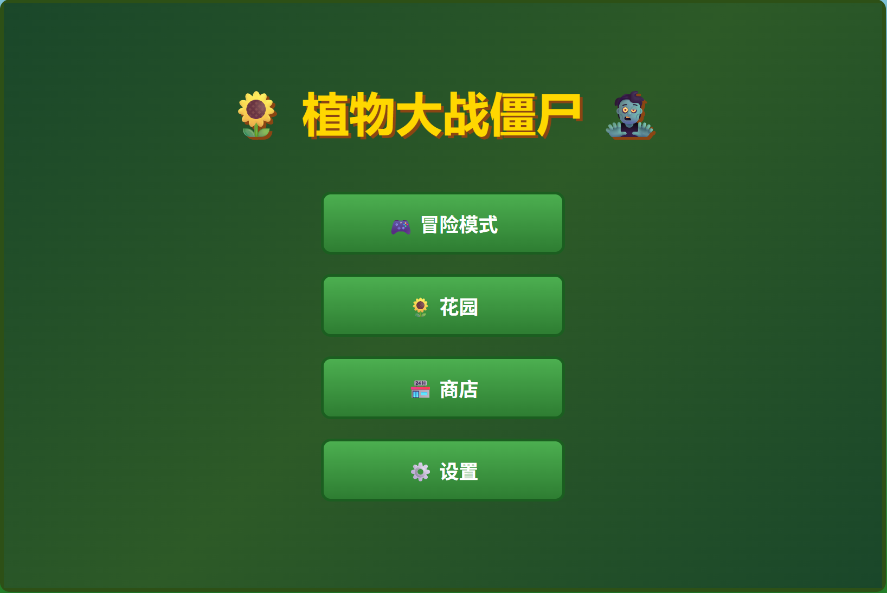
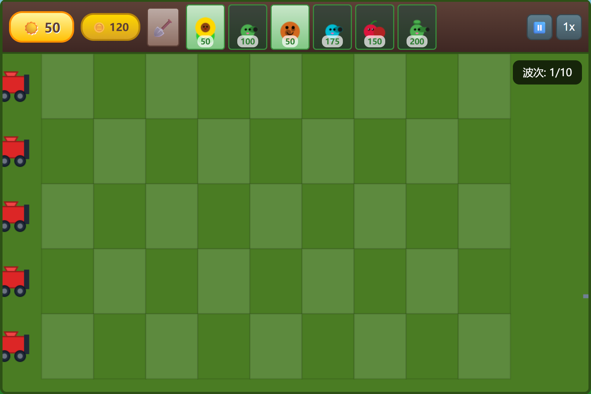

# 一、基础信息

### 1. 存储位置

```
\\wsl.localhost\Ubuntu\home\sheen\pvz-game
```

### 2. 操作方式

在vscode激活wsl后，使用opencode进行vibecoding。

### 3. opencode对话记录

```bash
(base) sheen@MSI:/mnt/c/WINDOWS/system32$ opencode
                                   ▄
  █▀▀█ █▀▀█ █▀▀█ █▀▀▄ █▀▀▀ █▀▀█ █▀▀█ █▀▀█
  █  █ █  █ █▀▀▀ █  █ █    █  █ █  █ █▀▀▀
  ▀▀▀▀ █▀▀▀ ▀▀▀▀ ▀▀▀▀ ▀▀▀▀ ▀▀▀▀ ▀▀▀▀ ▀▀▀▀

  Session   植物大战僵尸游戏开发复刻
  Continue  opencode -s ses_32916ff16ffe0xURI1pjmY3Jt6
```

# 二、内容

### version-1.0

- **版本介绍**
基本初步完成功能预设，包含：6张植物卡牌，4种僵尸，1战斗场景，商店系统，金钱系统，花园系统，一个主界面，设置，难度选择，冒险模式。
- **局内展示**

