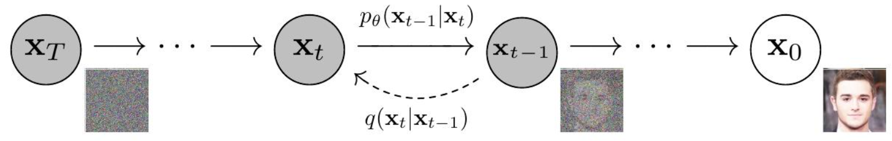

> [!Denoising Diffusion Probabilistic Models]
> 发表日期：2020年6月19日
> 期刊：arXiv (Cornell University)
> 期刊官网：[https://openalex.org/I205783295](https://openalex.org/I205783295)
> 出版商：Cornell University
> DOI：[10.48550/arxiv.2006.11239](https://doi.org/10.48550/arxiv.2006.11239)
> 来源：[http://arxiv.org/abs/2006.11239](http://arxiv.org/abs/2006.11239)
> 

# Abstract 摘要

我们展示了使用扩散概率模型进行高质量图像合成的结果，这是一类受到非平衡热力学考虑启发的潜变量模型。我们的最佳结果是通过在一个加权变分界限上进行训练获得的，该界限是根据扩散概率模型与朗之万动力学的去噪得分匹配之间的新颖联系设计的，并且我们的模型自然地允许一种渐进式有损解压缩方案，这可以被解释为自回归解码的推广。**在无条件CIFAR10数据集上，我们获得了9.46的Inception得分和3.17的最先进FID得分**。在256x256的LSUN上，我们获得的样本质量类似于ProgressiveGAN。我们的实现可在[https://github.com/hojonathanho/diffusion](https://github.com/hojonathanho/diffusion)找到。

# 1. Introduction 引言

各种类型的深度生成模型最近在各种数据模态中都展现出了高质量的样本。生成对抗网络（GANs）、自回归模型、流模型和变分自编码器（VAEs）已经合成了引人注目的图像和音频样本 [14, 27, 3, 58, 38, 25, 10, 32, 44, 57, 26, 33, 45]，并且基于能量的建模和分数匹配也取得了显著进展，产生了可与GANs相媲美的图像 [11, 55]。

> [!图1]
> 图 1：在 CelebA-HQ 256 × 256（左）和无条件 CIFAR10（右）上生成的样本。本文介绍了扩散概率模型 [53] 的进展。扩散概率模型（为简洁起见，我们将其称为“扩散模型”）是一个参数化的马尔可夫链，它使用变分推断进行训练，以在有限时间后生成与数据匹配的样本。学习此链的转换是为了逆转扩散过程，扩散过程是一个马尔可夫链，它在与采样相反的方向上逐渐向数据添加噪声，直到信号被破坏。当扩散由少量高斯噪声组成时，将采样链转换设置为条件高斯也足够了，从而允许特别简单的神经网络参数化。

> [!图2]
> 图 2：本研究中考虑的有向图模型。

**扩散模型**易于定义且训练高效，但据我们所知，尚未有证据表明它们能够生成高质量的样本。我们证明了扩散模型实际上**能够生成高质量的样本**，有时甚至优于已发表的其他类型生成模型的结果（第4节）。此外，我们表明**扩散模型的某种参数化揭示了在训练期间与多个噪声水平上的去噪分数匹配以及在采样期间与退火朗之万动力学的等价性**（第3.2节）[55, 61]。我们使用这种参数化获得了最佳的样本质量结果（第4.2节），因此我们认为这种等价性是我们的主要贡献之一。

尽管我们的模型样本质量良好，但与其他基于概率的模型相比，它们的对数似然度并不具竞争力（然而，我们的模型的对数似然度优于已报告的能量基模型和评分匹配所产生的大规模估计的**退火重要性采样**（Annealed Importance Sampling, AIS）的对数似然度[11, 55]）。我们发现大多数模型的无损编码长度用于描述无法察觉的图像细节（第4.3节）。我们在有损压缩的语言中对此现象进行了更细致的分析，并展示了扩散模型的采样过程是一种渐进解码，类似于沿位顺序的自回归解码，这大大推广了自回归模型通常可以实现的内容。

# 2. Background 背景

扩散模型 [53] 是以 pθ(x0) := R pθ(x0:T ) dx1:T 形式存在的潜变量模型，其中 x1, . . . , xT 是与数据 x0 ∼ q(x0) 具有相同维度的潜变量。联合分布 pθ(x0:T ) 被称为反向过程，它被定义为一个从 p(xT ) = N (xT ; 0, I): 开始的具有学习的**高斯转移的马尔可夫链**。

扩散模型与其他类型的潜在变量模型的区别在于**近似后验q**(x1:T |x0)（称为**前向过程或扩散过程**）被固定为一个马尔可夫链，该马尔可夫链根据方差计划β1, . . . , βT逐渐向数据添加高斯噪声：

训练通过优化负对数似然的常用变分界限来执行：

前向过程的方差 βt 可以通过重参数化 [33] 来学习，或者作为超参数固定不变，并且反向过程的表达能力在一定程度上由 pθ(xt−1|xt) 中高斯条件的选择来保证，因为当 βt 很小时，两个过程具有相同的函数形式 [53]。前向过程的一个显著特性是它允许以任意时间步长 t 形式化采样 xt：使用记法 αt := 1 − βt 和 ¯ αt := Qt s=1 αs，我们有

因此，通过使用随机梯度下降优化L的随机项，可以实现高效训练。进一步的改进来自于通过将L (3)重写为以下形式来减少方差：

（详情见附录A。术语上的标签在第3节中使用。）方程(5)使用KL散度直接比较pθ(xt−1|xt)与前向过程后验，后者在条件为x0:时是可处理的。

因此，公式(5)中的所有KL散度都是高斯分布之间的比较，因此它们可以用Rao-Blackwell化的方式，通过闭式表达式计算，而不是用高方差的蒙特卡罗估计。

# 3. Diffusion models and denoising autoencoders 扩散模型与去噪自编码器

扩散模型可能看起来像是潜变量模型的一个受限类别，但它们在实现中允许大量的自由度。必须选择前向过程的方差βt以及反向过程的模型架构和高斯分布参数化。为了指导我们的选择，我们建立了扩散模型和去噪分数匹配之间新的显式联系（第3.2节），从而为扩散模型导出了一个简化的、加权的变分界目标（第3.4节）。最终，我们的模型设计通过简洁性和经验结果得到验证（第4节）。我们的讨论按照公式(5)的各项进行分类。

### 3.1 Forward process and LT 前向过程和LT

我们忽略了前向过程方差βt可以通过重参数化学习的事实，而是将它们固定为常数（详见第4节）。因此，在我们的实现中，近似后验q没有可学习的参数，因此LT在训练期间是一个常数，可以忽略不计。

### 3.2 Reverse process and L1:T −1 逆过程和L1:T −1

现在我们讨论在 pθ(xt−1|xt) = N (xt−1; µθ(xt, t), Σθ(xt, t)) 中，对于 1 < t ≤ T 的选择。首先，我们将 Σθ(xt, t) = σ2 t I 设置为未经训练的、依赖于时间的常数。实验上，σ2 t = βt 和 σ2 t = ˜ βt = 1−¯ αt−1 1−¯ αt βt 的结果相似。第一种选择对于 x0 ∼ N (0, I) 是最优的，第二种选择对于确定性地设置为一个点的 x0 是最优的。这两种选择对应于具有坐标单位方差的数据的反向过程熵的上限和下限 [53]。

其次，为了表示均值 µθ(xt, t)，我们提出了一种特定的参数化方法，其动机来源于以下对 Lt 的分析。当 pθ(xt−1|xt) = N (xt−1; µθ(xt, t), σ2 t I) 时，我们可以写成：

其中C是一个不依赖于θ的常数。因此，我们看到µθ最直接的参数化是一个预测前向过程后验均值˜ µt的模型。然而，我们可以通过将公式(4)重新参数化为xt(x0, ϵ) = √¯ αtx0 + √1 − ¯ αtϵ，其中ε ∼ N (0, I)，并应用前向过程后验公式(7):，进一步扩展公式(8)：

方程 (10) 表明，在给定 xt 的情况下，µθ 必须预测 1 √αt xt − βt √1−¯ αt ϵ。由于 xt 可作为模型的输入，我们可以选择参数化

其中 ϵθ 是一个函数逼近器，旨在从 xt 预测 ϵ。从 xt−1 ∼ pθ(xt−1|xt) 采样计算 xt−1 = 1 √αt xt − βt √1−¯ αt ϵθ(xt, t) + σtz，其中 z ∼ N (0, I)。完整的采样过程，算法 2，类似于 Langevin 动力学，其中 ϵθ 是数据密度的学习梯度。此外，使用参数化 (11), 方程 (10) 简化为：

这类似于在由t索引的多个噪声尺度上进行去噪分数匹配[55]。由于公式(12)等于类朗之万反向过程(11),的变分界限（其中的一项），我们发现优化类似于去噪分数匹配的目标等同于使用变分推断来拟合类似于朗之万动力学的采样链的有限时间边缘分布。

总而言之，我们可以训练逆过程均值函数逼近器µθ来预测˜ µt，或者通过修改其参数化方式，我们可以训练它来预测ϵ。（也存在预测x0的可能性，但我们发现这会导致实验早期较差的样本质量。）我们已经表明，ε-预测参数化既类似于朗之万动力学，又将扩散模型的变分界简化为类似于去噪得分匹配的目标。尽管如此，它只是pθ(xt−1|xt)的另一种参数化方式，因此我们在第4节的消融实验中验证了它的有效性，在该实验中，我们将预测ϵ与预测˜ µt进行了比较。

### 3.3 Data scaling, reverse process decoder, and L0 数据缩放、逆过程解码器和L0

我们假设图像数据由{0, 1, . . . , 255}中的整数组成，并线性缩放到[−1, 1]。这确保了神经网络逆过程在从标准正态先验p(xT )开始，对一致缩放的输入进行操作。为了获得离散对数似然，我们将逆过程的最后一项设置为从高斯分布N (x0; µθ(x1, 1), σ2 1I):导出的独立离散解码器：

其中D是数据维度，上标i表示提取一个坐标。（可以很容易地加入更强大的解码器，如条件自回归模型，但我们将其留给未来的工作。）与VAE解码器和自回归模型中使用的离散化连续分布类似[34, 52]，我们在此的选择确保了变分界是离散数据的无损码长，而无需向数据添加噪声或将缩放操作的雅可比行列式纳入对数似然。在采样的最后，我们无噪声地显示µθ(x1, 1)。

### 3.4 Simplified training objective 简化的训练目标

通过上述定义的逆过程和解码器，变分界限（由公式推导而来）(12)和(13),显然关于θ是可微的，并且可以用于训练。然而，我们发现对以下变分界限的变体进行高质量采样（并且更容易实现）进行训练是有益的：

其中 t 在 1 和 T 之间是均匀的。t = 1 的情况对应于 L0，其中离散解码器定义 (13) 中的积分被高斯概率密度函数乘以箱宽所近似，忽略了 σ2 1 和边缘效应。t > 1 的情况对应于方程 (12), 的未加权版本，这类似于 NCSN 去噪分数匹配模型 [55] 使用的损失加权。(LT 不出现是因为前向过程方差 βt 是固定的。) 算法 1 显示了具有此简化目标的完整训练过程。

由于我们简化的目标函数(14)舍弃了公式(12),中的权重，因此它是一个加权变分界，与标准变分界[18, 22]相比，它更强调重建的不同方面。特别地，我们在第4节中提出的扩散过程设置导致简化的目标函数降低了对应于小t的损失项的权重。这些项训练网络以对具有极少量噪声的数据进行去噪，因此降低它们的权重是有益的，这样网络可以专注于在较大的t项上更困难的去噪任务。我们将在实验中看到，这种重新加权会带来更好的样本质量。

# 4. Experiments 实验

对于所有实验，我们设置T = 1000，以使采样过程中所需的神经网络评估次数与先前的工作相匹配[53，55]。我们将前向过程的方差设置为从β1 = 10−4线性增加到βT = 0.02的常数。选择这些常数是为了使其相对于缩放到[−1，1]的数据而言足够小，从而确保反向和前向过程具有大致相同的功能形式，同时使xT处的信噪比尽可能小(LT = 在我们的实验中，DKL(q(xT |x0) ∥ N (0, I)) ≈ 10−5 比特/维度)。

为了表示逆过程，我们使用**类似于非掩码PixelCNN++的U-Net主干网络**[52, 48]，并贯穿使用组归一化[66]。参数在时间上共享，时间信息通过Transformer正弦位置嵌入指定给网络[60]。我们在16 × 16特征图分辨率上使用自注意力机制[63, 60]。详细信息见附录B。

### 4.1 Sample quality 样本质量

表1展示了在CIFAR10上的Inception分数、FID分数和负对数似然（无损编码长度）。凭借3.17的FID分数，我们的无条件模型实现了比文献中大多数模型更好的样本质量，包括类条件模型。我们的FID分数是相对于训练集计算的，这是标准做法；当我们相对于测试集计算时，得分为5.24，这仍然优于文献中许多训练集的FID分数。

我们发现，正如预期的那样，在真实的变分界限上训练我们的模型比在简化的目标上训练产生更好的代码长度，但后者产生最佳的样本质量。有关 CIFAR10 和 CelebA-HQ 256 × 256 样本，请参见图 1，有关 LSUN 256 × 256 样本，请参见图 3 和图 4 [71]，更多信息请参见附录 D。

> [!图3]
> 图 3：LSUN 教堂样本。FID=7.89

> [!图4]
> 图 4：LSUN 卧室样本。FID=4.90
> 

### 4.2 Reverse process parameterization and training objective ablation 逆过程参数化和训练目标消融

在表 2 中，我们展示了反向过程参数化和训练目标（第 3.2 节）的样本质量效应。我们发现，仅当在真实的变分下界上训练时，预测 ̃ μ 的基线选项效果才好，而不是在无权重的均方误差上训练，后者是一个类似于公式 (14) 的简化目标。我们还发现，与固定方差相比，学习反向过程方差（通过将参数化的对角线 Σθ(xt) 纳入变分下界）会导致训练不稳定和样本质量较差。正如我们提出的，预测 ϵ 在使用固定方差在变分下界上训练时，其性能与预测 ̃ μ 的性能相当，但在使用我们简化的目标进行训练时，性能要好得多。

### 4.3 Progressive coding 渐进式编码

表1也展示了我们CIFAR10模型的码长。训练集和测试集之间的差距最多为每维度0.03比特，这与其他基于似然的模型报告的差距相当，表明我们的扩散模型没有过拟合（最近邻可视化见附录D）。尽管如此，虽然我们的无损码长优于基于能量的模型和使用退火重要性采样的分数匹配所报告的大量估计[11]，但它们与其他类型的基于似然的生成模型相比没有竞争力[7]。

鉴于我们的样本仍然具有高质量，我们得出结论，扩散模型具有一种归纳偏置，使其成为优秀的有损压缩器。将变分界项L1 + · · · + LT视为速率，L0视为失真，我们具有最高质量样本的CIFAR10模型具有1.78比特/维的速率和1.97比特/维的失真，这相当于在0到255的尺度上均方根误差为0.95。超过一半的无损编码长度描述的是难以察觉的失真。

渐进式有损压缩。我们可以通过引入一种渐进式有损编码来进一步探究我们模型的率失真行为，该编码与公式[NT0](5)的形式相呼应：参见算法3和4，这些算法假定可以访问一个过程，例如最小随机编码[19，20]，该过程可以使用大约DKL(q(x) ∥ p(x))比特的平均值来传输样本x ∼ q(x)，对于任何分布p和q，其中只有p可供接收器事先使用。当应用于x0 ∼ q(x0)时，算法3和4按顺序传输xT , . . . , x0，使用的总期望码长等于公式(5)。接收器在任何时间t都完全掌握部分信息xt，并且可以逐步估计：

由于方程 (4)。（随机重构 x0 ∼ pθ(x0|xt) 也是有效的，但我们在此不考虑它，因为它使得失真评估更加困难。）图 5 显示了在 CIFAR10 测试集上的所得失真率图。在每个时间 t，失真被计算为均方根误差 p∥x0 − ˆ x0∥2/D，而速率被计算为在时间 t 之前累积接收到的比特数。在失真率图的低速率区域，失真急剧下降，这表明大部分比特确实被分配给了不可感知的失真。

渐进式生成 我们还运行了一个渐进式无条件生成过程，该过程由从随机比特的渐进式解压给出。换句话说，我们预测反向过程 ˆ x0 的结果，同时使用算法 2 从反向过程进行采样。图 6 和 10 显示了反向过程中 ˆ x0 的结果样本质量。大规模图像特征先出现，细节后出现。图 7 显示了具有冻结的 xt 的各种 t 的随机预测 x0 ∼ pθ(x0|xt)。当 t 较小时，保留了除精细细节之外的所有内容，而当 t 较大时，仅保留了大规模特征。也许这些是概念压缩 [18] 的线索。

与自回归解码的连接 注意到变分界限(5)可以被重写为:

（推导过程见附录 A。）现在考虑将扩散过程长度 T 设置为数据的维度，定义前向过程，使得 q(xt|x0) 将所有概率质量置于 x0 上，并屏蔽掉前 t 个坐标（即 q(xt|xt−1) 屏蔽掉第 tth 个坐标），设置 p(xT ) 将所有质量置于空白图像上，并且为了论证起见，假设 pθ(xt−1|xt) 是一个完全表达性的条件分布。有了这些选择，DKL(q(xT ) ∥ p(xT )) = 0，并且最小化 DKL(q(xt−1|xt) ∥ pθ(xt−1|xt)) 训练 pθ 以保持坐标 t + 1, . . . , T 不变，并根据 t + 1, . . . , T 预测第 tth 个坐标。因此，使用这种特定的扩散训练 pθ 实际上是在训练一个自回归模型。

因此，我们可以将高斯扩散模型(2)解释为一种自回归模型，它具有一种广义的位排序，这种排序无法通过重新排序数据坐标来表达。先前的研究表明，这种重新排序引入了归纳偏置，这些偏置对样本质量有影响[38]，因此我们推测高斯扩散也起着类似的作用，也许效果更好，因为与掩蔽噪声相比，高斯噪声可能更自然地添加到图像中。此外，高斯扩散的长度不限于等于数据维度；例如，我们使用T = 1000，这小于我们实验中 32 × 32 × 3 或 256 × 256 × 3 图像的维度。可以缩短高斯扩散的长度以进行快速采样，或者延长其长度以提高模型的表达能力。

### 4.4 Interpolation 插值

我们可以使用 q 作为随机编码器，在潜在空间中对源图像 x0, x′ 0 ∼ q(x0) 进行插值，xt, x′ t ∼ q(xt|x0)，然后通过逆过程将线性插值后的潜在表示 ¯ xt = (1 − λ)x0 + λx′ 0 解码到图像空间，¯ x0 ∼ p(x0|¯ xt)。实际上，我们使用逆过程来移除源图像损坏版本线性插值产生的伪影，如图 8（左）所示。我们固定了不同 λ 值下的噪声，使得 xt 和 x′ t 保持不变。图 8（右）展示了原始 CelebA-HQ 256 × 256 图像（t = 500）的插值和重建结果。逆过程产生了高质量的重建，以及平滑变化姿态、肤色、发型、表情和背景等属性但并非眼镜属性的合理插值。较大的 t 导致更粗糙和更多样化的插值，在 t = 1000 时出现新颖样本（附录图 9）。

# 5. Related Work 相关工作

虽然扩散模型可能类似于流模型 [9, 46, 10, 32, 5, 16, 23] 和 VAEs [33, 47, 37]，但扩散模型的设计使得 q 没有参数，并且顶层潜在变量 xT 与数据 x0 几乎没有互信息。我们的 ε 预测逆过程参数化建立了扩散模型与多噪声水平上的去噪分数匹配之间的联系，并使用退火 Langevin 动力学进行采样 [55, 56]。然而，扩散模型允许直接的对数似然评估，并且训练过程使用变分推理显式地训练 Langevin 动力学采样器（详见附录 C）。这种联系也具有反向含义，即某种加权形式的去噪分数匹配与使用变分推理训练类 Langevin 采样器相同。用于学习马尔可夫链转移算子的其他方法包括注入训练 [2]、变分回溯 [15]、生成随机网络 [1] 以及其他方法 [50, 54, 36, 42, 35, 65]。

由于分数匹配和基于能量的建模之间存在已知的联系，我们的工作可能对其他最近关于基于能量的模型的67–69，12，70，13，11，41，17，8产生影响。我们的率失真曲线是在变分界的一次评估中随时间计算的，这让人联想到率失真曲线如何在退火重要性采样的一次运行中通过失真惩罚来计算[24]。我们的渐进式解码论证可以在卷积DRAW和相关模型[18，40]中看到，并且也可能导致自回归模型的子尺度排序或采样策略的更通用设计[38, 64]。

# 6. Conclusion 结论

我们展示了使用扩散模型生成的高质量图像样本，并且发现了扩散模型与训练马尔可夫链的变分推断、去噪分数匹配和退火朗之万动力学（以及能量模型）、自回归模型和渐进有损压缩之间的联系。由于扩散模型似乎对图像数据具有出色的归纳偏置，我们期待研究它们在其他数据模式中的效用，以及作为其他类型的生成模型和机器学习系统中的组件。

我们关于扩散模型的工作与其他类型的深度生成模型（例如，改进GAN、流模型、自回归模型等样本质量的努力）具有相似的范围。我们的论文代表了在使扩散模型成为该技术家族中一种普遍有用的工具方面取得的进展，因此它可能有助于扩大生成模型对更广阔世界已经产生（并将产生）的任何影响。

不幸的是，生成模型存在许多众所周知的恶意用途。可以利用样本生成技术来制作知名人士的虚假图像和视频，以达到政治目的。虽然在软件工具出现之前，人们就已经手动创建虚假图像，但像我们这样的生成模型使这一过程变得更加容易。幸运的是，目前CNN生成的图像存在一些细微的缺陷，可以进行检测[62]，但生成模型的改进可能会使检测变得更加困难。生成模型也会反映其训练数据集中的偏差。由于许多大型数据集是通过自动化系统从互联网上收集的，因此很难消除这些偏差，尤其是在图像未标记的情况下。如果使用在这些数据集上训练的生成模型生成的样本在互联网上泛滥，那么这些偏差只会进一步加强。

另一方面，扩散模型可能对数据压缩有用。随着数据分辨率的提高和全球互联网流量的增加，数据压缩对于确保广大受众能够访问互联网可能至关重要。我们的工作可能有助于对未标记的原始数据进行表征学习，以用于从图像分类到强化学习等各种下游任务。扩散模型也可能在艺术、摄影和音乐等创作领域得到应用。

# 心得体会

尽管 **Denoising Diffusion Probabilistic Models (DDPMs)** 在图像生成任务中能产生高质量的视觉样本，其表现有时甚至超越了其他主流生成模型，但它们在传统的**对数似然度 (log likelihood)** 这一评估指标上通常不具备竞争力。然而，值得注意的是，其对数似然度仍然优于通过退火重要性采样（Annealed Importance Sampling, AIS）为能量基模型（Energy-Based Models, EBMs）和评分匹配（Score Matching）模型估算的大规模对数似然度。

论文进一步分析发现，DDPMs 模型的大部分**无损编码长度 (lossless codelengths)** 被用于描述人眼**难以察觉的图像细节**。这表明，虽然模型在理论上为了完美复现所有数据细节而使用了较长的编码，但这些额外的编码并未显著提升图像的感知质量。

基于这一发现，作者提出从**有损压缩 (lossy compression)** 的角度重新审视扩散模型：

1. **优秀的有损压缩器：** DDPMs 具有出色的**有损压缩归纳偏置 (inductive bias)**，能够在牺牲（对人类感知而言）不重要细节的情况下，生成高质量的图像。这意味着它能以相对较少的“有效”信息，构建出令人满意的视觉效果。
2. **渐进式解码机制：** 扩散模型的采样过程是一种**渐进式解码 (progressive decoding)**。它从纯噪声开始，通过一系列去噪步骤，逐步恢复图像信息，首先呈现宏观的结构特征，然后逐步补充精细的细节。
3. **广义自回归解码：** 这种渐进解码方式可以被解释为一种**广义的自回归解码 (generalized autoregressive decoding)**。它不拘泥于传统的像素或比特顺序，而是沿着一种从粗到精的“位顺序”逐步生成，这大大扩展了传统自回归模型的能力范围，使其能够更灵活、有效地生成复杂数据。

综上所述，论文指出 DDPMs 的高样本质量并非源于高对数似然度，而是因为它们在**有损压缩方面的卓越能力**和独特的**多尺度渐进式解码机制**，使其能够高效且逼真地生成图像。