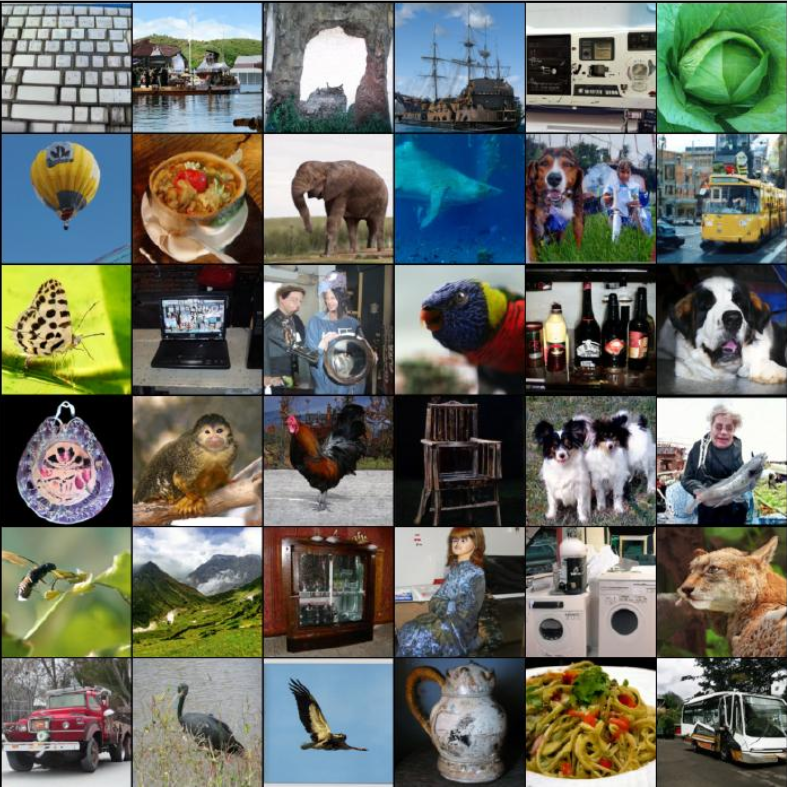

> [!Flow Matching for Generative Modeling]
> 发表日期：2022年10月6日
> 期刊：arXiv (Cornell University)
> 期刊官网：[https://openalex.org/I205783295](https://openalex.org/I205783295)
> 出版商：Cornell University
> DOI：[10.48550/arxiv.2210.02747](https://doi.org/10.48550/arxiv.2210.02747)
> 来源：[http://arxiv.org/abs/2210.02747](http://arxiv.org/abs/2210.02747)
> 

# Abstract 摘要

本文提出一种建立在**连续归一化流**（**Continuous Normalizing Flows, CNFs**）之上的生成建模新范式，使 CNF 能以前所未有的规模训练。核心概念是**流匹配**（**Flow Matching, FM**）：一种无需仿真的 CNF 训练方法，通过回归固定条件概率路径的向量场来学习生成过程。流匹配兼容一大类从噪声样本到数据样本的高斯概率路径，其中已有扩散路径只是特例。实验发现，**在扩散路径上使用 FM 可得到比传统扩散模型训练更稳健、更稳定的替代方案**。更重要的是，FM 允许使用非扩散概率路径训练 CNF。一个特别重要的实例是用**最优传输**（Optimal Transport, OT）的位移插值定义条件概率路径。这类路径比扩散路径更高效，训练和采样更快，泛化更好。在 ImageNet 上，用流匹配训练 CNF 在似然和样本质量上均优于多种扩散方法，并可直接使用现成的数值 ODE 求解器进行快速可靠的样本生成。

# 1. Introduction 引言

深度生成模型旨在估计并从未知数据分布中采样。近年来图像生成的快速进展，很大程度上依赖于扩散模型稳定且可扩展的训练。然而，局限于简单扩散过程会限制可用采样概率路径的空间，导致训练时间很长，并且需要专门技术才能高效采样。

本文考虑更一般且确定性的连续归一化流框架。CNF 能够表达任意概率路径，也包含扩散过程建模的概率路径。但除了扩散可以通过去噪分数匹配等方式高效训练外，已有 CNF 的可扩展训练算法并不充分。最大似然训练通常需要昂贵的 ODE 数值仿真；已有免仿真方法要么涉及难以处理的积分，要么在小批量随机梯度中存在偏差。

本文目标是提出流匹配（FM），一种高效、免仿真的 CNF 训练方法，让一般概率路径可以作为 CNF 训练监督。FM 打破了可扩展 CNF 训练只能依赖扩散的限制，并允许直接在概率路径层面推理，而不必先构造扩散过程。

本文贡献包括：提出流匹配目标；给出**条件流匹配**（Conditional Flow Matching, CFM），证明其与原 FM 目标具有相同梯度；提出一大类高斯条件概率路径，其中包含扩散路径和最优传输路径；在 ImageNet 上验证 OT 路径训练的 CNF 在似然、FID 和采样效率上表现优良。

> [!图1]
> 图 1：使用带最优传输概率路径的流匹配训练出的 CNF 在 ImageNet-128 上的无条件样本。

  

# 2. 预备知识：连续归一化流

令 $\mathbb{R}^d$ 为数据空间，数据点为 $x=(x^1,\ldots,x^d)\in\mathbb{R}^d$。本文使用两个关键对象：概率密度路径 $p:[0,1]\times\mathbb{R}^d\rightarrow\mathbb{R}_{>0}$，即随时间变化的密度函数 $p_t(x)$，满足 $\int p_t(x)dx=1$；以及随时间变化的向量场 $v:[0,1]\times\mathbb{R}^d\rightarrow\mathbb{R}^d$。

向量场 $v_t$ 可构造一个随时间变化的微分同胚映射，也称为流 $\phi:[0,1]\times\mathbb{R}^d\rightarrow\mathbb{R}^d$，由常微分方程定义：
$$

\frac{d}{dt}\phi_t(x)=v_t(\phi_t(x))

\hspace{1cm}(1)

$$
$$

\phi_0(x)=x

\hspace{1cm}(2)

$$
Chen 等人建议用神经网络 $v_t(x;\theta)$ 表示向量场，其中 $\theta\in\mathbb{R}^p$ 是可学习参数。这形成了流 $\phi_t$ 的深度参数化模型，即连续归一化流。CNF 用于将简单先验密度 $p_0$（如纯噪声）变形为复杂密度 $p_1$，其推前关系为：
$$

p_t=[\phi_t]_*p_0

\hspace{1cm}(3)

$$

其中推前或变量替换算子定义为：
$$

[\phi_t]_*p_0(x)=p_0(\phi_t^{-1}(x))\det\left[\frac{\partial\phi_t^{-1}}{\partial x}(x)\right].

\hspace{1cm}(4)

$$
如果向量场 $v_t$ 的流 $\phi_t$ 满足式 3，则称 $v_t$ 生成概率密度路径 $p_t$。一种实用判据是连续性方程，证明中会反复使用。

  

# 3. 流匹配

令 $x_1$ 是服从未知数据分布 $q(x_1)$ 的随机变量。我们只有来自 $q(x_1)$ 的样本，而无法访问其密度函数。令 $p_t$ 为概率路径，其中 $p_0=p$ 是简单分布，例如标准正态 $p(x)=\mathcal{N}(x|0,I)$，而 $p_1$ 近似于 $q$。流匹配目标用于匹配该目标概率路径，从而把 $p_0$ 流到 $p_1$。

给定目标概率密度路径 $p_t(x)$ 及生成该路径的对应向量场 $u_t(x)$，定义 FM 目标为：
$$

\mathcal{L}_{\scriptscriptstyle\mathrm{FM}}(\theta)=\mathbb{E}_{t,p_t(x)}\|v_t(x)-u_t(x)\|^2,

\hspace{1cm}(5)

$$
其中 $t\sim\mathcal{U}[0,1]$，$x\sim p_t(x)$。直观上，FM 用神经网络 $v_t$ 回归向量场 $u_t$。当损失为零时，学习到的 CNF 会生成 $p_t(x)$。

直接使用 FM 目标并不可行，因为通常不知道合适的 $p_t$ 和 $u_t$，也没有闭式表达。本文说明可通过逐样本（条件）概率路径和条件向量场构造它们，并由此得到更可处理的训练目标。

### 3.1 由条件概率路径和条件向量场构造 $p_t,u_t$

给定数据样本 $x_1$，记 $p_t(x|x_1)$ 为条件概率路径，满足 $p_0(x|x_1)=p(x)$，并令 $p_1(x|x_1)$ 在 $x=x_1$ 附近集中，例如：
$$

p_1(x|x_1)=\mathcal{N}(x|x_1,\sigma^2 I).

$$
对条件路径关于 $q(x_1)$ 边缘化，得到边缘概率路径：
$$

p_t(x)=\int p_t(x|x_1)q(x_1)dx_1,

\hspace{1cm}(6)

$$
特别地：
$$

p_1(x)=\int p_1(x|x_1)q(x_1)dx_1\approx q(x).

\hspace{1cm}(7)

$$
类似地定义边缘向量场：
$$

u_t(x)=\int u_t(x|x_1)\frac{p_t(x|x_1)q(x_1)}{p_t(x)}dx_1,

\hspace{1cm}(8)

$$
其中 $u_t(\cdot|x_1)$ 是生成 $p_t(\cdot|x_1)$ 的条件向量场。

**定理 1。** 给定生成条件概率路径 $p_t(x|x_1)$ 的条件向量场 $u_t(x|x_1)$，对任意分布 $q(x_1)$，式 8 中的边缘向量场 $u_t$ 生成式 6 中的边缘概率路径 $p_t$。

这一定理建立了条件向量场与边缘向量场之间的连接，使未知且难以处理的边缘向量场可由更简单的逐样本条件向量场表示。

### 3.2 条件流匹配

由于式 6 和式 8 包含难以处理的积分，直接计算 $u_t$ 和 FM 目标仍不可行。本文提出条件流匹配目标：
$$

\mathcal{L}_{\scriptscriptstyle\mathrm{CFM}}(\theta)=\mathbb{E}_{t,q(x_1),p_t(x|x_1)}\big\|v_t(x)-u_t(x|x_1)\big\|^2.

\hspace{1cm}(9)

$$
其中 $t\sim\mathcal{U}[0,1]$，$x_1\sim q(x_1)$，$x\sim p_t(x|x_1)$。只要可以从条件路径采样并计算条件向量场，就能得到无偏训练估计。

**定理 2。** 若对所有 $x\in\mathbb{R}^d$ 和 $t\in[0,1]$ 有 $p_t(x)>0$，则除与 $\theta$ 无关的常数外，$\mathcal{L}_{\scriptscriptstyle\mathrm{CFM}}$ 与 $\mathcal{L}_{\scriptscriptstyle\mathrm{FM}}$ 相等，因此：
$$

\nabla_\theta\mathcal{L}_{\scriptscriptstyle\mathrm{FM}}(\theta)=\nabla_\theta\mathcal{L}_{\scriptscriptstyle\mathrm{CFM}}(\theta).

$$
因此，优化 CFM 在期望意义上等价于优化 FM，且无需访问边缘概率路径或边缘向量场。

# 4. 条件概率路径与向量场

CFM 可使用任意条件概率路径和条件向量场。本文考虑一大类高斯条件路径：
$$

p_t(x|x_1)=\mathcal{N}(x\,|\,\mu_t(x_1),\sigma_t(x_1)^2 I),

\hspace{1cm}(10)

$$
其中 $\mu_t$ 是均值，$\sigma_t$ 是标量标准差。设置 $\mu_0(x_1)=0$、$\sigma_0(x_1)=1$，使所有条件路径在 $t=0$ 汇聚到标准高斯；设置 $\mu_1(x_1)=x_1$、$\sigma_1(x_1)=\sigma_{\min}$，使 $p_1(x|x_1)$ 在 $x_1$ 附近集中。

考虑条件流：
$$

\psi_t(x)=\sigma_t(x_1)x+\mu_t(x_1).

\hspace{1cm}(11)

$$
若 $x$ 服从标准高斯，则 $\psi_t(x)$ 是映射到均值 $\mu_t(x_1)$、标准差 $\sigma_t(x_1)$ 的高斯变量的仿射变换，因此：
$$

[\psi_t]_*p(x)=p_t(x|x_1).

\hspace{1cm}(12)

$$
对应向量场满足：
$$

\frac{d}{dt}\psi_t(x)=u_t(\psi_t(x)|x_1).

\hspace{1cm}(13)

$$
将 $p_t(x|x_1)$ 用 $x_0$ 重新参数化并代入 CFM 损失，可得：
$$

\mathcal{L}_{\scriptscriptstyle\mathrm{CFM}}(\theta)=\mathbb{E}_{t,q(x_1),p(x_0)}\Big\|v_t(\psi_t(x_0))-\frac{d}{dt}\psi_t(x_0)\Big\|^2.

\hspace{1cm}(14)

$$
**定理 3。** 若 $p_t(x|x_1)$ 是式 10 的高斯路径，且 $\psi_t$ 如式 11，则定义 $\psi_t$ 的唯一向量场为：
$$

u_t(x|x_1)=\frac{\sigma'_t(x_1)}{\sigma_t(x_1)}\left(x-\mu_t(x_1)\right)+\mu'_t(x_1).

\hspace{1cm}(15)

$$
因此该向量场生成高斯路径 $p_t(x|x_1)$。

### 4.1 高斯条件概率路径的特例

#### 示例 I：扩散条件向量场

反向（噪声到数据）方差爆炸（VE）路径可写为：
$$

p_t(x)=\mathcal{N}(x|x_1,\sigma_{1-t}^2 I),

\hspace{1cm}(16)

$$
将其代入式 15 得：
$$

u_t(x|x_1)=-\frac{\sigma'_{1-t}}{\sigma_{1-t}}(x-x_1).

\hspace{1cm}(17)

$$
反向方差保持（VP）扩散路径为：
$$

p_t(x|x_1)=\mathcal{N}(x\,|\,\alpha_{1-t}x_1,(1-\alpha_{1-t}^2)I),\quad

\alpha_t=e^{-\frac{1}{2}T(t)},\quad T(t)=\int_0^t\beta(s)ds.

\hspace{1cm}(18)

$$
对应向量场为：
$$

u_t(x|x_1)=\frac{\alpha'_{1-t}}{1-\alpha_{1-t}^2}(\alpha_{1-t}x-x_1)

=-\frac{T'(1-t)}{2}\left[\frac{e^{-T(1-t)}x-e^{-\frac{1}{2}T(1-t)}x_1}{1-e^{-T(1-t)}}\right].

\hspace{1cm}(19)

$$
这些条件向量场与已有确定性概率流中的向量场一致。将扩散条件向量场与 FM 目标结合，为扩散模型训练提供了更稳定的替代方案。

#### 示例 II：最优传输条件向量场

更自然的选择是令均值和标准差随时间线性变化：
$$

\mu_t(x)=t x_1,\quad \sigma_t(x)=1-(1-\sigma_{\min})t.

\hspace{1cm}(20)

$$
根据定理 3，该路径由如下向量场生成：
$$

u_t(x|x_1)=\frac{x_1-(1-\sigma_{\min})x}{1-(1-\sigma_{\min})t}.

\hspace{1cm}(21)

$$
对应条件流为：
$$

\psi_t(x)=(1-(1-\sigma_{\min})t)x+t x_1.

\hspace{1cm}(22)

$$
此时 CFM 损失为：
$$

\mathcal{L}_{\scriptscriptstyle\mathrm{CFM}}(\theta)=\mathbb{E}_{t,q(x_1),p(x_0)}\Big\|v_t(\psi_t(x_0))-\big(x_1-(1-\sigma_{\min})x_0\big)\Big\|^2.

\hspace{1cm}(23)

$$
该条件流是两个高斯之间的 OT 位移映射。OT 插值定义为：
$$

p_t=[(1-t)\mathrm{id}+t\psi]_*p_0,

\hspace{1cm}(24)

$$
其中 $\psi$ 是将 $p_0$ 推到 $p_1$ 的 OT 映射。直观上，OT 位移映射下的粒子沿直线以恒定速度移动；相比扩散路径中可能出现的弯曲甚至回退轨迹，OT 路径更简单、更易拟合。

 
图 2：与扩散路径的条件分数函数相比，OT 路径的条件向量场方向随时间保持不变，因而更容易由参数模型拟合。  

图 3：扩散与 OT 的采样轨迹比较，OT 轨迹为直线。

# 5. 相关工作

连续归一化流最初作为归一化流的连续时间版本提出，通常通过最大似然训练，但需要昂贵的 ODE 正向和反向仿真。已有工作尝试通过增广、正则化或随机采样积分区间来让 ODE 更容易求解，但并未改变基本训练算法。

一些免仿真的 CNF 训练框架通过显式设计目标概率路径和动力学来加速训练，但常涉及难以估计的积分或带偏梯度。相比之下，流匹配框架以无偏梯度实现免仿真训练，并能扩展到高维图像。

另一类免仿真训练依赖扩散过程间接定义目标概率路径。本文的条件流匹配受去噪分数匹配启发，但直接匹配向量场，并超越了简单扩散可表达的路径族。并行工作如 Rectified Flow、Stochastic Interpolants 等也提出了相关的条件目标。

图 4：在二维棋盘数据上，不同目标训练的 CNF 轨迹比较。OT 路径更早形成棋盘结构，FM 训练更稳定；使用 OT 的 FM 在中点法采样时更高效。

## 6. 实验

实验覆盖 CIFAR-10 和 ImageNet 32、64、128 分辨率，并比较扩散路径与 OT 路径。除特别说明外，使用 dopri5 ODE 求解器，以绝对和相对容差 $10^{-5}$ 评估似然和样本。

表 1：在 CIFAR-10、ImageNet 32、ImageNet 64 和 ImageNet 128 上比较负对数似然（BPD）、样本质量（FID）和评估时间（NFE）。FM w/ OT 在多数设置中取得最佳或接近最佳的似然和 FID，并显著降低 NFE。

### 6.1 ImageNet 上的密度建模与样本质量

FM w/ OT 在 ImageNet 上表现稳定，尤其在 ImageNet 32 和 64 上优于扩散路径和传统分数匹配；在 ImageNet 128 上，FM w/ OT 取得 2.90 BPD 和 20.9 FID，在当时的无条件 ImageNet-128 结果中具有竞争力。

图 5：ImageNet 64 训练过程中的图像质量。使用 OT 路径训练的模型更快达到较好视觉质量。

### 6.2 采样效率

由于 FM 直接学习生成向量场，并且 OT 条件路径更直，采样可使用较少函数评估次数。实验显示，在相似数值误差或 FID 下，FM w/ OT 相比扩散路径需要更少 NFE。

图 6：从相同初始噪声出发的采样路径。OT 路径大致线性地去噪，而扩散路径往往在后期才显著去噪。  

图 7：在 ImageNet 32 上，FM 特别是 OT 路径能用更少 NFE 保持相近数值误差和样本质量。

### 6.3 从低分辨率图像进行条件采样

本文还展示了以低分辨率图像为条件的超分辨率生成。FM w/ OT 能在 ImageNet 超分任务中获得有竞争力的 FID 与感知质量。

表 2：ImageNet 验证集上的图像超分辨率结果。FM w/ OT 在条件生成质量上优于或接近已有方法。

# 7. Conclusion 结论

本文提出流匹配，一种用于训练连续归一化流的免仿真目标。通过条件流匹配，可以只使用逐样本条件概率路径和向量场进行训练，同时保持与目标 FM 损失相同的梯度。该框架统一了扩散路径，并自然支持最优传输路径。实验表明，基于 OT 路径的 FM 在训练、采样、似然和样本质量上均具优势，为大规模 CNF 生成建模提供了实用方案。
