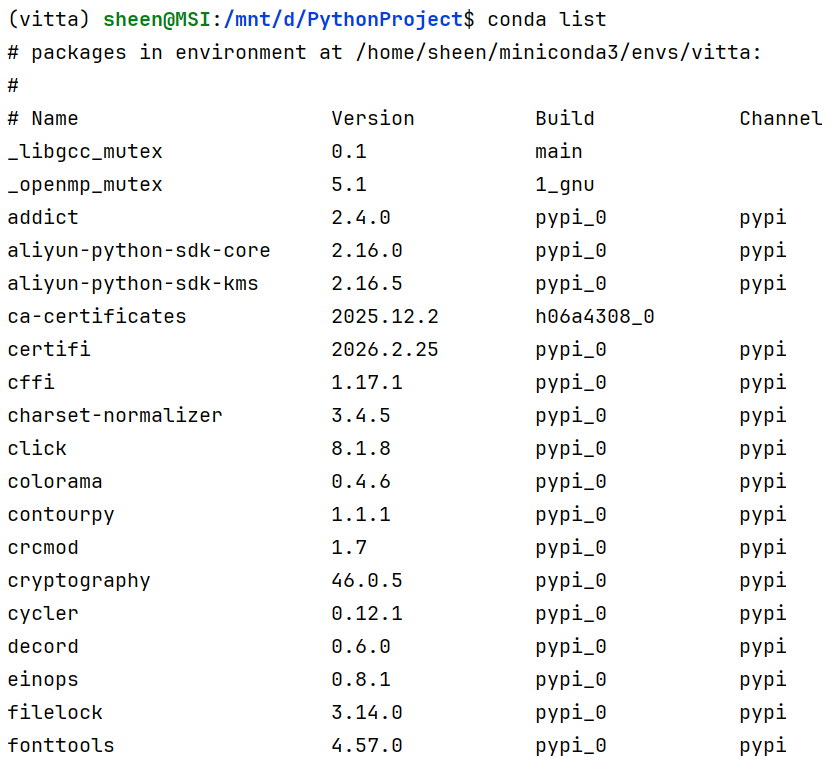

# 一、环境配置

1. 代码来自于github开源项目：(https://github.com/wlin-at/ViTTA.git)
2. 在wsl的Ubuntu里配置了一个vitta环境：


# 二、工具使用

```bash
sheen@MSI:/mnt/d/PythonProject/ViTTA-main$ opencode
                                   ▄
  █▀▀█ █▀▀█ █▀▀█ █▀▀▄ █▀▀▀ █▀▀█ █▀▀█ █▀▀█
  █  █ █  █ █▀▀▀ █  █ █    █  █ █  █ █▀▀▀
  ▀▀▀▀ █▀▀▀ ▀▀▀▀ ▀▀▀▀ ▀▀▀▀ ▀▀▀▀ ▀▀▀▀ ▀▀▀▀

  Session   ViTTA 复现指南
  Continue  opencode -s ses_3256e9fabffeaWZyIB0c5mszJU

```


